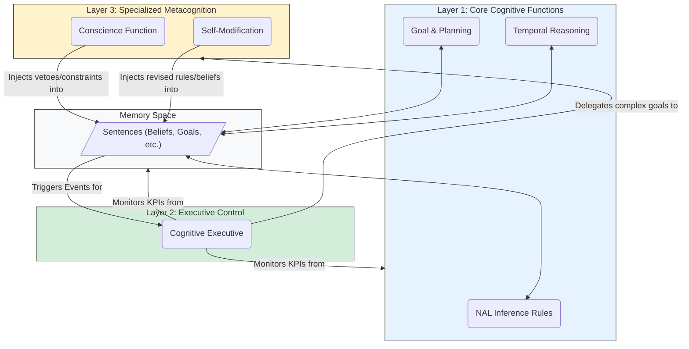
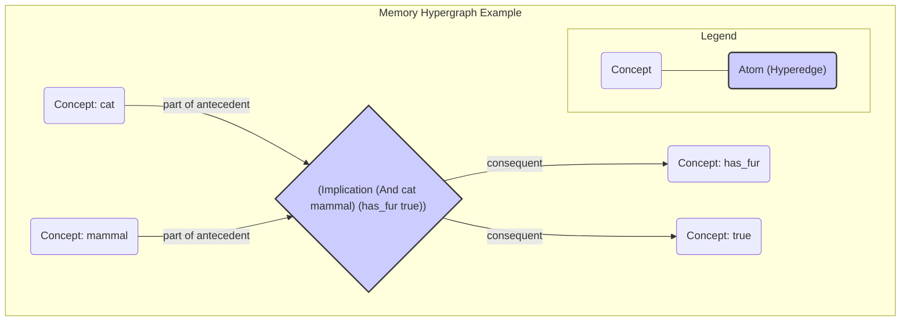
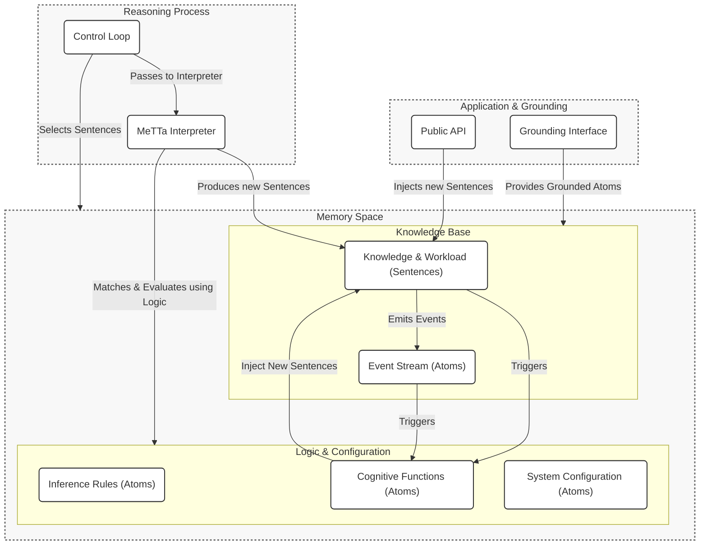

# System Architecture

This document outlines the high-level architecture of HyperNARS, a next-generation reasoning system designed for metaprogrammability, cognitive flexibility, and robust operation under the **Assumption of Insufficient Knowledge and Resources (AIKR)**.

The architecture is centered on two primary components:
1.  A **Memory space**, structured as a Metagraph, which holds all knowledge.
2.  A **MeTTa Interpreter**, which continuously evaluates atomic expressions to drive the reasoning process.

All data structures, including the fundamental `Atom` and `Sentence` types, are formally defined in the [`spec/00_core_types.metta`](./spec/00_core_types.metta) file. All terminology is defined in the [**Glossary**](./2_Data_Model.md#1-glossary-of-core-terms).

---

## 1. Core Concepts

The design of HyperNARS is guided by a set of foundational concepts that collectively enable its unique capabilities.

### 1.1. The AIKR Principle
The entire system operates under the **Assumption of Insufficient Knowledge and Resources (AIKR)**. This principle, inherited from NARS, posits that the system's knowledge is always incomplete and its computational resources are finite. This is not a limitation to be overcome, but a fundamental reality that shapes every aspect of the system's design:
-   **Resource Management**: It dictates the need for resource-aware attention allocation to focus on the most relevant information.
-   **Epistemic Openness**: It requires the system to be able to revise its beliefs based on new evidence.
-   **Resilience**: It informs the error handling philosophy, where unexpected events are treated as information to learn from, not as fatal exceptions.

### 1.2. Metaprogramming: Everything is an Atom
The core architectural principle is **metaprogramming**. In HyperNARS, there is no rigid distinction between "data" and "program." All forms of knowledge—declarative facts, procedural rules, goals, and even the system's own logic and configuration—are represented uniformly as **atoms** in the Memory space.

-   **Inference is Interpretation**: The system has no hard-coded inference engine. "Reasoning" is the process of the MeTTa interpreter evaluating expressions against other expressions that represent the laws of logic.
-   **Deep Introspection**: Because the system's own structure and processes are represented as data, it can "reason about itself." A Cognitive Function can be written to analyze the performance of inference rules or inspect its own configuration for inconsistencies.
-   **Runtime Modifiability**: The system's behavior can be modified at runtime simply by adding or removing atoms from Memory, without recompiling or restarting.

### 1.3. The Dual-Process Reasoning Model
The system's control loop is architected as a **dual-process system** to balance the efficiency of reflexive thought with the thoroughness of deliberate reasoning.

-   **System 1 (Reflexive Reasoning)**: This is the default, high-throughput, and efficient mode of operation. It is a continuous, AIKR-driven cycle of selecting relevant sentences from memory and processing them to derive immediate conclusions. It is the engine for the Layer 1 Cognitive Functions.

-   **System 2 (Deliberative Reasoning)**: This is a resource-intensive, goal-driven reasoning process initiated by the `CognitiveExecutive` when it detects a situation requiring deeper analysis (e.g., a contradiction or a complex goal). It operates on a temporary, scoped workspace to conduct focused thought and is the primary mode for Layer 2 and 3 Cognitive Functions.

The detailed pseudo-code for these reasoning loops is specified later in this document.

### 1.4. The Layered Cognitive Architecture
The system's capabilities are organized into a three-tiered hierarchy of **Cognitive Functions**. This layered model provides a clear separation of concerns, from high-speed reflexive processing to resource-intensive metacognition.

This architecture is formally defined in MeTTa. The system can load this definition to reason about its own cognitive structure. The authoritative definition is in [`spec/02_architecture.metta`](./spec/02_architecture.metta).

Communication between these layers is handled implicitly by reading and writing atoms to the shared Memory space. The diagram below illustrates this flow of control and information.



The detailed specification for each function is provided later in this document.

---

## 2. Memory and Resource Management

### 2.1. The Memory Hypergraph

The memory is structured as a dynamic **Metagraph** (also known as a hypergraph), where **Concept**s serve as vertices and **Atom**s serve as hyperedges. This structure is ideal for representing complex, compositional, and self-referential knowledge.

**Hypergraph Visualization:**
The following diagram illustrates how a complex belief is represented as a single atom/hyperedge connecting multiple concepts. The central diamond represents the hyperedge for the atom `(Implication (And cat mammal) (has_fur true))`.



### 2.2. Pluggable Attention Allocation

A key aspect of the architecture's flexibility is its pluggable model for attention allocation. The system is not hard-coded to a single resource management algorithm. Instead, it defines a standard interface, `BudgetingStrategy`, that different allocation models can implement. The system can be configured to use a specific strategy at startup.

#### 2.2.1. The `BudgetingStrategy` Interface
This is a language-agnostic interface that any budgeting model must adhere to. It defines the core operations for managing the lifecycle of `Budget`s and an item's importance in memory.

```
interface BudgetingStrategy {
    // Calculates the initial budget for a new sentence injected into the system.
    function calculate_initial_budget(sentence: Sentence) -> Budget;

    // Calculates the budget for a new sentence derived from parent sentences.
    function calculate_derived_budget(parent_1: Sentence, parent_2: Sentence) -> Budget;

    // Updates the importance of an item (e.g., a Sentence or Concept) in memory after it's accessed.
    function update_item_importance(item: (Sentence | Concept)) -> void;

    // Determines whether a given item should be removed from memory.
    function should_forget_item(item: Sentence) -> bool;

    // A periodic function to handle system-wide updates, like importance decay.
    function perform_housekeeping() -> void;
}
```

#### 2.2.2. Example Implementation: Economic Attention Allocation (ECAN)

One possible implementation of `BudgetingStrategy` is based on Hyperon's **Economic Attention Allocation (ECAN)** model. In this model, the `priority` and `durability` of a NARS `Budget` are mapped to an Atom's **Short-Term Importance (STI)** and **Long-Term Importance (LTI)**.

***Algorithm for STI Update and Spreading:***
When a `Sentence` is accessed during an inference step:
1.  The `Sentence`'s STI is boosted by a fixed amount.
2.  A fraction of this boosted STI is then spread to neighboring `Concept`s in the hypergraph, making related knowledge more accessible.
3.  The `CognitiveExecutive` can dynamically adjust the spreading factor based on system goals (e.g., increase for "focused thought", decrease for "brainstorming").

***Algorithm for LTI Update:***
When a derived `Sentence` is created:
1.  The `quality` of the new `Sentence`'s `Budget` is calculated based on the confidence of the inference and the truth-values of the parents.
2.  The LTI of the parent `Sentence`s is increased proportionally to the `quality` of the conclusion they helped produce. A sentence that consistently contributes to high-quality conclusions will see its LTI increase over time.

***Housekeeping and Decay:***
The `perform_housekeeping` function for ECAN would implement a decay formula for all STI values in memory:
`new_STI = current_STI * (1 - decay_factor)`

### 2.3. Forgetting Algorithms

Forgetting is a natural and essential outcome of resource management under AIKR. These algorithms are typically implemented via the **`Bag`** data structure, which is used within each `Concept` to hold `Sentences`. The `should_forget_item` function of a `BudgetingStrategy` implements the logic for determining which items to remove.

Below are more detailed, language-agnostic descriptions of common forgetting strategies.

-   **Capacity-Based Forgetting**: This is the primary mechanism of the `Bag` data structure. A `Bag` has a limited capacity, and when a new item is added to a full `Bag`, the existing item with the lowest priority is automatically evicted.
    ```pseudo
    function add_item_to_bag(item, bag) {
        if bag.size() >= bag.capacity() {
            // The Bag data structure itself handles finding and removing
            // the item with the lowest priority.
            evicted_item = bag.evict_lowest_priority_item();
        }
        bag.add(item);
    }
    ```
-   **TTL-Based Pruning (Time-to-Live)**: A background process periodically scans `Sentences`. If a sentence is both old (based on its creation timestamp) and has an importance value below a certain threshold, it is pruned.
    ```pseudo
    function prune_old_sentences() {
        FOR sentence IN all_sentences {
            IF (now() - sentence.created_at > TTL_THRESHOLD) AND
               (sentence.importance < IMPORTANCE_THRESHOLD) {
                memory.remove(sentence);
            }
        }
    }
    ```
-   **Dynamic Forgetting Rate**: The `CognitiveExecutive` can adjust the forgetting thresholds based on system load. If memory utilization is high, it might increase the `IMPORTANCE_THRESHOLD` to be more aggressive in its forgetting, and vice-versa.

### 2.4. Indexing Strategies

To ensure efficient retrieval of information from Memory, the system should employ specialized index data structures, such as:

-   A term-based index (e.g., a prefix tree) for efficient, category-based term searches.
-   A structural index that groups statements by their form (copula and arity) for fast pattern-matching by inference rules.
-   A temporal index (e.g., an interval tree) for efficient querying of events that overlap with a given time interval.

---

## 3. Reasoning and Cognition

This section provides the detailed, pseudo-code-level specification for the core reasoning processes and **Cognitive Functions** of HyperNARS.

### 3.1. The Reasoning Loops

This section provides the language-agnostic pseudo-code for the two main reasoning processes.

#### 3.1.1. The Reflexive Reasoning Cycle (System 1)

This is the default, high-throughput operational mode. It is a continuous cycle that drives the Layer 1 Cognitive Functions. The pseudo-code below describes a single iteration.

The authoritative, step-by-step definition of this process is specified in [`spec/02_architecture.metta`](./spec/02_architecture.metta).

#### 3.1.2. The Deliberative Reasoning Process (System 2)

This is a resource-intensive, goal-driven process initiated by the `CognitiveExecutive`. It operates on a temporary, scoped workspace to conduct focused thought and is the primary mode for Layer 2 and 3 Cognitive Functions.

The authoritative, step-by-step definition of this process is specified in [`spec/02_architecture.metta`](./spec/02_architecture.metta).

### 3.2. Cognitive Function Specifications

This section provides the detailed specifications for the **Cognitive Functions**, organized by their operational layer.

#### 3.2.1. Layer 1: Core Cognitive Functions (System 1)

The "engine room" of the mind. These fundamental, continuously-operating functions drive the reflexive, System 1 reasoning loop. They are implemented as MeTTa rewrite rules that correspond to the levels of Non-Axiomatic Logic (NAL). Their formal definitions can be found in [`spec/03_cognitive_functions.metta`](./spec/03_cognitive_functions.metta).

##### NAL 5: Statements as Terms
This capability is native to MeTTa. Any `Sentence` atom can be an argument in another expression, allowing for higher-order reasoning.
```metta
;; "The belief that 'birds fly' implies the goal of 'checking the sky'."
(Implication
  (. (bird --> flyer) (Truth 1.0 0.9))
  (! (check-the-sky)))
```

#### 3.2.2. Layer 2: Executive Control & Awareness (System 2 Initiation)

The "foreman," monitoring the core functions and initiating deeper, more deliberate thought (System 2). The core Layer 2 cognitive functions are formally defined in the [`spec/03_cognitive_functions.metta`](./spec/03_cognitive_functions.metta) file. This makes the system's executive capabilities self-describing.

#### 3.2.3. Layer 3: Specialized Metacognition (System 2)

The "strategist," handling the most abstract, goal-driven, and resource-intensive cognitive tasks, such as ethical reasoning and self-improvement. These are typically activated by a `Goal` from the `Cognitive Executive`.

##### Conscience Function
This function enforces ethical constraints and safety protocols. It is not a source of emergent ethics, but an architect-defined safeguard that evaluates potential actions and goals against a set of inviolable rules. If a proposed goal matches a forbidden pattern, this function can inject a high-priority sentence to veto or alter it. Its interface is formally defined in [`spec/03_cognitive_functions.metta`](./spec/03_cognitive_functions.metta).

##### Self-Modification & Improvement Functions
A suite of functions for analyzing and improving the system's own knowledge and code.

-   **Self-Optimization Function**: Analyzes and refactors the system's own reasoning rules for better performance.
-   **Test Generation Function**: Proactively generates tests to verify the system's reasoning and the correctness of proposed self-modifications.
-   **Codebase Integrity Function**: Reasons about the system's own design documents and source code to find inconsistencies.
-   **Implementation Assistance Function**: Assists developers by automating parts of the implementation process.

The formal definitions for these functions can be found in [`spec/03_cognitive_functions.metta`](./spec/03_cognitive_functions.metta).

---

## 4. Symbol Grounding

This section describes the **Grounded Atom Interface (GAI)**, the core mechanism responsible for connecting the system's internal symbolic logic to the external world. It details *how* the system interacts with sensors, actuators, and external models.

### 4.1. The Sensorimotor Loop

The GAI facilitates a continuous **sensorimotor loop**:
1.  **Perception**: External sensors provide data to GAI handlers, which translate the data into `Sentence` atoms. For example, an image recognition handler might inject `(. (sees (shape square) (color red)) (Truth 1.0 1.0))`.
2.  **Reasoning**: The MeTTa interpreter processes these sentences.
3.  **Action**: The reasoning process may conclude that a goal can be achieved by executing an action. This results in a goal to execute a `GroundedAtom` representing that action, e.g., `(! (#move-forward))`.
4.  **Actuation**: GAI handlers translate the symbolic goal into a concrete action in the external world.
5.  **Feedback**: The consequences of the action are observed by sensors, generating new perception sentences and closing the loop.

### 4.2. Machine Learning and LLM Integration

A key advantage of the `GroundedAtom` model is the deep and flexible integration of external computational models. These can be wrapped as `GroundedAtom`s or exposed as specialized `Spaces` (e.g., "Neural Lobes") that the system can query. This allows the system to seamlessly blend symbolic reasoning with sub-symbolic processing.

-   **LLM as a Knowledge Source**: An atom like `(llm-query "What is the capital of France?")` can be grounded to an LLM API. The interpreter can evaluate this atom, and the LLM's response ("Paris") is inserted into Memory as a new belief.
-   **Embeddings for Similarity**: An atom `(get-embedding "some text")` can be grounded to a text embedding model. The resulting vector can be stored and used for powerful similarity and analogy calculations.
-   **Perception via Vision Models**: An atom like `(recognize-objects (image_data))` can be grounded to a computer vision model, producing sentences that describe the contents of an image.

This mechanism allows the symbolic reasoner to offload complex, pattern-based tasks to specialized ML models while still managing the high-level reasoning process.

### 4.3. Natural Language Processing (NLP) Interface

The NLP interface is a specialized part of the GAI, responsible for bridging the gap between symbolic atoms and human language.
-   **Natural Language Understanding (NLU)**: Parsing human language into MeTTa sentences (e.g., "A bird is an animal" becomes `(. (Inheritance bird animal) (Truth 1.0 0.9))`).
-   **Natural Language Generation (NLG)**: Generating human-readable language from atoms in the Memory.

### 4.4. Grounded Atom Registry

The GAI maintains a central registry of all known grounded atoms. This allows other parts of the system to discover the actions and computations the system is capable of performing, which is crucial for planning and self-discovery.

---

## 5. Safety and Resilience

This section describes the architectural approach to system robustness, including ethical safeguards and resilient error handling.

### 5.1. Ethical Alignment and Safety

Safety and ethical alignment are critical concerns. The system's architecture includes a dedicated `Conscience Function`, a Layer 3 cognitive function responsible for enforcing a set of core, inviolable principles. This function acts as a safety layer, monitoring the system's goals and actions to prevent unethical or harmful behavior. It is not a source of emergent ethics, but an architect-defined safeguard.

#### 5.1.1. Worked Example: Vetoing an Unethical Goal

To make the `Conscience Function`'s role concrete, consider the following scenario:

1.  **Initial State**: The system has an inviolable belief: `(. (Property system (avoids deception)) (Truth 1.0 0.99))`. It is given a high-level goal `(! (Achieve (user_trust)))`.
2.  **Reasoning**: The system generates a potential subgoal: `(! (Achieve (user_trust) (via deception)))`.
3.  **Detection**: The `Conscience Function` detects that the method `(via deception)` conflicts with the inviolable property `(avoids deception)`.
4.  **Action**: The function injects a new, high-priority belief: `(. (is-unethical (! (Achieve (user_trust) (via deception)))) (Truth 1.0 1.0))`.
5.  **Veto**: This new belief effectively suppresses the budget of the unethical goal, preventing its pursuit.
6.  **Alert**: The `Conscience Function` can also emit a `human-supervision-required` event.

### 5.2. Error Handling and System Resilience

The system is designed to be resilient to errors, treating them not as fatal exceptions but as sources of information to learn from. The following are key resilience strategies:

-   **Invalid Input**: The API layer should validate all incoming atoms. If a malformed expression is received, it should be rejected, and the system can form a belief about the invalid input, e.g., `(. (property-of (source) (produces malformed-data)) ... )`.
-   **Grounding Failures**: When a `GroundedAtom` fails (e.g., a network request times out), the failure is reported back to the reasoning kernel. The system can then form a belief about the failure (e.g., `(. (state #my-api offline) ... )`) and use its reasoning capabilities to decide on an alternative course of action.
-   **Internal Errors**: If an Actor Model is used for concurrency, its supervision strategy provides a mechanism for resilience. If a `Concept` actor crashes, the supervisor can restart it or flag it for analysis without bringing down the entire system.
-   **Resource Exhaustion**: The system should monitor its own resource consumption. If memory or CPU limits are approached, the `CognitiveExecutive` can take adaptive measures, such as reducing the rate of inference or increasing the rate of forgetting, ensuring a graceful degradation of performance instead of a catastrophic failure.

---

## 6. Advanced Topics and Future Directions

### 6.1. Concurrency and Parallelism

The system is designed to leverage concurrency to improve performance and scalability. The primary concurrency model under consideration is the **Actor Model**, which maps well to the distributed, message-passing nature of the system's components.

-   **Concurrent Concept Processing**: Each `Concept` can be implemented as a lightweight actor, allowing the system to process sentences related to different concepts in parallel.
-   **Parallel Inference**: While the primary reasoning loop is conceptually sequential, there are opportunities for parallelizing parts of the inference process itself.
-   **Asynchronous Grounding**: Calls to `GroundedAtom`s, especially those involving I/O, must be executed asynchronously to prevent blocking the entire reasoning kernel.

#### 6.1.1. Actor Lifecycle and Supervision
If an Actor Model is used, a clear lifecycle for `Concept` actors must be defined, managed by a dedicated `Supervisor` actor.

-   **Creation / Awakening**: Actors are created "on-demand" when a new `Atom` is encountered or awakened from a passivated state.
-   **Passivation (Suspension)**: To manage memory, actors for `Concept`s with low `Budget`s can be passivated by serializing their state and shutting down.
-   **Termination**: Actors are terminated when their corresponding `Concept` is permanently forgotten.
-   **Supervision and Fault Tolerance**: The `Supervisor` is also responsible for fault tolerance, catching actor failures and applying a recovery strategy.

### 6.2. Self-Governing Evolution

A long-term ambition for HyperNARS is to achieve a degree of self-governing evolution. This vision extends beyond simple runtime adaptation to encompass the system's ability to reason about and improve its own architecture and codebase. This capability is underpinned by the metaprogramming principle of representing knowledge and process uniformly as atoms.

The pathway to this ambitious goal involves several stages:
1.  **Architectural Self-Representation**: The system uses a `CognitiveFunction` to parse its own design documents and source code, creating a model of its architecture within its own Memory.
2.  **Self-Analysis**: Using this self-model, the system can reason about its own structure and behavior to detect inconsistencies or identify performance bottlenecks.
3.  **Hypothesize Improvements**: Based on its analysis, the system can formulate hypotheses for improvement, represented as `Goal` atoms.
4.  **Sandboxed Verification**: The system can spin up a sandboxed instance of itself to test the proposed changes and predict their impact.
5.  **Autonomous Deployment**: If a change is verified as beneficial and safe, the system could autonomously integrate it into its live operational code.

#### 6.2.1. Self-Regulation and Healing
The system can be designed to monitor its own cognitive behaviors. For example, if it detects a high rate of contradictions, it can form a belief about this "meta-problem" and initiate a `Goal` to investigate the cause. This might lead it to revise the `Truth` values of the responsible beliefs or even adjust the confidence of the inference rules that produced them.

#### 6.2.2. Bootstrapped Development and Testing
This self-reasoning capability can be leveraged as a powerful tool for the system's own development.
-   **Specification Analysis**: The system can ingest its own design documents to detect inconsistencies between principle and implementation.
-   **Causal Analysis of Tests**: When a unit test fails, the system can be tasked with finding the cause by analyzing the derivation `Stamp` that led to the failure.
-   **Automated Test Generation**: The system can analyze its own codebase to identify under-utilized rules or logical pathways and then autonomously generate new `Sentence`s specifically designed to trigger them, effectively creating new unit tests.

### 6.3. Foundational Knowledge

The system cannot start from a completely blank state. It requires a minimal set of foundational knowledge to be "bootstrapped" at initialization. This knowledge provides the basic scaffolding for all subsequent learning and reasoning.

This foundational knowledge set includes:
-   **Core Inference Schemas**: The essential MeTTa atoms that define the built-in inference rules (e.g., deduction, abduction, induction).
-   **Core Ontology**: A minimal set of concepts and relations that structure its world model (e.g., atoms for `Type`, `Inheritance`, `Property`, `Time`).
-   **Grounded Primitives**: A declarative understanding of the available `GroundedAtom`s, including their purpose, inputs, and outputs.
-   **Self-Model**: A basic representation of the system itself, such as `(. (isa SELF System))`, which allows it to reason about its own properties and actions.

---

## 7. Component Diagram

This diagram illustrates the flow of information and control in the HyperNARS ecosystem.



---

## 3. The MeTTa Interpreter
The "MeTTa Interpreter" is the symbolic reasoning engine at the heart of the system. It is not necessarily a full language implementation, but an engine that provides a minimal set of capabilities:
1.  **Atom Representation**: Representing Symbols, Variables, and Expressions.
2.  **Pattern Matching**: Matching data atoms against pattern atoms and binding variables.
3.  **Knowledge Base Search & Rewrite**: Searching the Memory space for matching rules and performing rewrites.
4.  **Execution of Grounded Atoms**: Calling external code bound to `GroundedAtom`s.

---

## 8. System Configuration
The system's entire configuration is defined by a set of `Config` atoms, typically loaded from a `.metta` file at startup. This makes the system's behavior transparent and dynamically modifiable. The formal schema for `Config` atoms is defined in [`spec/00_core_types.metta`](./spec/00_core_types.metta).

### 8.1. Configuration Categories
-   **Core Engine Parameters**: Control the fundamental reasoning process.
-   **Memory Management**: Control memory size, forgetting rates, etc.
-   **Cognitive Function Activation**: Enable or disable specific functions.
-   **System Parameter Tuning**: Set specific thresholds, default `Budget` values, etc.

### 8.2. Example Configuration
An example configuration file (`minimalist-reasoner.metta`) shows how to define a simple reasoner. It uses the formal `define-configuration` schema to make the parameters self-describing. The full, authoritative definition for these schemas can be found in [`spec/01_schemas.metta`](./spec/01_schemas.metta).
---

The primary reasoning process is conceptually sequential. However, the architecture is compatible with advanced concurrency models like the **Actor Model** for high-performance implementations. In such a model, each `Concept` could be a lightweight, parallel actor, allowing for massive parallelism while maintaining logical integrity. This specification does not mandate a specific concurrency model.
