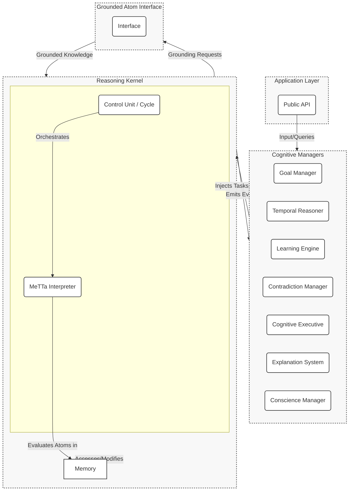

# System Architecture

The HyperNARS architecture is a modular, layered system designed for testability, extensibility, and maintainability. It is centered around two core components: a **Memory** for knowledge representation and the **MeTTa Interpreter** for reasoning and execution.

The system is composed of a central **Reasoning Kernel** that executes the core reasoning cycle, and a suite of specialized **Cognitive Managers** (implemented as MeTTa scripts) that handle higher-level cognitive functions. Communication between these layers is handled via an **asynchronous event bus**.

At the heart of the kernel is the **Memory**, a unified knowledge store containing all of the system's knowledge as MeTTa expressions (atoms). The reasoning process itself is driven by a **MeTTa Interpreter**, which evaluates these expressions. This approach replaces a traditional, fixed set of inference rules with a dynamic, programmable reasoning engine where the rules of inference are themselves atoms in the Memory.

Managers subscribe to events from the kernel and influence the system by injecting new tasks—which are also atoms—into the Memory for the interpreter to process.

## Component Diagram

## Event-Based Communication
The Reasoning Kernel emits events at key points in the reasoning cycle. Cognitive Managers subscribe to these events to perform their functions. Below are core events and their conceptual payloads:

-   **`task-selected`**: Fired when a task is chosen for processing.
    -   **Payload**: The selected `Task`.
-   **`belief-updated`**: Fired when a belief's truth-value is updated.
    -   **Payload**: The `Belief` and its previous `TruthValue`.
-   **`belief-added`**: Fired when a new belief is added to a concept.
    -   **Payload**: The new `Belief`.
-   **`contradiction-detected`**: Fired when a new task or belief directly contradicts an existing belief.
    -   **Payload**: The conflicting `Statement` and the two conflicting `Belief`s.
-   **`concept-activated`**: Fired when a concept's activation level changes.
    -   **Payload**: The `Concept` and its new activation value.
-   **`concept-created`**: Fired when a new concept is created.
    -   **Payload**: The new `Concept`.
-   **`system-idle`**: Fired when the reasoning cycle has no tasks to process.
    -   **Payload**: The duration of the idle period.

Managers can inject new tasks into the system via a dedicated API on the kernel. This is the primary mechanism for managers to influence the reasoning process.

## Pluggable Module Architecture
A core design principle is modularity, allowing different implementations of key components to be swapped out. The system should support a mechanism to select between different versions of its modules at initialization time (e.g., a `SimpleMemoryManager` vs. an `AdvancedMemoryManager`). This allows the system's footprint and complexity to be tailored to the specific application.
