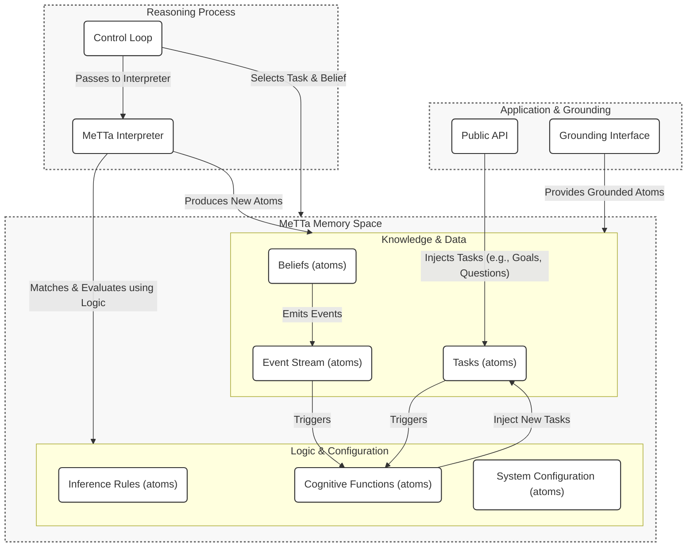

# System Architecture

The HyperNARS architecture is a modular, dynamic system designed around a single, powerful principle: **"Everything is an Atom."** This means all components—knowledge, reasoning rules, cognitive processes, and even the system's configuration—are represented as expressions in the MeTTa (Meta Type Talk) language. This creates an exceptionally flexible, transparent, and self-modifiable system.

The architecture is centered on two core components: a **Memory** space, which holds all atoms, and a **MeTTa Interpreter**, which continuously evaluates atoms to drive the reasoning process. Higher-level cognitive capabilities are not implemented as separate software modules, but as collections of MeTTa atoms called **Cognitive Functions**.

---

## 1. Design Rationale: The Metaprogramming Approach

The choice to build the entire architecture on a programmable, symbolic foundation is deliberate and central to the project's goals.

-   **Ultimate Flexibility**: Traditional architectures have hard-coded components (e.g., event buses, configuration parsers, inference engines). In HyperNARS, these are all implemented as MeTTa programs and data. This means they can be modified, extended, or even replaced at runtime simply by changing the atoms in Memory, without recompiling or restarting the system.

-   **Deep Introspection**: Because the system's own logic and configuration are represented as data, it can "reason about itself." A Cognitive Function can be written to analyze the performance of inference rules, inspect the event stream for patterns, or check the system's configuration for inconsistencies. This is the foundation for true self-awareness and self-improvement.

-   **Simplicity and Elegance**: By using a single representation (Atoms) and a single processing mechanism (the MeTTa Interpreter), the overall complexity of the system is dramatically reduced. There are fewer distinct parts and fewer ad-hoc interfaces. The architecture is defined by the *content* of its Memory, not by a rigid, external structure.

---

## 2. Component Diagram

This diagram illustrates the flow of information and control. It is not a traditional software component diagram, but rather a conceptual map of the MeTTa Memory space.



---

## 3. Event-Driven Communication via MeTTa

The system avoids a traditional, external event bus. Instead, eventing and messaging are handled directly within the MeTTa Memory space, making the communication process itself introspectable and modifiable.

-   **Events as Atoms**: An "event" is simply the act of adding a specific `Event` atom to Memory. (See `DATA_STRUCTURES.md` for the formal schema).
    -   `belief-added` -> `(Event belief-added <belief-1> <belief-2> (now))`
    -   `contradiction-detected` -> `(Event contradiction-detected <belief-1> <belief-2> (now))`

-   **Handlers as MeTTa Rules**: Cognitive Functions "handle" events by defining MeTTa rules that match on these `Event` atoms. They are, in effect, persistent queries over the event stream.
    ```metta
    ;; The ContradictionManager function is just a MeTTa rule.
    (= (handle (Event contradiction-detected $b1 $b2 $t))
       (Goal (resolve-contradiction $b1 $b2)))
    ```

---

## 4. Configurable Architecture via MeTTa

The system's entire configuration is defined by a set of `Config` atoms, typically loaded from a `.metta` file at startup. This allows the system's behavior, capabilities, and even its "personality" to be defined and modified using its own native language.

### Example: `minimalist-reasoner.metta`

This configuration file defines a simple reasoner with only the most basic cognitive functions enabled.

```metta
;; --- minimalist-reasoner.metta ---

;; Define the 'personality' of this instance
(Config personality "Minimalist Reasoner")

;; == Component Selection ==
;; Select the implementation for the core budgeting strategy.
(Config BudgetingStrategy (GroundedAtom "SimpleBudgetingStrategy"))

;; == Cognitive Function Activation ==
;; Define which cognitive functions are active for this run.
(Config (active-function GoalManager) True)
(Config (active-function ContradictionManager) True)
(Config (active-function TemporalReasoner) False)       ; Disabled
(Config (active-function SelfOptimizationManager) False) ; Disabled
(Config (active-function Conscience) False)             ; Disabled

;; == System Parameter Tuning ==
;; Define the system's operational parameters.
;; All schemas are formally defined in DATA_STRUCTURES.md.

;; Default budget for new beliefs asserted from outside (uses Budget schema)
(Config default-belief-budget (Budget 0.9 0.9 0.5))

;; Default budget for new goals asserted from outside (uses Budget schema)
(Config default-goal-budget (Budget 0.99 0.9 0.9))

;; Threshold for the CognitiveExecutive to trigger contradiction management
(Config contradiction-rate-threshold 0.05)

;; == Initial Knowledge ==
;; The configuration can also include initial beliefs to seed the system's memory.

;; A foundational ethical principle (uses Belief and TruthValue schemas).
(Belief <(Forbid (Goal (cause-harm-to-human)))> (TruthValue 1.0 0.99))
```
This approach makes the system's architecture transparent, dynamically reconfigurable, and deeply aligned with the "everything is an atom" philosophy.
