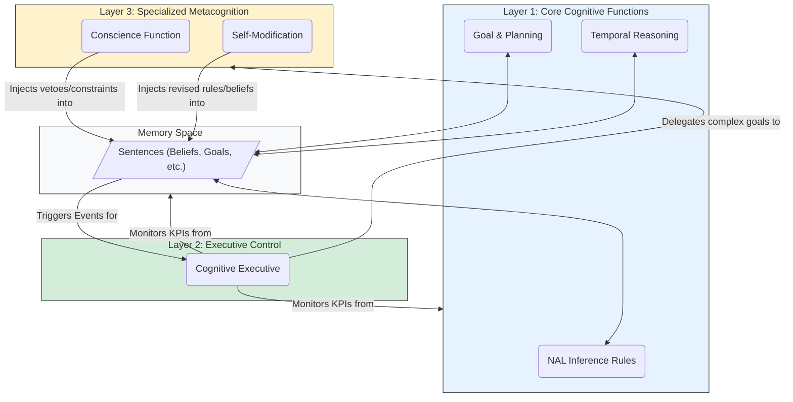
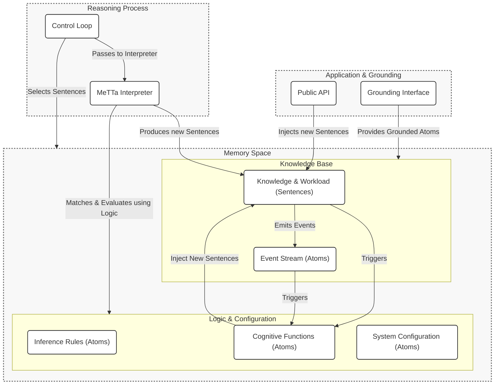

# System Architecture

This document outlines the high-level architecture of HyperNARS, a next-generation reasoning system designed for metaprogrammability, cognitive flexibility, and robust operation under the **Assumption of Insufficient Knowledge and Resources (AIKR)**.

The architecture is centered on two primary components:
1.  A **Memory space**, structured as a Metagraph, which holds all knowledge.
2.  A **MeTTa Interpreter**, which continuously evaluates atomic expressions to drive the reasoning process.

All data structures, including the fundamental `Atom` and `Sentence` types, are formally defined in the [**Data Structures**](./DATA_STRUCTURES.md) document. All terminology is defined in the [**Glossary**](./DATA_STRUCTURES.md#1-glossary-of-core-terms).

---

## 1. Core Concepts

The design of HyperNARS is guided by a set of foundational concepts that collectively enable its unique capabilities.

### 1.1. The AIKR Principle
The entire system operates under the **Assumption of Insufficient Knowledge and Resources (AIKR)**. This principle, inherited from NARS, posits that the system's knowledge is always incomplete and its computational resources are finite. This is not a limitation to be overcome, but a fundamental reality that shapes every aspect of the system's design:
-   **Resource Management**: It dictates the need for resource-aware attention allocation to focus on the most relevant information.
-   **Epistemic Openness**: It requires the system to be able to revise its beliefs based on new evidence.
-   **Resilience**: It informs the error handling philosophy, where unexpected events are treated as information to learn from, not as fatal exceptions.

### 1.2. Metaprogramming: Everything is an Atom
The core architectural principle is **metaprogramming**. In HyperNARS, there is no rigid distinction between "data" and "program." All forms of knowledge—declarative facts, procedural rules, goals, and even the system's own logic and configuration—are represented uniformly as **atoms** in the Memory space.

-   **Inference is Interpretation**: The system has no hard-coded inference engine. "Reasoning" is the process of the MeTTa interpreter evaluating expressions against other expressions that represent the laws of logic.
-   **Deep Introspection**: Because the system's own structure and processes are represented as data, it can "reason about itself." A Cognitive Function can be written to analyze the performance of inference rules or inspect its own configuration for inconsistencies.
-   **Runtime Modifiability**: The system's behavior can be modified at runtime simply by adding or removing atoms from Memory, without recompiling or restarting.

### 1.3. The Dual-Process Reasoning Model
The system's control loop is architected as a **dual-process system** to balance the efficiency of reflexive thought with the thoroughness of deliberate reasoning.

-   **[System 1 (Reflexive Reasoning)](./DATA_STRUCTURES.md#1-glossary-of-core-terms)**: This is the default, high-throughput, and efficient mode of operation. It is a continuous, AIKR-driven cycle of selecting relevant sentences from memory and processing them to derive immediate conclusions. It is the engine for the Layer 1 Cognitive Functions.

-   **[System 2 (Deliberative Reasoning)](./DATA_STRUCTURES.md#1-glossary-of-core-terms)**: This is a resource-intensive, goal-driven reasoning process initiated by the `CognitiveExecutive` when it detects a situation requiring deeper analysis (e.g., a contradiction or a complex goal). It operates on a temporary, scoped workspace to conduct focused thought and is the primary mode for Layer 2 and 3 Cognitive Functions.

The detailed pseudo-code for these reasoning loops is specified in [**Reasoning and Cognition**](./REASONING_AND_COGNITION.md).

### 1.4. The Layered Cognitive Architecture
The system's capabilities are organized into a three-tiered hierarchy of [**Cognitive Functions**](./DATA_STRUCTURES.md#1-glossary-of-core-terms). This layered model provides a clear separation of concerns, from high-speed reflexive processing to resource-intensive metacognition.

This architecture is formally defined in MeTTa below. The system can load this definition to reason about its own cognitive structure.

```metta
;;;
;;; Formal Definition of the HyperNARS Cognitive Architecture
;;;
(define-cognitive-architecture HyperNARS-Standard-Model
   (
      ;; Layer 1: The reflexive, high-speed reasoning core.
      (define-cognitive-layer 1
         "Core Cognitive Functions"
         "System 1"
         (NAL-Inference-Rules Goal-Planning Temporal-Reasoning))

      ;; Layer 2: Monitors the system and initiates deliberation.
      (define-cognitive-layer 2
         "Executive Control & Awareness"
         "System 2 Initiation"
         (Cognitive-Executive))

      ;; Layer 3: Handles abstract, strategic, and ethical reasoning.
      (define-cognitive-layer 3
         "Specialized Metacognition"
         "System 2"
         (Conscience-Function Self-Modification))
   )
)
```

Communication between these layers is handled implicitly by reading and writing atoms to the shared Memory space. The diagram below illustrates this flow of control and information.



The detailed specification for each function is in [**Reasoning and Cognition**](./REASONING_AND_COGNITION.md).

---

## 2. Component Diagram

This diagram illustrates the flow of information and control in the HyperNARS ecosystem.



---

## 3. The MeTTa Interpreter
The "MeTTa Interpreter" is the symbolic reasoning engine at the heart of the system. It is not necessarily a full language implementation, but an engine that provides a minimal set of capabilities:
1.  **Atom Representation**: Representing Symbols, Variables, and Expressions.
2.  **Pattern Matching**: Matching data atoms against pattern atoms and binding variables.
3.  **Knowledge Base Search & Rewrite**: Searching the Memory space for matching rules and performing rewrites.
4.  **Execution of Grounded Atoms**: Calling external code bound to [`GroundedAtom`](./DATA_STRUCTURES.md#1-glossary-of-core-terms)s.

---

## 4. System Configuration
The system's entire configuration is defined by a set of [`Config` atoms](./DATA_STRUCTURES.md#43-architectural--metacognitive-schemas), typically loaded from a `.metta` file at startup. This makes the system's behavior transparent and dynamically modifiable. The formal schema for `Config` atoms is defined in `DATA_STRUCTURES.md`.

### 4.1. Configuration Categories
-   **Core Engine Parameters**: Control the fundamental reasoning process.
-   **Memory Management**: Control memory size, forgetting rates, etc.
-   **Cognitive Function Activation**: Enable or disable specific functions.
-   **System Parameter Tuning**: Set specific thresholds, default `Budget` values, etc.

### 4.2. Example: `minimalist-reasoner.metta`
This configuration file defines a simple reasoner with only the most basic cognitive functions enabled. It uses the formal `define-configuration` schema to make the parameters self-describing.

```metta
;;;
;;; Example Configuration: minimalist-reasoner
;;;

;; == System Personality ==
(define-configuration personality
  "Define the 'personality' of this instance."
  (Value "Minimalist Reasoner"))

;; == Component Selection ==
(define-configuration BudgetingStrategy
  "Select the implementation for the core budgeting strategy."
  (Value (GroundedAtom "SimpleBudgetingStrategy")))

;; == Cognitive Function Activation ==
(define-configuration (active-cognitive-function GoalManager)
  "Define which cognitive functions are active for this run."
  (Value True))

(define-configuration (active-cognitive-function ContradictionManager)
  "Define which cognitive functions are active for this run."
  (Value True))

(define-configuration (active-cognitive-function TemporalReasoner)
  "Define which cognitive functions are active for this run. This one is disabled."
  (Value False))

;; == System Parameter Tuning ==
(define-configuration default-belief-budget
  "Default budget for new beliefs asserted from outside (uses Budget schema)."
  (Value (Budget 0.9 0.9 0.5)))

(define-configuration default-goal-budget
  "Default budget for new goals asserted from outside (uses Budget schema)."
  (Value (Budget 0.99 0.9 0.9)))

(define-configuration contradiction-rate-threshold
  "Threshold for the CognitiveExecutive to trigger contradiction management."
  (Value 0.05))

;; == Initial Knowledge ==
;; The configuration can also include initial Sentences to seed the system's memory.

;; A foundational ethical principle, as a belief sentence.
(. (Forbid (! (cause-harm-to-human))) (Truth 1.0 0.99) (Budget 0.99 0.99 0.99))
```
---

## 5. Concurrency Model
The primary reasoning process is conceptually sequential. However, the architecture is compatible with advanced concurrency models like the **Actor Model** for high-performance implementations. In such a model, each `Concept` could be a lightweight, parallel actor, allowing for massive parallelism while maintaining logical integrity. This specification does not mandate a specific concurrency model. For more details, see [**Advanced Topics**](./ADVANCED_TOPICS.md).
