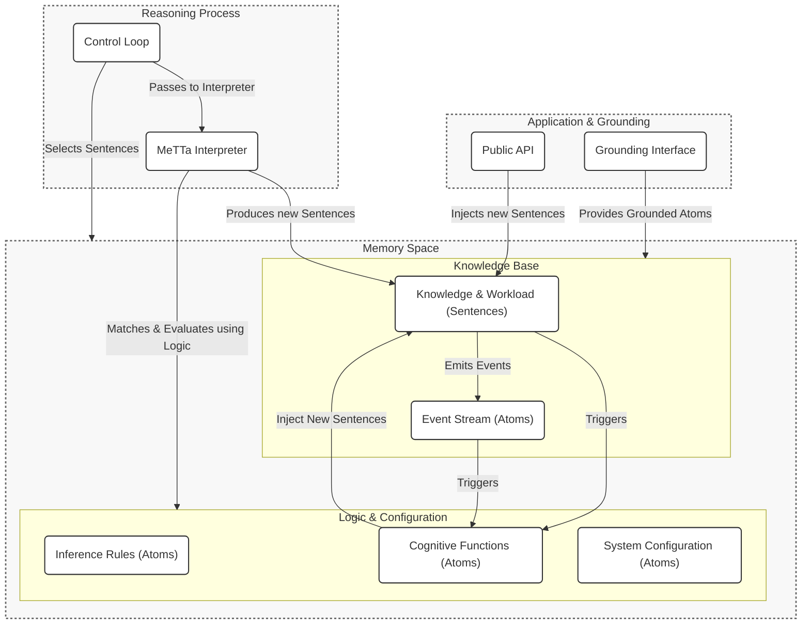

# System Architecture

The HyperNARS architecture is a modular, dynamic system designed around the core principle of metaprogramming. Its behavior is defined not by rigid, hard-coded components, but by the **atoms** held in its memory.

The fundamental data structures, including the `Atom` and the processable `Sentence`, are formally defined in the [**Data Structures**](./DATA_STRUCTURES.md#2-the-conceptual-hierarchy) document. This approach creates an exceptionally flexible, transparent, and self-modifiable system.

The architecture is centered on two core components: a **Memory** space, which holds all data, and a **MeTTa Interpreter**, which continuously evaluates atoms to drive the reasoning process.

---

## 1. Architectural Principles

The system's design is guided by a set of core principles that enable its flexibility and power.

-   **Metaprogramming as a First Principle**: Traditional architectures have hard-coded components (e.g., event buses, configuration parsers, inference engines). In HyperNARS, these are all implemented as MeTTa programs and data. They can be modified at runtime simply by changing the atoms in Memory, without recompiling or restarting the system. For a detailed guide on the practical startup sequence and its relationship to this architectural philosophy, see the [**System Initialization Guide**](./API_AND_INTEGRATION.md#22-bootstrap-process).

-   **Deep Introspection**: Because the system's own logic and configuration are represented as data, it can "reason about itself." A Cognitive Function can be written to analyze the performance of inference rules, inspect the event stream, or check its own configuration for inconsistencies.

-   **Simplicity and Elegance**: By using a single representation for content (Atoms) and a single processing mechanism (the MeTTa Interpreter), the overall complexity is dramatically reduced. The architecture is defined by the *content* of its Memory, not by a rigid, external structure.

-   **Cognitive Functions as Atom Collections**: Higher-level capabilities are not implemented as separate software modules, but as collections of MeTTa atoms. A function like "Goal Planning" is simply a set of inference rules loaded into memory that know how to manipulate `Goal` sentences.

### 1.1. Concurrency Model

The primary reasoning process, described in `REASONING_AND_COGNITION.md`, is the conceptually sequential `reflexive_reasoning_cycle`. However, the architecture is compatible with advanced concurrency models like the **Actor Model** (as discussed in `ADVANCED_TOPICS.md`) as an implementation strategy.

In such a model, each `Concept` could be implemented as a lightweight, parallel actor. The `reflexive_reasoning_cycle` would then represent the logic running *inside* each actor. This allows for massive parallelism at the concept level while maintaining the logical integrity of the reasoning process for each step. This specification does not mandate an Actor Model but highlights it as a viable path for high-performance implementations.

---

## 2. Component Diagram

This diagram illustrates the flow of information and control. It is a conceptual map of the primary data structures and processes in the HyperNARS ecosystem.



---

## 3. The Role of the MeTTa Interpreter

While the specification refers to a "MeTTa Interpreter," the system does not necessarily depend on a full-featured MeTTa (Meta Type Talk) language implementation. Rather, it depends on a symbolic reasoning engine that provides a specific, minimal set of capabilities. This clarifies the boundary between the HyperNARS specification and the underlying interpreter, allowing for a wider range of implementation choices.

An interpreter suitable for HyperNARS must be a symbolic reasoning engine that provides the following core capabilities:

1.  **Pattern Matching with Variable Binding**: The ability to match a data atom against a pattern (or rule) atom, and bind variables in the pattern to the corresponding parts of the data atom.
2.  **Knowledge Base Search & Rewrite**: The ability to take an input expression, find a matching rule in the knowledge base, and perform a rewrite by replacing the expression with the body of the rule, substituting any bound variables. This is the fundamental mechanism of inference.
3.  **Execution of Grounded Atoms**: A mechanism to treat certain atoms as "grounded" (bound to external, non-symbolic code, like a Python function) and execute them. This is critical for calculations, environmental interaction, and calling specialized models.

The fundamental data types manipulated by the interpreter (Symbols, Variables, and Expressions) are formally defined as `Atoms` in the [**Core Data Structures**](./DATA_STRUCTURES.md#31-atom) document. A full MeTTa implementation provides all of these capabilities, but a custom-built engine focused on these features would also be sufficient.

---

## 4. Event-Driven Communication via MeTTa

The system avoids a traditional, external event bus. Instead, eventing and messaging are handled directly within the Memory space using `Event` atoms, making the communication process itself introspectable and modifiable. Cognitive Functions "handle" events by defining MeTTa rules that match these atoms, effectively creating a persistent query over the event stream.

The formal schema for `Event` atoms and other architectural types is defined in the [**System Data Dictionary**](./DATA_STRUCTURES.md#43-architectural--metacognitive-schemas).

---

## 5. Configurable Architecture via MeTTa

The system's entire configuration is defined by a set of `Config` atoms, typically loaded from a `.metta` file at startup. This allows the system's behavior, capabilities, and even its "personality" to be defined and modified using its own native language.

The formal schema for `Config` atoms is defined in the [**System Data Dictionary**](./DATA_STRUCTURES.md#43-architectural--metacognitive-schemas).

### Example: `minimalist-reasoner.metta`

This configuration file defines a simple reasoner with only the most basic cognitive functions enabled.

```metta
;; --- minimalist-reasoner.metta ---

;; Define the 'personality' of this instance
(Config personality "Minimalist Reasoner")

;; == Component Selection ==
;; Select the implementation for the core budgeting strategy.
(Config BudgetingStrategy (GroundedAtom "SimpleBudgetingStrategy"))

;; == Cognitive Function Activation ==
;; Define which cognitive functions are active for this run.
(Config (active-cognitive-function GoalManager) True)
(Config (active-cognitive-function ContradictionManager) True)
(Config (active-cognitive-function TemporalReasoner) False)       ; Disabled
(Config (active-cognitive-function SelfOptimizationManager) False) ; Disabled
(Config (active-cognitive-function Conscience) False)             ; Disabled

;; == System Parameter Tuning ==
;; Define the system's operational parameters.
;; All schemas are formally defined in DATA_STRUCTURES.md.

;; Default budget for new beliefs asserted from outside (uses Budget schema)
(Config default-belief-budget (Budget 0.9 0.9 0.5))

;; Default budget for new goals asserted from outside (uses Budget schema)
(Config default-goal-budget (Budget 0.99 0.9 0.9))

;; Threshold for the CognitiveExecutive to trigger contradiction management
(Config contradiction-rate-threshold 0.05)

;; == Initial Knowledge ==
;; The configuration can also include initial Sentences to seed the system's memory.

;; A foundational ethical principle, as a belief sentence.
(. (Forbid (! (cause-harm-to-human))) (Truth 1.0 0.99) (Budget 0.99 0.99 0.99))
```
