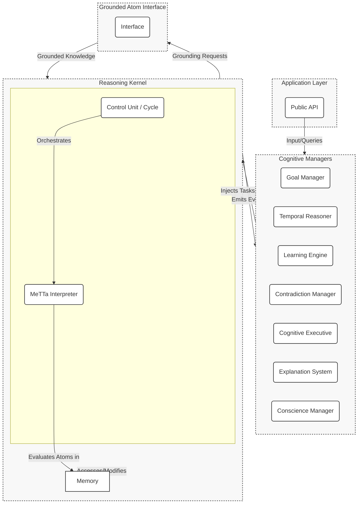

# System Architecture

The HyperNARS architecture is a modular, layered system designed for testability, extensibility, and maintainability. It is centered around two core components: a **Memory** for knowledge representation and the **MeTTa Interpreter** for reasoning and execution.

The system is composed of a central **Reasoning Kernel** that executes the core reasoning cycle, and a suite of specialized **Cognitive Managers** (implemented as MeTTa scripts) that handle higher-level cognitive functions. Communication between these layers is handled via an **asynchronous event bus**.

At the heart of the kernel is the **Memory**, a unified knowledge store containing all of the system's knowledge as MeTTa expressions (atoms). The reasoning process itself is driven by a **MeTTa Interpreter**, which evaluates these expressions. This approach replaces a traditional, fixed set of inference rules with a dynamic, programmable reasoning engine where the rules of inference are themselves atoms in the Memory.

Managers subscribe to events from the kernel and influence the system by injecting new tasks—which are also atoms—into the Memory for the interpreter to process.

## Component Diagram



## Event-Driven Architecture via MeTTa
To push the principle of "everything is an atom" further, the system avoids a traditional, external event bus. Instead, eventing and messaging are handled directly within the MeTTa Memory space.

-   **Events as Atoms**: The Reasoning Kernel "emits" an event by adding a timestamped `Event` atom to a special, high-priority `&events` atomspace.
    -   `belief-added` -> `(Event belief-added <belief-id> (now))`
    -   `contradiction-detected` -> `(Event contradiction-detected <belief-id-1> <belief-id-2> (now))`
-   **Managers as Event Handlers**: Cognitive Managers are implemented as sets of MeTTa rules that match on these `Event` atoms. They are, in effect, persistent queries over the `&events` space.
    ```metta
    ;; The ContradictionManager is just a MeTTa rule.
    (= (handle (Event contradiction-detected $b1 $b2 $t))
       (resolve-contradiction $b1 $b2))
    ```
-   **Benefits of this Approach**:
    -   **Unified Representation**: The eventing mechanism is no longer a separate, special-purpose piece of engineering. It is part of the core knowledge and reasoning system.
    -   **Introspection**: The system can reason about its own event stream. It can analyze event frequency, detect patterns, and even learn to anticipate events.
    -   **Dynamic Handlers**: New event handlers can be added or modified at runtime simply by adding new MeTTa rules to Memory, enabling powerful runtime adaptability.

## Configurable Architecture via MeTTa
A core design principle is modularity. To embody this in a "dogfooding" spirit, the system's own architectural configuration is defined as a set of MeTTa atoms, typically loaded from a `config.metta` file at startup.

This allows the system's footprint and complexity to be tailored to the specific application using its own native representation.

-   **Module Selection**: The configuration file specifies which implementation to use for each pluggable component.
    ```metta
    ;; Select the memory manager implementation for this run
    (= (config MemoryManager) (GroundedAtom "SimpleMemoryManager"))

    ;; For a more advanced setup, one might use:
    ; (= (config MemoryManager) (GroundedAtom "DistributedActorMemoryManager"))
    ```
-   **Cognitive Manager Activation**: The configuration can also enable or disable specific cognitive managers, allowing for different "personalities" or operational profiles.
    ```metta
    ;; Configure the set of active cognitive managers for this run
    (= (active-manager GoalManager) True)
    (= (active-manager TemporalReasoner) True)
    (= (active-manager SelfOptimizationManager) False) ;; Disabled for this run
    ```
-   **Parameter Tuning**: Other system parameters, such as default budget allocations or forgetting rates, can also be defined in this file, making the system's fundamental behaviors transparent and modifiable.
    ```metta
    (= (config default-belief-budget) (Budget 0.9 0.9 0.5))
    ```
