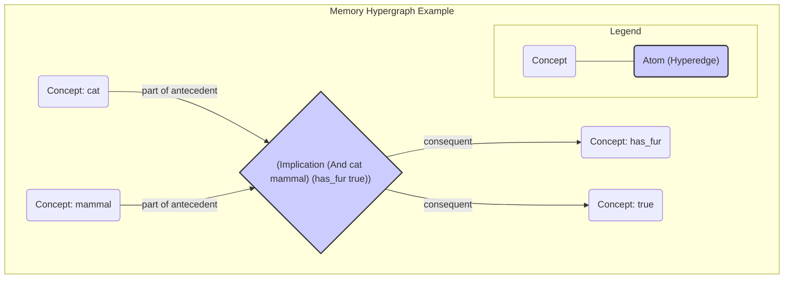

# Memory and Resource Management

The Memory System is the core of the system's knowledge base. The AIKR principle is implemented through a sophisticated resource management system that governs how knowledge is stored, prioritized, and forgotten.

## The Memory Hypergraph

The memory is structured as a dynamic **hypergraph** (specifically, a Hyperon Atomspace or Metagraph), where `Concept`s (representing key atoms) are vertices and all other `Atoms` are hyperedges that can connect any number of vertices. This allows for representing complex, compositional knowledge. Unlike a traditional hypergraph, the metagraph's edges (Links) can connect to other Links, allowing for the representation of nested and self-referential knowledge.

**Hypergraph Visualization:**
The following diagram illustrates how a complex belief is represented as a single atom/hyperedge connecting multiple concepts. The central diamond represents the hyperedge for the atom `(Implication (And cat mammal) (has_fur true))`.

## Economic Attention Allocation (ECAN)

Resource management is guided by Hyperon's **Economic Attention Allocation (ECAN)** model. The NARS `Budget` system is mapped to ECAN concepts, where the `priority` and `durability` of a NARS budget correspond to the **Short-Term Importance (STI)** and **Long-Term Importance (LTI)** values of an Atom in Memory.

-   **Activation Spreading**: This is the mechanism for managing the system's focus. The activation of concepts is managed by the spreading of STI values through the Memory metagraph. When an Atom is accessed, its STI increases, and this importance spreads to related Atoms, bringing relevant knowledge into the system's focus. This activation should decay over time.

-   **Contextual Attention**: The system should support a mechanism for managing short-term focus, such as a context stack that temporarily boosts the importance of concepts relevant to the current task.

## Forgetting Algorithms

Forgetting is a natural and essential outcome of resource management under AIKR. A continuous process removes Atoms with low LTI and STI from Memory, ensuring that the system's finite resources are focused on the most relevant and important knowledge. This is implemented via several complementary strategies:

-   **Relevance-Based Forgetting**: Continuously removing the least relevant item (belief or task) from a concept when its capacity is exceeded.
-   **TTL-Based Pruning**: Periodically pruning beliefs that are both old and have low confidence.
-   **Dynamic Capacity/Rate Adjustment**: Dynamically adjusting the memory capacity of concepts or the rate of forgetting based on overall system load.

## Indexing Strategies

To ensure efficient retrieval of information from Memory, the system should employ specialized index data structures, such as:

-   A term-based index (e.g., a prefix tree) for efficient, category-based term searches.
-   A structural index that groups statements by their form (copula and arity) for fast pattern-matching by inference rules.
-   A temporal index (e.g., an interval tree) for efficient querying of events that overlap with a given time interval.
