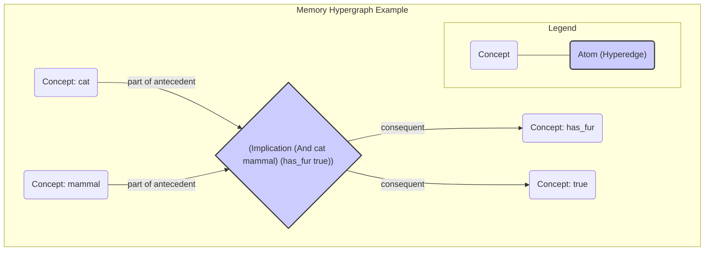

# Memory and Resource Management

The Memory System is the core of the system's knowledge base. The AIKR principle is implemented through a sophisticated resource management system that governs how knowledge is stored, prioritized, and forgotten.

## The Memory Hypergraph

The memory is structured as a dynamic **hypergraph** (specifically, a Hyperon Atomspace or Metagraph), where `Concept`s (representing key atoms) are vertices and all other `Atoms` are hyperedges that can connect any number of vertices. This allows for representing complex, compositional knowledge. Unlike a traditional hypergraph, the metagraph's edges (Links) can connect to other Links, allowing for the representation of nested and self-referential knowledge.

**Hypergraph Visualization:**
The following diagram illustrates how a complex belief is represented as a single atom/hyperedge connecting multiple concepts. The central diamond represents the hyperedge for the atom `(Implication (And cat mammal) (has_fur true))`.



## Pluggable Attention Allocation

A key aspect of the architecture's flexibility is its pluggable model for attention allocation. The system is not hard-coded to a single resource management algorithm. Instead, it defines a standard interface, `BudgetingStrategy`, that different allocation models can implement. The system can be configured to use a specific strategy at startup.

### The `BudgetingStrategy` Interface
This is a language-agnostic interface that any budgeting model must adhere to. It defines the core operations for managing the lifecycle of `Budget`s and an item's importance in memory.

```
interface BudgetingStrategy {
    // Calculates the initial budget for a new task injected into the system.
    function calculate_initial_budget(task: Task) -> Budget;

    // Calculates the budget for a new task derived from parent premises.
    function calculate_derived_task_budget(parent_task: Task, parent_belief: Belief) -> Budget;

    // Updates the importance of an item (e.g., a Belief) in memory after it's accessed.
    function update_item_importance(item: (Belief | Concept)) -> void;

    // Determines whether a given item should be removed from memory.
    function should_forget_item(item: (Belief | Task)) -> bool;

    // A periodic function to handle system-wide updates, like importance decay.
    function perform_housekeeping() -> void;
}
```

### Example Implementation: Economic Attention Allocation (ECAN)

One possible implementation of `BudgetingStrategy` is based on Hyperon's **Economic Attention Allocation (ECAN)** model. In this model, the `priority` and `durability` of a NARS `Budget` correspond to an Atom's **Short-Term Importance (STI)** and **Long-Term Importance (LTI)**.

-   **STI (Short-Term Importance)**: Represents the immediate relevance of an item. It spikes when an item is used in reasoning and decays over time. This maps to a `Budget`'s `priority`.
-   **LTI (Long-Term Importance)**: Represents the long-term value or usefulness of an item. It increases when an item is involved in successful, high-quality inferences. This maps to a `Budget`'s `durability`.

***Algorithm for STI Update and Spreading:***
When a `Belief` is accessed during an inference step:
1.  The `Belief`'s STI is boosted by a fixed amount.
2.  A fraction of this boosted STI is then spread to neighboring `Concept`s in the hypergraph, making related knowledge more accessible.
3.  The `CognitiveExecutive` can dynamically adjust the spreading factor based on system goals (e.g., increase for "focused thought", decrease for "brainstorming").

***Algorithm for LTI Update:***
When a derived `Task` is created:
1.  The `quality` of the new `Task`'s `Budget` is calculated based on the confidence of the inference and the truth-values of the parents.
2.  The LTI of the parent `Belief`s is increased proportionally to the `quality` of the conclusion they helped produce. A belief that consistently contributes to high-quality conclusions will see its LTI increase over time.

***Housekeeping and Decay:***
The `perform_housekeeping` function for ECAN would implement a decay formula for all STI values in memory:
`new_STI = current_STI * (1 - decay_factor)`

## Forgetting Algorithms

Forgetting is a natural and essential outcome of resource management under AIKR. The `should_forget_item` function of a `BudgetingStrategy` implements the logic for removing items. This ensures that the system's finite resources are focused on the most relevant and important knowledge.

Below are more detailed, language-agnostic descriptions of common forgetting strategies.

-   **Capacity-Based Forgetting**: Each `Concept` has a limited capacity for `Beliefs` and `Tasks`. When a new item is added and the capacity is exceeded, the item with the lowest importance (e.g., lowest STI in the ECAN model) is removed.
    ```pseudo
    function add_item_to_concept(item, concept) {
        if concept.size() >= concept.capacity() {
            lowest_importance_item = concept.find_item_with_lowest_importance();
            concept.remove(lowest_importance_item);
        }
        concept.add(item);
    }
    ```
-   **TTL-Based Pruning (Time-to-Live)**: A background process periodically scans `Beliefs`. If a belief is both old (based on its creation timestamp) and has an importance value below a certain threshold, it is pruned.
    ```pseudo
    function prune_old_beliefs() {
        FOR belief IN all_beliefs {
            IF (now() - belief.created_at > TTL_THRESHOLD) AND
               (belief.importance < IMPORTANCE_THRESHOLD) {
                memory.remove(belief);
            }
        }
    }
    ```
-   **Dynamic Forgetting Rate**: The `CognitiveExecutive` can adjust the forgetting thresholds based on system load. If memory utilization is high, it might increase the `IMPORTANCE_THRESHOLD` to be more aggressive in its forgetting, and vice-versa.

## Memory Performance Monitoring

The system must be able to reason about the efficiency of its own memory system. The `CognitiveExecutive` monitors these metrics, which are stored as `Beliefs` in Memory, to detect problems and guide optimization.

| KPI Name | Description | Example MeTTa Representation |
| :--- | :--- | :--- |
| `memory_utilization`| The percentage of total memory capacity currently being used. | `(has-value (kpi memory_utilization) 0.85)` |
| `concept_hit_rate` | The percentage of times a selected `Concept` contains a useful `Belief` for the current `Task`. Low rates may indicate poor concept formation or activation spreading. | `(has-value (kpi concept_hit_rate) 0.60)` |
| `forgetting_rate` | The number of items being forgotten per second. Can be used to tune forgetting algorithm aggressiveness. | `(has-value (kpi forgetting_rate) 50)` |
| `index_lookup_time` | The average time taken to retrieve an item from an index. Spikes might indicate a need for index maintenance. | `(has-value (kpi index_lookup_time) (2 milliseconds))` |
| `lti_distribution` | A histogram of the LTI values of all items. Can reveal if the system is failing to identify long-term important knowledge. | `(has-value (kpi lti_distribution) (histogram ...))` |


## Indexing Strategies

To ensure efficient retrieval of information from Memory, the system should employ specialized index data structures, such as:

-   A term-based index (e.g., a prefix tree) for efficient, category-based term searches.
-   A structural index that groups statements by their form (copula and arity) for fast pattern-matching by inference rules.
-   A temporal index (e.g., an interval tree) for efficient querying of events that overlap with a given time interval.
