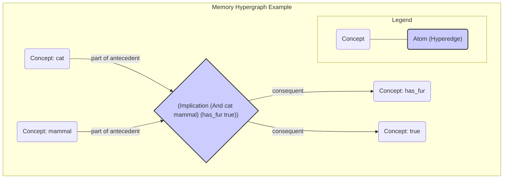

# Memory and Resource Management

This document describes the structure of the system's memory and the resource management strategies used to govern it. The entire memory system operates under the core [**AIKR principle**](./ARCHITECTURE.md#11-the-aikr-principle).

All terminology is formally defined in the [**Glossary**](./DATA_STRUCTURES.md#1-glossary-of-core-terms).

## 1. The Memory Hypergraph

The memory is structured as a dynamic [**Metagraph**](./DATA_STRUCTURES.md#1-glossary-of-core-terms) (also known as a hypergraph), where [`Concept`](./DATA_STRUCTURES.md#1-glossary-of-core-terms)s serve as vertices and [`Atom`](./DATA_STRUCTURES.md#1-glossary-of-core-terms)s serve as hyperedges. This structure is ideal for representing complex, compositional, and self-referential knowledge.

**Hypergraph Visualization:**
The following diagram illustrates how a complex belief is represented as a single atom/hyperedge connecting multiple concepts. The central diamond represents the hyperedge for the atom `(Implication (And cat mammal) (has_fur true))`.



## 2. Pluggable Attention Allocation

A key aspect of the architecture's flexibility is its pluggable model for attention allocation. The system is not hard-coded to a single resource management algorithm. Instead, it defines a standard interface, `BudgetingStrategy`, that different allocation models can implement. The system can be configured to use a specific strategy at startup.

### 2.1. The `BudgetingStrategy` Interface
This is a language-agnostic interface that any budgeting model must adhere to. It defines the core operations for managing the lifecycle of `Budget`s and an item's importance in memory.

```
interface BudgetingStrategy {
    // Calculates the initial budget for a new sentence injected into the system.
    function calculate_initial_budget(sentence: Sentence) -> Budget;

    // Calculates the budget for a new sentence derived from parent sentences.
    function calculate_derived_budget(parent_1: Sentence, parent_2: Sentence) -> Budget;

    // Updates the importance of an item (e.g., a Sentence or Concept) in memory after it's accessed.
    function update_item_importance(item: (Sentence | Concept)) -> void;

    // Determines whether a given item should be removed from memory.
    function should_forget_item(item: Sentence) -> bool;

    // A periodic function to handle system-wide updates, like importance decay.
    function perform_housekeeping() -> void;
}
```

### 2.2. Example Implementation: Economic Attention Allocation (ECAN)

One possible implementation of `BudgetingStrategy` is based on Hyperon's [**Economic Attention Allocation (ECAN)**](./DATA_STRUCTURES.md#1-glossary-of-core-terms) model. In this model, the `priority` and `durability` of a NARS [`Budget`](./DATA_STRUCTURES.md#1-glossary-of-core-terms) are mapped to an Atom's [**Short-Term Importance (STI)**](./DATA_STRUCTURES.md#1-glossary-of-core-terms) and [**Long-Term Importance (LTI)**](./DATA_STRUCTURES.md#1-glossary-of-core-terms), which are defined in the [**Glossary**](./DATA_STRUCTURES.md#1-glossary-of-core-terms).

***Algorithm for STI Update and Spreading:***
When a `Sentence` is accessed during an inference step:
1.  The `Sentence`'s STI is boosted by a fixed amount.
2.  A fraction of this boosted STI is then spread to neighboring `Concept`s in the hypergraph, making related knowledge more accessible.
3.  The `CognitiveExecutive` can dynamically adjust the spreading factor based on system goals (e.g., increase for "focused thought", decrease for "brainstorming").

***Algorithm for LTI Update:***
When a derived `Sentence` is created:
1.  The `quality` of the new `Sentence`'s `Budget` is calculated based on the confidence of the inference and the truth-values of the parents.
2.  The LTI of the parent `Sentence`s is increased proportionally to the `quality` of the conclusion they helped produce. A sentence that consistently contributes to high-quality conclusions will see its LTI increase over time.

***Housekeeping and Decay:***
The `perform_housekeeping` function for ECAN would implement a decay formula for all STI values in memory:
`new_STI = current_STI * (1 - decay_factor)`

## 3. Forgetting Algorithms

Forgetting is a natural and essential outcome of resource management under AIKR. These algorithms are typically implemented via the [**`Bag`**](./DATA_STRUCTURES.md#34-bag) data structure, which is used within each `Concept` to hold `Sentences`. The `should_forget_item` function of a `BudgetingStrategy` implements the logic for determining which items to remove.

Below are more detailed, language-agnostic descriptions of common forgetting strategies.

-   **Capacity-Based Forgetting**: This is the primary mechanism of the `Bag` data structure. A `Bag` has a limited capacity, and when a new item is added to a full `Bag`, the existing item with the lowest priority is automatically evicted.
    ```pseudo
    function add_item_to_bag(item, bag) {
        if bag.size() >= bag.capacity() {
            // The Bag data structure itself handles finding and removing
            // the item with the lowest priority.
            evicted_item = bag.evict_lowest_priority_item();
        }
        bag.add(item);
    }
    ```
-   **TTL-Based Pruning (Time-to-Live)**: A background process periodically scans `Sentences`. If a sentence is both old (based on its creation timestamp) and has an importance value below a certain threshold, it is pruned.
    ```pseudo
    function prune_old_sentences() {
        FOR sentence IN all_sentences {
            IF (now() - sentence.created_at > TTL_THRESHOLD) AND
               (sentence.importance < IMPORTANCE_THRESHOLD) {
                memory.remove(sentence);
            }
        }
    }
    ```
-   **Dynamic Forgetting Rate**: The `CognitiveExecutive` can adjust the forgetting thresholds based on system load. If memory utilization is high, it might increase the `IMPORTANCE_THRESHOLD` to be more aggressive in its forgetting, and vice-versa.

## 4. Memory Performance Monitoring

The `CognitiveExecutive` monitors memory-related KPIs to detect problems and guide optimization. The authoritative list of all system KPIs is defined in [**`DATA_STRUCTURES.md`**](./DATA_STRUCTURES.md#5-self-monitoring-kpis).


## 5. Indexing Strategies

To ensure efficient retrieval of information from Memory, the system should employ specialized index data structures, such as:

-   A term-based index (e.g., a prefix tree) for efficient, category-based term searches.
-   A structural index that groups statements by their form (copula and arity) for fast pattern-matching by inference rules.
-   A temporal index (e.g., an interval tree) for efficient querying of events that overlap with a given time interval.
