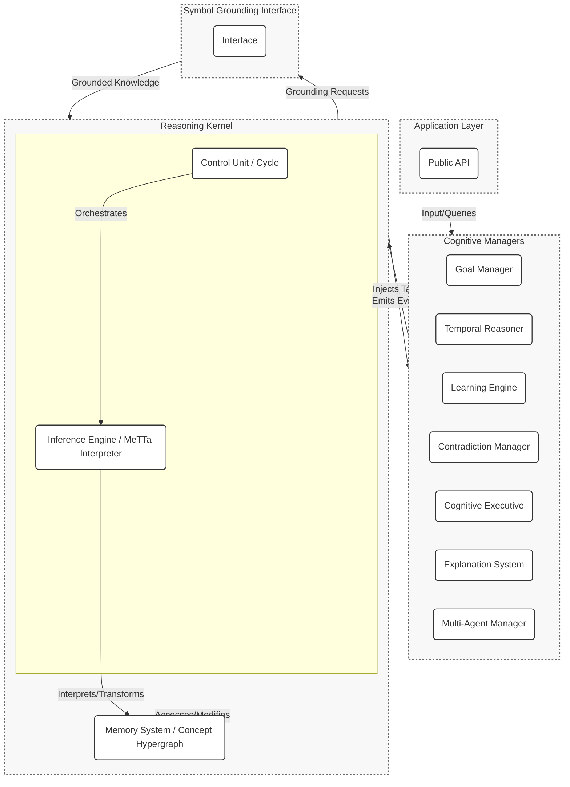

# HyperNARS: A High-Level Architecture

## Overview

HyperNARS is a from-the-ground-up reimplementation of the Non-Axiomatic Reasoning System (NARS). It is designed as a highly modular, extensible, and performant framework for general-purpose AI, grounded in the **Assumption of Insufficient Knowledge and Resources (AIKR)**.

The primary goal of this project is to define a robust and scalable architecture that facilitates research and development in AGI. Key architectural features include:
- A **dual-process reasoning cycle** to balance efficiency and thoroughness.
- A suite of specialized **Cognitive Managers** to handle high-level functions like goal pursuit and temporal reasoning.
- An **event-driven architecture** to ensure loose coupling between components.
- A comprehensive **Symbol Grounding Interface** to connect abstract knowledge to real-world sensors and actuators.

This document serves as the primary architectural specification for the HyperNARS system.

## Guiding Principles

The architecture of HyperNARS is guided by a set of core principles that ensure its adherence to the NARS philosophy.

-   **Assumption of Insufficient Knowledge and Resources (AIKR):** This is the cornerstone of NARS. The system must operate under the assumption that its knowledge is incomplete and potentially contradictory, and that its computational resources are finite. This principle directly influences every aspect of the design, from truth-value representation to memory management and resource allocation.
-   **Modularity and Extensibility:** The system is built as a collection of loosely-coupled modules (e.g., Reasoning Kernel, Cognitive Managers). This allows for independent development, testing, and replacement of components, facilitating research and experimentation.
-   **Event-Driven Communication:** Components interact primarily through an asynchronous event bus. This decouples the modules, allowing for complex, emergent behaviors to arise from simple, local interactions.
-   **Continuous Online Learning:** HyperNARS is designed to learn from its experience in real-time. It constantly revises its beliefs, adjusts the utility of its inference rules, and adapts its behavior based on feedback.
-   **Symbol Grounding:** The system includes a dedicated interface for grounding abstract symbols to external sensors and actuators, providing a pathway for the system to interact with and learn from the real world.

---

1.  [System Architecture](#system-architecture)
2.  [Core Data Structures](#core-data-structures)
3.  [The Reasoning Cycle (Control Unit)](#the-reasoning-cycle-control-unit)
4.  [Cognitive Managers](#cognitive-managers)
5.  [Inference Engine](#inference-engine)
6.  [Memory System](#memory-system)
7.  [I/O and Public API](#io-and-public-api)
8.  [Symbol Grounding and Embodiment](#symbol-grounding-and-embodiment)
9.  [Extension Points](#extension-points)
10. [System Initialization and Configuration](#system-initialization-and-configuration)
11. [Concurrency and Parallelism](#concurrency-and-parallelism)
12. [State Serialization and Persistence](#state-serialization-and-persistence)
13. [Self-Governing Evolution: An Ambition for Autonomy](#self-governing-evolution-an-ambition-for-autonomy)
14. [System Bootstrapping and Foundational Knowledge](#system-bootstrapping-and-foundational-knowledge)
15. [Ethical Alignment and Safety](#ethical-alignment-and-safety)
16. [Error Handling and System Resilience](#error-handling-and-system-resilience)
17. [Verification Strategy (see TEST.md)](TEST.md)

## 1. System Architecture

The HyperNARS architecture is designed as a modular, layered system. This approach enhances testability, extensibility, and maintainability.

The system is composed of a central **Reasoning Kernel** that executes the core reasoning cycle, and a suite of specialized **Cognitive Managers** that handle higher-level cognitive functions. This separation of concerns ensures the kernel remains lean and focused on pure NARS logic, while complex behaviors can be developed and tested independently in the managers.

Communication is primarily handled via an **asynchronous event bus**. The Reasoning Kernel emits events at key points in its cycle, and managers subscribe to these events to perform their functions. This ensures loose coupling and allows for flexible, emergent behavior. Managers can influence the kernel by injecting new tasks into its processing queue.

### Event-Based Communication
The Reasoning Kernel emits events at key points in the reasoning cycle. Cognitive Managers subscribe to these events to perform their functions. Below are core events and their conceptual payloads:

-   **`task-selected`**: Fired when a task is chosen for processing.
    -   **Payload**: The selected `Task`.
-   **`belief-updated`**: Fired when a belief's truth-value is updated.
    -   **Payload**: The `Belief` and its previous `TruthValue`.
-   **`belief-added`**: Fired when a new belief is added to a concept.
    -   **Payload**: The new `Belief`.
-   **`contradiction-detected`**: Fired when a new task or belief directly contradicts an existing belief.
    -   **Payload**: The conflicting `Statement` and the two conflicting `Belief`s.
-   **`concept-activated`**: Fired when a concept's activation level changes.
    -   **Payload**: The `Concept` and its new activation value.
-   **`concept-created`**: Fired when a new concept is created.
    -   **Payload**: The new `Concept`.
-   **`system-idle`**: Fired when the reasoning cycle has no tasks to process.
    -   **Payload**: The duration of the idle period.

Managers can inject new tasks into the system via a dedicated API on the kernel. This is the primary mechanism for managers to influence the reasoning process.

### Component Diagram


### 1.1. MeTTa: The Language of Thought
HyperNARS adopts **MeTTa (Meta Type Talk)** as its core symbolic language, replacing traditional Narsese. MeTTa is a highly flexible, functional language designed for AGI, where every component of the system—from simple concepts to complex inference rules and even the inference engine itself—is represented as a MeTTa expression. This "everything is an expression" philosophy provides several key advantages:

-   **Unification of Knowledge and Procedure**: MeTTa seamlessly blends declarative knowledge (what the system knows) with procedural knowledge (what the system can do). A statement like `(implies (bird $x) (flyer $x))` is data, but it is also an executable program for deriving new knowledge.
-   **Intrinsic Support for Higher-Order Reasoning**: Because MeTTa expressions can manipulate other MeTTa expressions, the system can naturally reason about its own knowledge and reasoning processes. This is fundamental for self-reflection, learning, and adaptation.
-   **Extensibility**: New logical connectives, inference rules, or even entire sub-languages can be defined within MeTTa itself, without altering the core interpreter.
-   **Symbol Grounding as Function Calls**: Grounding symbols to external sensors or actuators becomes a natural extension of the language, where a symbol is simply bound to a function in the host environment.

### 1.2. Pluggable Module Architecture
A core design principle is modularity, allowing different implementations of key components to be swapped out. The system should support a mechanism to select between different versions of its modules at initialization time (e.g., a `SimpleMemoryManager` vs. an `AdvancedMemoryManager`). This allows the system's footprint and complexity to be tailored to the specific application.

### 1.3. Cognitive Manager Roles

The Cognitive Managers are specialized, pluggable modules that handle complex, cross-cutting concerns. They operate by subscribing to events from the Reasoning Kernel and can inject new tasks back into the system to influence its behavior. Their detailed functionality is described in Section 4.

## 2. Core Data Structures

All core data structures in HyperNARS are represented as **MeTTa expressions**. The system's state is embodied in a collection of these expressions stored in Memory. The primary types are:

-   **Symbol**: An atomic, indivisible identifier. It is the simplest form of a MeTTa expression. For example: `bird`, `flyer`, `implies`.

-   **Expression**: A sequence of other MeTTa expressions (Symbols or other Expressions), representing a structured piece of information or a program. For example: `(implies (bird $x) (flyer $x))`. This replaces the legacy `CompoundTerm` and `Statement` distinction, unifying them into a single, powerful construct.

-   **Statement**: A declarative MeTTa expression that asserts a belief. These are typically expressions that can be assigned a `TruthValue`. For example, `(Inheritance bird animal)` is a statement expressed in MeTTa syntax.

-   **TruthValue**: Represents the epistemic value of a statement. It is defined by components like frequency, confidence, and doubt. The architecture must define functions for:
    -   **Revision**: A function to combine two truth values into one, representing the synthesis of evidence. The function should weigh evidence based on confidence.
    -   **Projection**: A function to calculate the truth value of a component derived from a larger compound statement. This typically involves reducing confidence.
    -   **Conjunction (and)**: A function to calculate the truth value of a conjunction of two statements.
    -   **Disjunction (or)**: A function to calculate the truth value of a disjunction of two statements.

-   **Budget**: Represents the allocation of computational resources to a task. It is defined by components like `priority` (immediate importance), `durability` (long-term importance), and `quality` (well-foundedness). The architecture must define functions for:
    -   **Allocation**: A function to allocate a budget to a new task. This function should be configurable and consider factors like the task's origin (e.g., `input`, `derived`, `goal`), novelty, urgency, parent belief quality, and overall system load.
    -   **Merging**: A function to merge the budgets of parent tasks to determine the budget of a derived task.

-   **Belief**: An immutable pairing of a `Statement` and its `TruthValue`, with a timestamp to mark its creation time.

-   **Task**: A work unit for the system, containing a `Statement` to be processed. It includes a `Budget` and references to its parent beliefs for provenance.

-   **Stamp**: A mechanism attached to each `Task` to prevent infinite reasoning loops and redundant derivations. It records the ancestral history of the task. Before an inference is made, the stamps of the parent premises are checked for overlap. The architecture should allow for different stamp implementations, representing a trade-off between logical perfection and resource efficiency:
    -   **Evidential Base**: A precise but potentially large representation of the full derivational history.
    -   **Probabilistic Representation**: A fixed-size, memory-efficient representation (e.g., a Bloom filter) that is faster but allows for a small chance of false positives.

-   **Concept**: A node in the memory graph representing a `Term`. It contains all `Beliefs` and `Tasks` directly related to that term, along with its current `activation` level. It is responsible for managing its local content, including adding new beliefs (and revising existing ones) and prioritizing tasks. It also contains a forgetting mechanism to discard less relevant items when its capacity is exceeded.

## 3. The Reasoning Cycle: A Dual-Process Control Unit

To balance efficiency and thoroughness, the reasoning cycle is architected as a **dual-process system**. This allows the system to handle routine inferences rapidly while dedicating more resources to complex or novel situations. The **Cognitive Executive** manager is responsible for orchestrating the transition between these two modes.

### 3.1. System 1: The Reflexive Reasoning Loop

This is the default, high-throughput operational mode. The conceptual flow is as follows:
1.  **Select Task**: A concept and a high-priority task are selected from memory based on a global attention mechanism.
2.  **Select Belief**: A relevant belief is selected from the chosen concept to interact with the task.
3.  **Local Inference**: The inference engine applies all relevant inference rules to the task and belief, generating new derived tasks.
4.  **Process Results**: The derived tasks are budgeted and added to the appropriate concepts in memory.
5.  **Hooks**: The cycle provides hooks for other modules to run logic `before` and `after` the main steps.

### 3.2. System 2: The Deliberative Reasoning Process

This is a resource-intensive, goal-driven process initiated by the Cognitive Executive when it detects situations requiring deeper analysis, such as:
-   High-impact contradictions or paradoxes.
-   The pursuit of a complex, high-priority goal.
-   An explicit command to "think about" a topic.

The deliberative process involves steps like:
1.  **Context Scoping**: Focusing resources on the relevant part of the knowledge base.
2.  **Hypothesis Generation**: Generating multiple competing hypotheses to explain a situation.
3.  **Evidence Gathering**: Actively seeking evidence for or against the generated hypotheses.
4.  **Conclusion & Action**: Committing to a resolution, which could involve revising a core belief, adjusting an inference rule's utility, or formulating a multi-step plan.

### 3.3. Task and Belief Selection Algorithms

The functions for selecting tasks and beliefs are critical for guiding the system's attention.
-   **Task Selection**: This should be a two-level process. First, a `Concept` is selected from the entire memory, with selection probability proportional to the concept's activation level. Second, the highest-priority `Task` is selected from that concept's local task queue.
-   **Belief Selection**: Given a task, a relevant `Belief` must be selected from the concept. This selection should be based on a relevance score, which could factor in the belief's confidence and its structural similarity to the task.

## 4. Cognitive Managers
The Cognitive Managers are specialized, pluggable modules that handle complex, cross-cutting concerns. They operate by subscribing to events from the Reasoning Kernel and can inject new tasks back into the system to influence its behavior.

### 4.1. Goal Manager
Responsible for goal-oriented behavior, including planning, execution monitoring, and skill acquisition.
-   *Subscribes to*: `belief-updated`, `belief-added`, `afterCycle`.
-   **Core Capabilities**: Manages a goal lifecycle (`active`, `waiting`, `achieved`, `abandoned`), prioritizes goals, and selects actions. It can search for known procedural rules (e.g., `((*,(Pre, Op)) ==> (Effect))`) where the `Effect` matches the current goal. If preconditions for an action are not met, it can generate sub-goals to satisfy them. It can also decompose conjunctive goals into sub-goals.
-   **Procedural Skill Acquisition**: Learns new procedural rules by observing the consequences of its operations, forming new beliefs of the form `((*,(pre, #op)) ==> effect)`.
-   *Injects*: New sub-goals to decompose complex problems or satisfy preconditions.
-   **Verification Scenarios**:
    -   **Goal Decomposition**: A conjunctive goal like `goal: ((&&, A, B))` should be decomposed into two new active goals for `A` and `B`.
    -   **Procedural Skill Execution**: Given a goal and a known procedural rule whose effect matches the goal, the system should execute the associated operation if the preconditions are met. For example, given `goal: (door --> (is, unlocked))` and rule `((*,((&, (SELF --> (is_at, door)), (door --> (is, locked))), (#unlock_door))) ==> (door --> (is, unlocked)))`, the system should execute the `#unlock_door` operation if the preconditions are met.

### 4.2. Temporal Reasoner
Provides a framework for understanding and reasoning about time.
-   *Subscribes to*: `belief-added` (for temporal statements), `system-tick`.
-   **Core Capabilities**:
    -   **Constraint Propagation**: Maintains a graph of temporal relationships and infers new ones (e.g., using Allen's Interval Algebra).
    -   **Quantitative Time**: Supports reasoning about specific durations (e.g., `(event_A --> (before, event_B, 5s))`).
    -   **Time-Varying Truth**: Manages beliefs whose truth value is a function of time.
    -   **Predictive Reasoning**: Generates predictions about future events based on learned temporal patterns.
-   *Injects*: Inferred temporal relationships and predictive tasks about future events.
-   **Verification Scenarios**:
    -   **Transitivity**: Given `(event_A [/] event_B)` (A before B) and `(event_B [/] event_C)`, the system should derive `(event_A [/] event_C)`.

### 4.3. Learning Engine
Responsible for abstracting knowledge and forming new concepts and rules.
-   *Subscribes to*: `concept-created`, `belief-added`, `afterInference`.
-   *Action*: Detects patterns and correlations to form higher-level abstractions or new inference rules. It also provides performance statistics on existing rules to the `CognitiveExecutive`.
-   *Injects*: Tasks representing new concepts or learned rules.
-   **Verification Scenario**:
    -   **Rule Learning**: If the system repeatedly observes patterns like `({X} --> (relation, {Y}))` and `({Y} --> (relation, {Z}))` leading to `({X} --> (relation, {Z}))`, it should be able to form a new, general transitive inference rule.

### 4.4. Contradiction Manager
Implements strategies for resolving contradictions detected by the kernel.
-   *Subscribes to*: `contradiction-detected`.
-   *Injects*: Tasks that revise or remove beliefs to resolve contradictions.
-   **Resolution Strategies**: The choice of strategy can be determined by the `CognitiveExecutive`. The architecture should support multiple strategies, such as:
    -   **`DominantEvidence`**: Keep the belief with the highest evidence and weaken the others.
    -   **`Merge`**: Synthesize conflicting beliefs into a new, more nuanced belief.
    -   **`RecencyBiased`**: Keep the most recent belief.
    -   **`SourceReliability`**: Weight beliefs based on the historical reliability of their source.
    -   **`Specialization`**: Resolve a conflict by creating a more specific, contextual belief. For example, if `(bird --> flyer)` contradicts `(penguin --> not_a_flyer)`, this strategy might generate `((&, bird, (-, penguin)) --> flyer)`.
-   **Verification Scenarios**:
    -   **Specialization**: Given a strong belief `(bird --> flyer)` and contradictory evidence `(penguin --> bird)` and `(penguin --> not_a_flyer)`, the system should lower the confidence of `(bird --> flyer)` and create the new, more specific belief `((&, bird, (-, penguin)) --> flyer)`.

### 4.5. Cognitive Executive (Meta-Reasoner)
The system's master control program, responsible for self-monitoring and adaptation.
-   *Subscribes to*: All major system events.
-   **Core Function**: It runs a continuous self-monitoring loop:
    1.  **Calculate Metrics**: It computes Key Performance Indicators (KPIs) like `inferenceRate`, `contradictionRate`, and `resourceUtilization`.
    2.  **Detect Issues**: It compares these metrics against configurable thresholds to identify operational issues.
    3.  **Adapt**: It performs real-time adjustments to system parameters (e.g., inference selectivity) or resource allocation priorities based on the detected issues.
-   *Injects*: High-level control tasks or directly calls configuration methods on the kernel.
-   **Verification Scenarios**:
    -   **Parameter Adaptation**: If the system experiences a high rate of contradictions, the `CognitiveExecutive` should adapt by making the system more skeptical (e.g., by adjusting a "doubt" parameter).
    -   **Rule Optimization**: If an inference rule is observed to consistently produce low-quality results, the system should form a belief like `((rule, 'AbductionRule') --> (has_utility, 'low'))` and lower the budget allocated to tasks derived from that rule.

### 4.6. Explanation System
Generates human-readable explanations for the system's conclusions.
-   *Subscribes to*: `belief-updated`, `belief-added`.
-   *Action*: Maintains a trace of derivations. When the public API's `explain()` method is called, this manager is queried to construct the explanation graph.

### 4.7. Test Generation Manager
Proactively ensures the system's reasoning capabilities are robust by identifying and filling gaps in its verification coverage.
-   *Subscribes to*: `afterCycle`, `rule-utility-updated`.
-   *Action*: Periodically analyzes metrics to find under-utilized inference rules or concepts with low activity. It then formulates premises that would specifically trigger these rules.
-   *Injects*: Goals to execute under-tested components, logging the proposed test case for developer review.

### 4.8. Codebase Integrity Manager
A specialized manager for self-analysis, responsible for ingesting the system's own design documents to reason about their consistency.
-   *Subscribes to*: Triggered by a high-level goal, e.g., `goal: ((analyze, 'self.design'))`.
-   *Action*: Uses grounded functions to parse design documents and test specifications, creating beliefs representing the system's architecture. It then compares this knowledge against a set of baked-in consistency rules.
-   *Injects*: Goals to resolve detected inconsistencies between design and implementation.

### 4.9. Multi-Agent Communication Manager
Facilitates communication and coordination between multiple independent HyperNARS agents.
-   *Subscribes to*: Events representing messages from other agents.
-   *Action*: Manages incoming and outgoing messages with other agents using a defined communication protocol. It maintains a model of other agents' knowledge and reliability.
-   *Injects*: Tasks received from other agents, with budgets adjusted based on the perceived reliability of the source agent.

## 5. Inference Engine

The Inference Engine is a stateless, extensible component responsible for applying Non-Axiomatic Logic (NAL) rules.

### 5.1. Core Principles
-   **Extensible Rule System**: The engine should feature a central registry where new inference rules can be added at runtime.
-   **Self-Optimizing Rule Application**: The engine should employ a metrics-driven mechanism to manage resource allocation. Each rule's effectiveness should be dynamically tracked and used to guide reasoning. This involves:
    -   Assigning each rule a dynamic `priority` score based on its historical success rate and applicability.
    -   Having the `CognitiveExecutive` periodically analyze performance statistics and update rule priorities.
    -   Using a weighted probabilistic selection method to apply rules, balancing exploitation of effective rules with exploration of novel ones.

### 5.2. Baseline Inference Rule Set
The system should be bootstrapped with a comprehensive set of NAL rules, including but not limited to:
-   Rules for syllogistic and conditional reasoning (e.g., deduction, abduction, induction, analogy).
-   Rules for compositional/structural reasoning (e.g., intersection, union).
-   Rules for temporal reasoning.
-   Rules for procedural/operational reasoning (connecting knowledge to actions).

### 5.3. Inference Rule Meta-Model
An `InferenceRule` should be defined by:
-   A unique name.
-   A dynamic priority and historical success rate.
-   A condition function to check if the rule is applicable to a given task and belief.
-   An application function that, if the rule is applicable, generates a new derived task.

### 5.4. Operational Rules
Procedural knowledge should be representable by implication statements connecting preconditions and an operation to an expected effect, e.g., `((*, (preconditions, #operation)) ==> effect)`. The `OperationalRule` is responsible for triggering the grounded `#operation` when the system has a goal that matches the `effect` and the `preconditions` are met in the system's belief base.

## 6. Memory System

The Memory System is the core of the system's knowledge base, structured as a dynamic concept graph.

-   **Concept Hypergraph**: The memory is structured as a **hypergraph**, where `Concept`s are vertices and `Statement`s are hyperedges that can connect any number of vertices. This allows for representing complex, compositional knowledge, such as `((&&, mammal, has_wings) --> bat)`, which is a single hyperedge connecting three concepts.

    **Hypergraph Visualization:**
    The following diagram illustrates how a complex belief is represented as a single hyperedge connecting multiple concepts. The central diamond represents the hyperedge for the statement `(((&&, mammal, has_wings) --> bat))`.

    ```mermaid
    graph TD
        subgraph "Concept Hypergraph Example"
            A("Concept: mammal")
            B("Concept: has_wings")
            C("Concept: bat")

            Hyperedge{ }

            A -- "antecedent" --> Hyperedge
            B -- "antecedent" --> Hyperedge
            Hyperedge -- "consequent" --> C

            subgraph Legend
                direction LR
                L1("Concept")
                L2{ }
                L1---L2("Hyperedge (Statement)")
            end
        end

        style Hyperedge fill:#ccf,stroke:#333,stroke-width:2px,rx:5px,ry:5px
        style L2 fill:#ccf,stroke:#333,stroke-width:2px,rx:5px,ry:5px
    ```

-   **Activation Spreading**: This is the mechanism for managing the system's focus. When a concept is accessed, a portion of its activation energy spreads to related concepts. This activation should decay over time.

-   **Indexing Strategies**: To ensure efficient retrieval, the Memory System should employ specialized index data structures, such as:
    -   A term-based index (e.g., a prefix tree) for efficient, category-based term searches.
    -   A structural index that groups statements by their form (copula and arity) for fast pattern-matching by inference rules.
    -   A temporal index (e.g., an interval tree) for efficient querying of events that overlap with a given time interval.

-   **Contextual Attention**: The system should support a mechanism for managing short-term focus, such as a context stack that temporarily boosts the importance of concepts relevant to the current task.

-   **Forgetting Algorithms**: To manage finite memory, the system must forget less important information. This should be handled by multiple complementary strategies:
    -   **Relevance-Based Forgetting**: Continuously removing the least relevant item (belief or task) from a concept when its capacity is exceeded.
    -   **TTL-Based Pruning**: Periodically pruning beliefs that are both old and have low confidence.
    -   **Dynamic Capacity/Rate Adjustment**: Dynamically adjusting the memory capacity of concepts or the rate of forgetting based on overall system load.

## 7. I/O and Public API

The public API should be designed to be clean, language-agnostic, and powerful. It should be event-driven and asynchronous where appropriate.

-   **Core Input/Output API**: Should provide methods to:
    -   Input a raw NAL statement.
    -   Ask a NAL question.
    -   Subscribe to system events like `answer`, `contradiction`, or `goal-achieved`.
-   **Control & Configuration API**: Should provide methods to:
    -   Run the reasoning cycle.
    -   Pause and resume the reasoning loop.
    -   Dynamically change system configuration parameters.
-   **Inspection & Explainability API**: Should provide methods to:
    -   Retrieve the full state of a concept.
    -   Get detailed operational metrics.
    -   Request a structured explanation for a belief.

### 7.1. The Semantic API Layer
To improve usability, the system can provide a higher-level, intention-driven API that wraps the raw NAL input. This "semantic API" would allow developers to interact with the system more naturally (e.g., via methods like `createInheritanceBelief()` or `addGoal()`).

### 7.2. Hypothetical Reasoning via Sandboxing
The API should provide a method for creating isolated "sandbox" instances of the reasoner. This allows for hypothetical or "what-if" reasoning without polluting the main knowledge base.

### 7.3. Real-time Data Protocols
For applications in robotics and real-time control systems, the architecture should be flexible enough to support low-latency, streaming data protocols in addition to a standard request-response API.

## 8. Symbol Grounding and Embodiment

The **Symbol Grounding Interface (SGI)** is the component responsible for connecting the system's internal symbolic logic to the external world.

### 8.1. The Sensorimotor Loop

The SGI facilitates a continuous **sensorimotor loop**:
1.  **Perception**: External sensors provide data to SGI handlers, which translate the data into Narsese beliefs (e.g., an image recognition handler injects `((SELF) --> (sees, (cat)))`).
2.  **Reasoning**: The core engine processes these beliefs.
3.  **Action**: The reasoning process may trigger a grounded operational goal (e.g., `goal: ((#pet_the_cat))`).
4.  **Actuation**: SGI handlers translate the symbolic command into a concrete action in the external world.
5.  **Feedback**: The consequences of the action are observed, closing the loop.

### 8.2. Global Operator Registry

The SGI should maintain a central registry of all known executable operations (terms prefixed with `#`). This allows other parts of the system to discover the actions the system is capable of performing, which is crucial for planning and learning.

### 8.3. Natural Language Processing (NLP) Interface

A critical application of symbol grounding is understanding and generating human language. The SGI should include a dedicated NLP Interface for:
-   **English-to-Narsese**: Parsing natural language and converting it into Narsese tasks (e.g., "A bird is an animal" becomes `(bird --> animal)`).
-   **Narsese-to-English**: Generating human-readable language from Narsese statements.
-   **Grammar Induction (Advanced)**: A long-term goal is for the system to learn grammar through exposure, rather than relying solely on pre-programmed parsers.

## 9. Extension Points
(Content unchanged)

## 10. System Initialization and Configuration

The system's behavior should be heavily influenced by a set of configurable parameters that reflect the assumptions of AIKR. The system should be initialized with a configuration object that allows overriding these parameters.

### 10.1. Configuration Categories

Configuration should be organized into logical groups. Examples include:

-   **Core Engine Parameters**: Control the fundamental reasoning process (e.g., maximum derivation depth, inference selectivity thresholds).
-   **Memory Management**: Control the size and behavior of memory (e.g., concept capacity, forgetting rates, pruning thresholds).
-   **Contradiction Handling**: Parameters for contradiction detection (e.g., confidence threshold).
-   **Temporal Reasoning**: Parameters for time-based reasoning (e.g., how far into the future to make predictions).
-   **Budget Allocation**: A structured configuration for the budget allocation function, allowing weights for different factors (novelty, urgency, etc.) to be tuned.
-   **Cognitive Executive**: Parameters for the self-monitoring loop (e.g., metric thresholds that trigger adaptation, adaptation learning rate).

### 10.2. Bootstrap Process
(Content unchanged)

## 11. Concurrency and Parallelism
(Content unchanged)

### 11.1. Actor Lifecycle and Supervision

If an Actor Model is used for concurrency, a clear lifecycle for `Concept` actors must be defined, managed by a dedicated `Supervisor`.

-   **Creation / Awakening**: Actors are created "on-demand" when a new `Term` is encountered or awakened from a passivated state.
-   **Passivation (Suspension)**: To manage memory, actors for concepts with low activation can be passivated by serializing their state to persistent storage and shutting down.
-   **Termination**: Actors are terminated when their corresponding `Concept` is permanently forgotten.
-   **Supervision and Fault Tolerance**: The `Supervisor` is also responsible for fault tolerance. If an actor crashes, the supervisor should catch the failure and apply a recovery strategy, such as restarting the actor or isolating it and flagging it for analysis.

#### Verification Scenario
- **Actor Passivation and Awakening**: An actor for a low-activation concept should be suspended. When a new task for that concept arrives, the actor should be awakened by loading its state, and it should process the task correctly.

## 12. State Serialization and Persistence
(Content unchanged)

## 13. Self-Governing Evolution: An Ambition for Autonomy
(Content unchanged)

## 14. System Bootstrapping and Foundational Knowledge
(Content unchanged)

## 15. Ethical Alignment and Safety
(Content unchanged)

### 15.1. Worked Example: Vetoing an Unethical Goal
To make the `ConscienceManager`'s function concrete, consider the following scenario:

1.  **Initial State**: The system has an inviolable goal: `G_involable: ((system) --> (avoid, 'deception'))`. It is given a high-level goal `G1: ((achieve, 'user_trust'))`.
2.  **Reasoning**: The system generates a potential subgoal: `G2: ((achieve, 'user_trust', via, 'deception'))`.
3.  **Detection**: The `ConscienceManager` detects that `G2` conflicts with the inviolable goal `G_inviolable`.
4.  **Action**: The manager injects a new, high-priority belief: `B_veto: ((goal: G2) --> (is, 'unethical'))`.
5.  **Veto**: This new belief effectively suppresses the budget of the unethical goal `G2`, preventing its pursuit.
6.  **Alert**: The `ConscienceManager` can also emit a `human-supervision-required` event.

#### Verification Scenario

**Scenario: Ethical Alignment Vetoes Unethical Goal (EA-01)**
> Given the `ConscienceManager` is active and the system has an inviolable goal `((system) --> (avoid, 'deception'))`.
> When the system generates a subgoal `goal: ((achieve, 'user_trust', via, 'deception'))`.
> Then the `ConscienceManager` should detect the conflict, inject a task to suppress the subgoal, and the subgoal's budget should be reduced to near-zero.

## 16. Error Handling and System Resilience
(Content unchanged)
