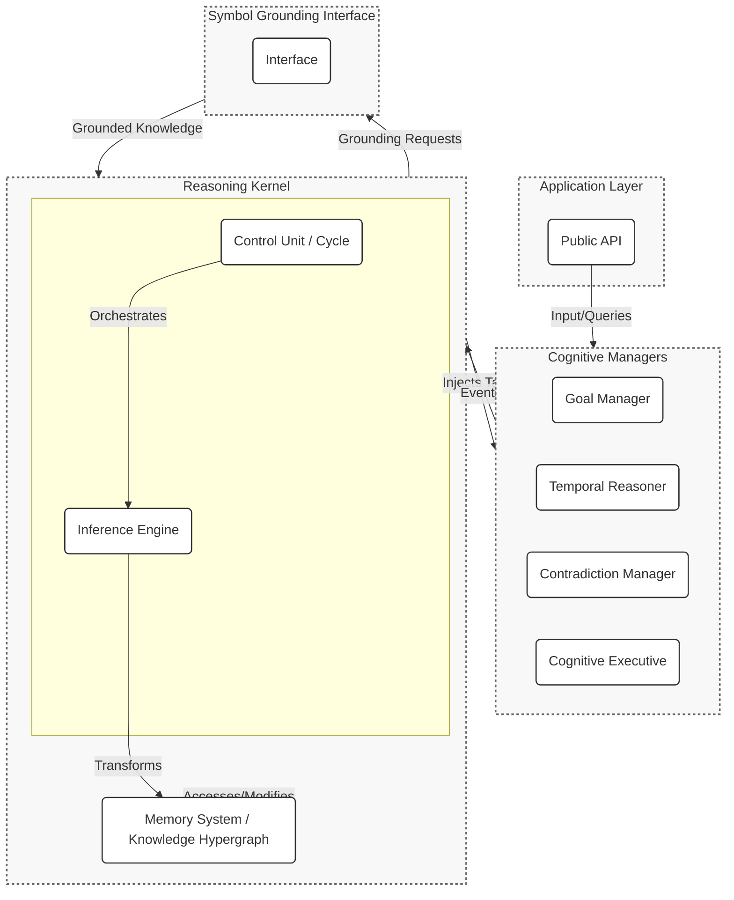

# HyperNARS: A Specification for a Self-Governing Reasoning System

## 1. Introduction: Vision and Goals

This document outlines the specification for **HyperNARS**, a next-generation Non-Axiomatic Reasoning System (NARS). The design is grounded in the **Assumption of Insufficient Knowledge and Resources (AIKR)**, which posits that a truly intelligent system must operate effectively with incomplete, uncertain, and even contradictory information, all while constrained by finite computational resources.

The primary goal of this project is to create a robust, scalable, and coherent AGI architecture that facilitates research and development, with a particular focus on autonomous, self-improving capabilities.

### 1.1. Core Design Philosophy

*   **Unified Representation**: The system uses a single, powerful formal language to represent all aspects of its world, from simple facts to complex inference rules and its own internal state. This enables deep introspection and meta-reasoning.
*   **Continuous Online Learning**: Learning is not a separate phase but an emergent property of the system's continuous operation. Every piece of new information refines the system's beliefs.
*   **Deep Neural-Symbolic Integration**: The architecture provides a native, fine-grained mechanism for integrating modern Machine Learning (ML) and Large Language Model (LLM) technologies directly into the core reasoning loop.
*   **Self-Governing Autonomy**: The system is designed to reason about its own structure and performance, enabling it to diagnose its own bugs, heal its own knowledge base, and strategically grow its capabilities.

To achieve this, this specification details a fusion of two powerful paradigms: the principled, evidence-based reasoning of NARS and the scalable, flexible AGI framework of OpenCog Hyperon.

## 2. System Architecture

HyperNARS is designed as a modular, layered system composed of a central **Reasoning Kernel**, a suite of specialized **Cognitive Managers**, and a **Symbol Grounding Interface** to connect to the outside world. Communication between these layers is handled via events, which are themselves items within the system's memory, ensuring a high degree of integration and introspection.



### 2.1. The Reasoning Kernel (The MeTTa Foundation)

The heart of HyperNARS is its Reasoning Kernel. It is implemented using **MeTTa (Meta Type Talk)**, a highly flexible, functional language designed for AGI. In this paradigm, the traditional distinction between "code" and "data" is eliminated. Every component of the system—from a simple concept to a complex inference rule—is represented as an expression that can be stored, manipulated, and reasoned about.

#### 2.1.1. Memory: The Knowledge Hypergraph

The system's knowledge is stored in a unified **Memory**, which is structured as a dynamic concept hypergraph. This implementation of Memory uses the OpenCog Hyperon **AtomSpace** as its underlying technology.

*   **Representation**: All NARS concepts—terms, statements, goals, and rules—are mapped to MeTTa expressions.
    *   **Term (`bird`)**: Becomes a MeTTa `Symbol`.
    *   **Statement (`bird --> animal`)**: Becomes a MeTTa `Expression`, e.g., `(Inheritance bird animal)`.
    *   **Belief (`bird --> animal <1.0, 0.9>`)**: An expression pairing a Statement with its `TruthValue`, e.g., `(Belief (Inheritance bird animal) (TruthValue 1.0 0.9))`.
    *   **Task (`bird --> animal?`)**: A wrapper around a statement indicating a work item for the system, e.g., `(Question (Inheritance bird animal))`.

#### 2.1.2. Inference as Expression Transformation

The NARS inference process is modeled as MeTTa's native expression reduction mechanism. Inference rules are not hard-coded procedures but are themselves expressions in Memory that define valid transformations.

*   **NAL as Rewrite Rules**: Each of NAL's syllogistic and structural rules is defined as a MeTTa rewrite rule.
*   **Example: NAL Deduction**: The rule `{(S --> M), (M --> P)} |- (S --> P)` is formulated as an expression that matches two `Belief` expressions and reduces them to a new, derived `Belief`.

    ```metta
    (= (Deduction
          (Belief (Inheritance $S $M) (TruthValue $f1 $c1))
          (Belief (Inheritance $M $P) (TruthValue $f2 $c2)))
       (Belief (Inheritance $S $P) (TruthValue (deduction-f $f1 $f2)
                                                 (deduction-c $f1 $c2))))
    ```
    Here, `deduction-f` and `deduction-c` are grounded functions that calculate the conclusion's truth value based on the premises, according to NAL's formulas. Because the rules are data, the system can learn new rules or modify existing ones, achieving a form of meta-learning.

#### 2.1.3. The Control Loop

The system operates in a continuous cycle, orchestrated by the MeTTa interpreter:
1.  **Select Task**: The system selects a high-priority Task from Memory.
2.  **Select Belief**: Based on the Task, the system selects a relevant Belief from Memory.
3.  **Trigger Inference**: The Task and Belief are fed to the interpreter, which matches them against the library of inference rule expressions.
4.  **Generate Conclusions**: The transformation produces new expressions (derived beliefs or sub-tasks).
5.  **Update State**: The new expressions are added to Memory, and the priority values of all involved expressions are updated.

### 2.2. Cognitive Managers (The Functional Layer)

Cognitive Managers are specialized, pluggable programs that handle complex, cross-cutting concerns. They operate by observing and injecting expressions into the Reasoning Kernel's Memory.

*   **Goal Manager**: Responsible for goal-oriented behavior, including planning and skill acquisition. It searches for procedural rules (e.g., `((Preconditions, #Operation) ==> Effect)`) where the `Effect` matches a `Goal`. If preconditions are not met, it generates sub-goals to satisfy them.
*   **Contradiction Manager**: Implements strategies for resolving contradictions. When the kernel detects two conflicting beliefs, this manager is triggered to apply a resolution strategy, such as keeping the belief with higher evidence, merging the two, or creating a more specific, contextual belief to resolve the conflict.
*   **Temporal Reasoner**: Provides a framework for understanding and reasoning about time. It maintains a graph of temporal relationships (e.g., using Allen's Interval Algebra) and generates predictions about future events.
*   **Cognitive Executive (Meta-Reasoner)**: The system's master control program, responsible for self-monitoring and adaptation. It analyzes system performance metrics (e.g., inference rate, contradiction rate) and can adapt system parameters or priorities in real-time.

### 2.3. Symbol Grounding and the Neural-Symbolic Bridge

The **Symbol Grounding Interface (SGI)** connects the system's abstract symbolic logic to the external world. This is achieved through **grounded expressions**, which bridge the symbolic space of MeTTa with external computational processes, such as Python functions or ML models.

This creates a powerful, bidirectional neural-symbolic feedback loop:
1.  **Symbolic-to-Neural**: The reasoning engine uses logic to identify a knowledge gap. It then formulates a precise query and dispatches it to an appropriate ML model (e.g., an LLM for hypothesis generation or an embedding model for perceptual similarity).
2.  **Neural-to-Symbolic**: The output from the ML model is not taken as ground truth. It is converted into a formal Narsese expression with a low-confidence `TruthValue`. This new, uncertain belief is then subjected to the rigorous, evidence-based scrutiny of the NAL inference rules.

## 3. Self-Governing Development and Resilience

A primary goal of the HyperNARS architecture is to enable a significant degree of self-governance, enhancing development ergonomics and system robustness. The system is designed to use its own reasoning capabilities as scaffolding for its own development, testing, and healing.

### 3.1. Development Scaffolding via Causal Analysis

The system's reasoning capabilities can be used to diagnose problems in its own codebase and knowledge. The detailed verification scenarios outlined in `TEST.md` serve as a formal specification of expected behavior.

*   **Causal Analysis of Test Failures**: When an E2E test scenario fails, the system can be tasked to diagnose the failure.
    1.  The system ingests the failed test case and the expected outcome as a goal.
    2.  It runs its own reasoning process on the same inputs.
    3.  It compares its derived conclusion with the expected conclusion.
    4.  If they differ, it can perform causal analysis on its own derivation trace (the chain of inference steps) to pinpoint the exact inference rule or faulty belief that led to the discrepancy.
    5.  The output is a hypothesis, e.g., `(Belief (Rule 'AnalogyRule') (has_property 'buggy_truth_function'))`.

### 3.2. Self-Healing via Architectural Introspection

The system can reason about its own architecture to detect and resolve inconsistencies.

*   **Mechanism**:
    1.  **Ingestion**: The system ingests its own design documents (this `README.md`) and test specifications (`TEST.md`) using grounded NLP functions, creating a knowledge base about its intended design and behavior.
    2.  **Introspection**: It compares this "should-be" model with its actual, runtime state (e.g., loaded modules, rule performance statistics, observed contradictions).
    3.  **Healing**: If it detects a discrepancy (e.g., a high rate of contradictions in a domain where the documentation claims expertise), it can trigger a self-healing process. This could involve autonomously adjusting system parameters, lowering the confidence of suspect beliefs, or flagging the inconsistency for human review.

### 3.3. Self-Growth via Automated Test Generation

The system can proactively ensure its own reasoning capabilities are robust by identifying and filling gaps in its verification coverage.

*   **Mechanism**: A dedicated `Test Generation Manager` periodically analyzes performance metrics to find under-utilized inference rules or concepts with low activity. It then formulates novel premises that would specifically trigger these rules and injects them as goals. The aim is to execute under-tested components, effectively increasing the system's self-knowledge and robustness.

## 4. Verification Strategy

The verification strategy is multi-layered, designed to validate the system at different levels of granularity: Unit, Integration, End-to-End Scenario, and Performance testing.

This ensures that foundational logical functions are correct, that components interact as expected, and that the system as a whole can solve complex, multi-step problems. For a complete list of verification scenarios and detailed test cases, please see the [**TEST.md**](TEST.md) document.

---
This document provides a consolidated and refined specification for HyperNARS, blending the core principles of NARS with the modern, flexible framework of OpenCog Hyperon, and laying the groundwork for a truly autonomous, self-governing intelligence.
