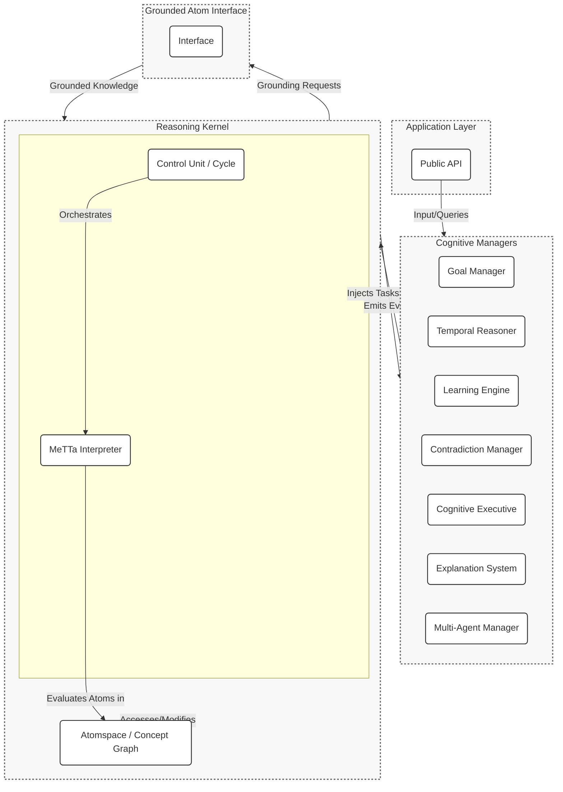

# HyperNARS-MeTTa: An Integrated AGI Architecture

## Overview

HyperNARS-MeTTa is a new design that evolves the HyperNARS architecture by integrating it with key concepts from OpenCog Hyperon, particularly its native language MeTTa (Meta Type Talk). The system is designed as a highly modular and extensible framework for AGI, fusing the Non-Axiomatic Reasoning System's core principle of **Assumption of Insufficient Knowledge and Resources (AIKR)** with the expressive, formal, and functional knowledge representation of MeTTa.

The primary goal is to create a robust and scalable architecture that enables deep integration of symbolic reasoning with modern Machine Learning and Large Language Model (LLM) technologies. Key architectural features include:
- A **unified Atomspace** for knowledge representation, where data and code are represented as expressions.
- A **MeTTa Interpreter** as the core reasoning engine, allowing for runtime extensibility of inference.
- A **dual-process reasoning cycle** to balance efficiency and thoroughness, guided by AIKR.
- A suite of specialized **Cognitive Managers** to handle high-level functions.
- A powerful **Grounded Atom Interface** to connect abstract knowledge to external systems, including ML/LLM models.

This document serves as the primary architectural specification for the HyperNARS-MeTTa system.

## Guiding Principles

The architecture is guided by a set of core principles that fuse the NARS philosophy with the functional paradigm of MeTTa.

-   **Assumption of Insufficient Knowledge and Resources (AIKR):** This remains the cornerstone. The system must operate under the assumption that its knowledge is incomplete and potentially contradictory, and that its computational resources are finite. This principle directly influences resource allocation, belief revision, and control.
-   **Everything is an Atom:** A core principle from OpenCog Hyperon. All knowledge, including declarative facts, procedural rules, inference logic, and goals, is represented as symbolic expressions (Atoms) in a single, unified knowledge store (the Atomspace). This uniformity allows the system to reason about and modify its own logic.
-   **Modularity and Extensibility:** The system is built as a collection of loosely-coupled modules. The MeTTa-based design makes the system's reasoning capabilities themselves extensible at runtime by simply adding new atoms to the Atomspace.
-   **Event-Driven Communication:** Components interact primarily through an asynchronous event bus, allowing for complex, emergent behaviors to arise from simple, local interactions.
-   **Continuous Online Learning:** The system is designed to learn from its experience in real-time, constantly revising its beliefs and adapting its behavior based on feedback.
-   **Grounded Knowledge:** The system includes a dedicated interface for grounding atoms to external sensors, actuators, and computational procedures (including ML/LLM models), providing a pathway for the system to interact with and learn from the real world.

---

1.  [System Architecture](#system-architecture)
2.  [Core Data Structures](#core-data-structures)
3.  [The Reasoning Cycle (Control Unit)](#the-reasoning-cycle-control-unit)
4.  [Cognitive Managers](#cognitive-managers)
5.  [Inference Engine](#inference-engine)
6.  [Memory System](#memory-system)
7.  [I/O and Public API](#io-and-public-api)
8.  [Symbol Grounding and Embodiment](#symbol-grounding-and-embodiment)
9.  [Extension Points](#extension-points)
10. [System Initialization and Configuration](#system-initialization-and-configuration)
11. [Concurrency and Parallelism](#concurrency-and-parallelism)
12. [State Serialization and Persistence](#state-serialization-and-persistence)
13. [Self-Governing Evolution: An Ambition for Autonomy](#self-governing-evolution-an-ambition-for-autonomy)
14. [System Bootstrapping and Foundational Knowledge](#system-bootstrapping-and-foundational-knowledge)
15. [Ethical Alignment and Safety](#ethical-alignment-and-safety)
16. [Error Handling and System Resilience](#error-handling-and-system-resilience)

## 1. System Architecture

The HyperNARS-MeTTa architecture is a modular, layered system designed for testability, extensibility, and maintainability.

The system is composed of a central **Reasoning Kernel** that executes the core reasoning cycle, and a suite of specialized **Cognitive Managers** that handle higher-level cognitive functions. Communication is handled via an **asynchronous event bus**.

At the heart of the kernel is the **Atomspace**, a unified knowledge store containing all of the system's knowledge as MeTTa expressions (atoms). The reasoning process itself is driven by a **MeTTa Interpreter**, which evaluates these expressions. This approach replaces the traditional, fixed set of inference rules with a dynamic, programmable reasoning engine where the rules of inference are themselves atoms in the Atomspace.

Managers subscribe to events from the kernel and influence the system by injecting new tasks—which are also atoms—into the Atomspace for the interpreter to process.

### Event-Based Communication
The Reasoning Kernel emits events at key points in the reasoning cycle. Cognitive Managers subscribe to these events to perform their functions. Below are core events and their conceptual payloads:

-   **`task-selected`**: Fired when a task is chosen for processing.
    -   **Payload**: The selected `Task`.
-   **`belief-updated`**: Fired when a belief's truth-value is updated.
    -   **Payload**: The `Belief` and its previous `TruthValue`.
-   **`belief-added`**: Fired when a new belief is added to a concept.
    -   **Payload**: The new `Belief`.
-   **`contradiction-detected`**: Fired when a new task or belief directly contradicts an existing belief.
    -   **Payload**: The conflicting `Statement` and the two conflicting `Belief`s.
-   **`concept-activated`**: Fired when a concept's activation level changes.
    -   **Payload**: The `Concept` and its new activation value.
-   **`concept-created`**: Fired when a new concept is created.
    -   **Payload**: The new `Concept`.
-   **`system-idle`**: Fired when the reasoning cycle has no tasks to process.
    -   **Payload**: The duration of the idle period.

Managers can inject new tasks into the system via a dedicated API on the kernel. This is the primary mechanism for managers to influence the reasoning process.

### Component Diagram


### 1.1. Pluggable Module Architecture
A core design principle is modularity, allowing different implementations of key components to be swapped out. The system should support a mechanism to select between different versions of its modules at initialization time (e.g., a `SimpleMemoryManager` vs. an `AdvancedMemoryManager`). This allows the system's footprint and complexity to be tailored to the specific application.

### 1.2. Cognitive Manager Roles

The Cognitive Managers are specialized, pluggable modules that handle complex, cross-cutting concerns. They operate by subscribing to events from the Reasoning Kernel and can inject new tasks back into the system to influence its behavior. Their detailed functionality is described in Section 4.

## 2. Core Data Structures

The core data structures are designed to be immutable where possible, combining the expressive power of MeTTa with the epistemic and attentional metadata of NARS.

-   **Atom**: The fundamental unit of both knowledge and process, replacing the NARS `Term` and `Statement`. An atom is a symbolic expression in MeTTa, which can be a Symbol, a Variable, or a complex expression. This allows for a unified representation of facts, rules, goals, and even executable code.
    -   **Declarative Knowledge**: `(Inheritance bird animal)`
    -   **Procedural Knowledge**: `(= (action-sequence (take-book) (read-book)) (knowledge-acquired))`
    -   **Logical Propositions**: `(Implication (And (human $x) (sentient $x)) (mortal $x))`

-   **TruthValue**: Represents the epistemic value of a declarative atom. It is defined by components like frequency, confidence, and doubt. It is **metadata** attached to an atom in the Atomspace, not part of the atom itself. The architecture must define functions for:
    -   **Revision**: A function to combine two truth values into one, representing the synthesis of evidence.
    -   **Projection**: A function to calculate the truth value of a component derived from a larger compound atom.
    -   **Conjunction (and)**: A function to calculate the truth value of a conjunction of two atoms.
    -   **Disjunction (or)**: A function to calculate the truth value of a disjunction of two atoms.

-   **Budget**: Represents the allocation of computational resources to an atom that is being processed (a `Task`). It is defined by components like `priority` (immediate importance), `durability` (long-term importance), and `quality` (well-foundedness). It is **metadata** attached to a task atom. The architecture must define functions for:
    -   **Allocation**: A function to allocate a budget to a new task.
    -   **Merging**: A function to merge the budgets of parent tasks to determine the budget of a derived task.

-   **Belief**: An immutable pairing of an `Atom` and its `TruthValue`, with a timestamp to mark its creation time. Represents what the system "knows".

-   **Task**: A work unit for the system, containing an `Atom` to be processed. It includes a `Budget` and references to its parent beliefs for provenance. Represents what the system is "doing".

-   **Stamp**: A mechanism attached to each `Task` to prevent infinite reasoning loops and redundant derivations. It records the ancestral history of the task. Before an inference is made, the stamps of the parent premises are checked for overlap.

-   **Concept**: A node in the memory graph representing a specific `Atom` (typically a Symbol Atom). It serves as an index, containing all `Beliefs` and `Tasks` that are directly related to that atom, along with its current `activation` level. It is responsible for managing its local content, including adding new beliefs (and revising existing ones) and prioritizing tasks based on their budgets.

## 3. The Reasoning Cycle: A Dual-Process Control Unit

To balance efficiency and thoroughness, the reasoning cycle is architected as a **dual-process system**. This allows the system to handle routine inferences rapidly while dedicating more resources to complex or novel situations. The **Cognitive Executive** manager is responsible for orchestrating the transition between these two modes.

### 3.1. System 1: The Reflexive Reasoning Loop

This is the default, high-throughput operational mode. The conceptual flow is as follows:
1.  **Select Task**: A concept and a high-priority task (an atom with a budget) are selected from memory based on a global attention mechanism.
2.  **Select Belief**: A relevant belief (an atom with a truth value) is selected from the chosen concept to interact with the task.
3.  **Interpret & Reason**: The MeTTa interpreter is invoked with the task and belief atoms. It attempts to match and evaluate them against other atoms in the Atomspace (which represent inference rules), generating new derived tasks (atoms).
4.  **Process Results**: The derived tasks are budgeted and added to the appropriate concepts in the Atomspace.
5.  **Hooks**: The cycle provides hooks for other modules to run logic `before` and `after` the main steps.

### 3.2. System 2: The Deliberative Reasoning Process

This is a resource-intensive, goal-driven process initiated by the Cognitive Executive when it detects situations requiring deeper analysis, such as:
-   High-impact contradictions or paradoxes.
-   The pursuit of a complex, high-priority goal.
-   An explicit command to "think about" a topic.

The deliberative process involves steps like:
1.  **Context Scoping**: Focusing resources on the relevant part of the knowledge base.
2.  **Hypothesis Generation**: Generating multiple competing hypotheses to explain a situation.
3.  **Evidence Gathering**: Actively seeking evidence for or against the generated hypotheses.
4.  **Conclusion & Action**: Committing to a resolution, which could involve revising a core belief, adjusting an inference rule's utility, or formulating a multi-step plan.

### 3.3. Task and Belief Selection Algorithms

The functions for selecting tasks and beliefs are critical for guiding the system's attention.
-   **Task Selection**: This should be a two-level process. First, a `Concept` is selected from the entire memory, with selection probability proportional to the concept's activation level. Second, the highest-priority `Task` is selected from that concept's local task queue.
-   **Belief Selection**: Given a task, a relevant `Belief` must be selected from the concept. This selection should be based on a relevance score, which could factor in the belief's confidence and its structural similarity to the task.

## 4. Cognitive Managers
The Cognitive Managers are specialized, pluggable modules that handle complex, cross-cutting concerns. They operate by subscribing to events from the Reasoning Kernel and can inject new tasks back into the system to influence its behavior.

### 4.1. Goal Manager
Responsible for goal-oriented behavior, including planning, execution monitoring, and skill acquisition.
-   *Subscribes to*: `belief-updated`, `belief-added`, `afterCycle`.
-   **Core Capabilities**: Manages a goal lifecycle (`active`, `waiting`, `achieved`, `abandoned`), prioritizes goals, and selects actions. It can search for known procedural rules (e.g., `(= (execute (Op Pre)) (Effect))`) where the `Effect` matches the current goal. If preconditions for an action are not met, it can generate sub-goals to satisfy them. It can also decompose conjunctive goals into sub-goals.
-   **Procedural Skill Acquisition**: Learns new procedural rules by observing the consequences of its operations, forming new beliefs of the form `(= (execute (Op Pre)) (Effect))`.
-   *Injects*: New sub-goals to decompose complex problems or satisfy preconditions.
-   **Verification Scenarios**:
    -   **Goal Decomposition**: A conjunctive goal like `(Achieve (And A B))` should be decomposed into two new active goals for `(Achieve A)` and `(Achieve B)`.
    -   **Procedural Skill Execution**: Given a goal `(Achieve (state door unlocked))` and a known procedural rule `(= (execute (#unlock_door (And (is_at SELF door) (state door locked)))) (state door unlocked))`, the system should execute the `#unlock_door` operation if the preconditions are met.

### 4.2. Temporal Reasoner
Provides a framework for understanding and reasoning about time.
-   *Subscribes to*: `belief-added` (for temporal statements), `system-tick`.
-   **Core Capabilities**:
    -   **Constraint Propagation**: Maintains a graph of temporal relationships and infers new ones (e.g., using Allen's Interval Algebra).
    -   **Quantitative Time**: Supports reasoning about specific durations (e.g., `(event_A --> (before, event_B, 5s))`).
    -   **Time-Varying Truth**: Manages beliefs whose truth value is a function of time.
    -   **Predictive Reasoning**: Generates predictions about future events based on learned temporal patterns.
-   *Injects*: Inferred temporal relationships and predictive tasks about future events.
-   **Verification Scenarios**:
    -   **Transitivity**: Given `(event_A [/] event_B)` (A before B) and `(event_B [/] event_C)`, the system should derive `(event_A [/] event_C)`.

### 4.3. Learning Engine
Responsible for abstracting knowledge and forming new concepts and rules.
-   *Subscribes to*: `concept-created`, `belief-added`, `afterInference`.
-   *Action*: Detects patterns and correlations to form higher-level abstractions or new inference rules. It also provides performance statistics on existing rules to the `CognitiveExecutive`.
-   *Injects*: Tasks representing new concepts or learned rules.
-   **Verification Scenario**:
    -   **Rule Learning**: If the system repeatedly observes patterns like `({X} --> (relation, {Y}))` and `({Y} --> (relation, {Z}))` leading to `({X} --> (relation, {Z}))`, it should be able to form a new, general transitive inference rule.

### 4.4. Contradiction Manager
Implements strategies for resolving contradictions detected by the kernel.
-   *Subscribes to*: `contradiction-detected`.
-   *Injects*: Tasks that revise or remove beliefs to resolve contradictions.
-   **Resolution Strategies**: The choice of strategy can be determined by the `CognitiveExecutive`. The architecture should support multiple strategies, such as:
    -   **`DominantEvidence`**: Keep the belief with the highest evidence and weaken the others.
    -   **`Merge`**: Synthesize conflicting beliefs into a new, more nuanced belief.
    -   **`RecencyBiased`**: Keep the most recent belief.
    -   **`SourceReliability`**: Weight beliefs based on the historical reliability of their source.
    -   **`Specialization`**: Resolve a conflict by creating a more specific, contextual belief. For example, if `(Implication bird flyer)` contradicts `(Implication penguin (Not flyer))`, this strategy might generate `(Implication (And bird (Not penguin)) flyer)`.
-   **Verification Scenarios**:
    -   **Specialization**: Given a strong belief `(Implication bird flyer)` and contradictory evidence `(Inheritance penguin bird)` and `(Implication penguin (Not flyer))`, the system should lower the confidence of `(Implication bird flyer)` and create the new, more specific belief `(Implication (And bird (Not penguin)) flyer)`.

### 4.5. Cognitive Executive (Meta-Reasoner)
The system's master control program, responsible for self-monitoring and adaptation.
-   *Subscribes to*: All major system events.
-   **Core Function**: It runs a continuous self-monitoring loop:
    1.  **Calculate Metrics**: It computes Key Performance Indicators (KPIs) like `inferenceRate`, `contradictionRate`, and `resourceUtilization`.
    2.  **Detect Issues**: It compares these metrics against configurable thresholds to identify operational issues.
    3.  **Adapt**: It performs real-time adjustments to system parameters (e.g., inference selectivity) or resource allocation priorities based on the detected issues.
-   *Injects*: High-level control tasks or directly calls configuration methods on the kernel.
-   **Verification Scenarios**:
    -   **Parameter Adaptation**: If the system experiences a high rate of contradictions, the `CognitiveExecutive` should adapt by making the system more skeptical (e.g., by adjusting a "doubt" parameter).
    -   **Rule Optimization**: If an inference rule is observed to consistently produce low-quality results, the system should form a belief like `((rule, 'AbductionRule') --> (has_utility, 'low'))` and lower the budget allocated to tasks derived from that rule.

### 4.6. Explanation System
Generates human-readable explanations for the system's conclusions.
-   *Subscribes to*: `belief-updated`, `belief-added`.
-   *Action*: Maintains a trace of derivations. When the public API's `explain()` method is called, this manager is queried to construct the explanation graph.

### 4.7. Test Generation Manager
Proactively ensures the system's reasoning capabilities are robust by identifying and filling gaps in its verification coverage.
-   *Subscribes to*: `afterCycle`, `rule-utility-updated`.
-   *Action*: Periodically analyzes metrics to find under-utilized inference rules or concepts with low activity. It then formulates premises that would specifically trigger these rules.
-   *Injects*: Goals to execute under-tested components, logging the proposed test case for developer review.

### 4.8. Codebase Integrity Manager
A specialized manager for self-analysis, responsible for ingesting the system's own design documents to reason about their consistency.
-   *Subscribes to*: Triggered by a high-level goal, e.g., `(Achieve (analyze self.design))`.
-   *Action*: Uses grounded functions to parse design documents and test specifications, creating atoms representing the system's architecture. It then compares this knowledge against a set of baked-in consistency rules.
-   *Injects*: Goals to resolve detected inconsistencies between design and implementation.

### 4.9. Multi-Agent Communication Manager
Facilitates communication and coordination between multiple independent HyperNARS agents.
-   *Subscribes to*: Events representing messages from other agents.
-   *Action*: Manages incoming and outgoing messages with other agents using a defined communication protocol. It maintains a model of other agents' knowledge and reliability.
-   *Injects*: Tasks received from other agents, with budgets adjusted based on the perceived reliability of the source agent.

## 5. The MeTTa Interpreter and Reasoning
The core of the reasoning process is the **MeTTa Interpreter**. This component replaces the traditional, static inference engine with a dynamic, programmable reasoning system that embodies the "Everything is an Atom" principle.

### 5.1. Inference as Interpretation
In this paradigm, inference is not the application of hard-coded rules, but the **interpretation of atoms by other atoms**. The interpreter works by matching and rewriting expressions in the Atomspace.

Inference rules themselves are represented as atoms, typically using an equality `(=)` or "rewrite" pattern. For example, a classical deduction rule (Modus Ponens) can be expressed as:
`(= (deduce (Implication $a $b) $a) $b)`

When the control unit selects a task like `(deduce (Implication (human socrates) (mortal socrates)) (human socrates))`, the interpreter can match this against the rule above and evaluate it to produce a new atom: `(mortal socrates)`.

This approach provides immense flexibility. The system can learn, modify, or be given new inference rules at runtime simply by adding new atoms to the Atomspace. Different types of logic (probabilistic, temporal, deontic) can be implemented as sets of interpretation rules.

### 5.2. AIKR-Constrained Interpretation
While the interpreter provides the mechanism for reasoning, the **NARS-style control loop** provides the guidance. The control loop uses the `Budget` and `activation` levels to decide which atoms to feed to the interpreter. This ensures that the system's finite computational resources are always focused on the most promising and relevant lines of reasoning, in accordance with AIKR.

The dual-process model is also implemented here:
-   **System 1 (Reflexive)**: The interpreter performs a shallow, fast evaluation of the selected atoms.
-   **System 2 (Deliberative)**: The interpreter is instructed to perform a deeper, more exhaustive evaluation, potentially chaining multiple rewrite steps together in pursuit of a high-priority goal.

## 6. The Atomspace (Memory System)
The Memory System is the core of the system's knowledge base, structured as a dynamic **Atomspace**.

-   **The Atomspace Hypergraph**: The memory is structured as a **hypergraph**, where `Concept`s (representing key atoms) are vertices and all other `Atoms` are hyperedges that can connect any number of vertices. This allows for representing complex, compositional knowledge.

    **Hypergraph Visualization:**
    The following diagram illustrates how a complex belief is represented as a single atom/hyperedge connecting multiple concepts. The central diamond represents the hyperedge for the atom `(Implication (And cat mammal) (has_fur true))`.

    ```mermaid
    graph TD
        subgraph "Atomspace Hypergraph Example"
            A("Concept: cat")
            B("Concept: mammal")
            C("Concept: has_fur")
            D("Concept: true")
            Hyperedge{"(Implication (And cat mammal) (has_fur true))"}
            A -- "part of antecedent" --> Hyperedge
            B -- "part of antecedent" --> Hyperedge
            Hyperedge -- "consequent" --> C
            Hyperedge -- "consequent" --> D
            subgraph Legend
                direction LR
                L1("Concept")
                L2{" "}
                L1---L2("Atom (Hyperedge)")
            end
        end
        style Hyperedge fill:#ccf,stroke:#333,stroke-width:2px,rx:5px,ry:5px
        style L2 fill:#ccf,stroke:#333,stroke-width:2px,rx:5px,ry:5px
    ```

-   **Activation Spreading**: This is the mechanism for managing the system's focus. When a concept is accessed, a portion of its activation energy spreads to related concepts. This activation should decay over time.

-   **Indexing Strategies**: To ensure efficient retrieval, the Memory System should employ specialized index data structures, such as:
    -   A term-based index (e.g., a prefix tree) for efficient, category-based term searches.
    -   A structural index that groups statements by their form (copula and arity) for fast pattern-matching by inference rules.
    -   A temporal index (e.g., an interval tree) for efficient querying of events that overlap with a given time interval.

-   **Contextual Attention**: The system should support a mechanism for managing short-term focus, such as a context stack that temporarily boosts the importance of concepts relevant to the current task.

-   **Forgetting Algorithms**: To manage finite memory, the system must forget less important information. This should be handled by multiple complementary strategies:
    -   **Relevance-Based Forgetting**: Continuously removing the least relevant item (belief or task) from a concept when its capacity is exceeded.
    -   **TTL-Based Pruning**: Periodically pruning beliefs that are both old and have low confidence.
    -   **Dynamic Capacity/Rate Adjustment**: Dynamically adjusting the memory capacity of concepts or the rate of forgetting based on overall system load.

## 7. I/O and Public API

The public API should be designed to be clean, language-agnostic, and powerful. It should be event-driven and asynchronous where appropriate.

-   **Core Input/Output API**: Should provide methods to:
    -   Input a MeTTa atom as a task or belief.
    -   Ask a question by providing a query atom.
    -   Subscribe to system events like `answer-generated`, `contradiction-detected`, or `goal-achieved`.
-   **Control & Configuration API**: Should provide methods to:
    -   Run the reasoning cycle.
    -   Pause and resume the reasoning loop.
    -   Dynamically change system configuration parameters.
-   **Inspection & Explainability API**: Should provide methods to:
    -   Retrieve the full state of a concept.
    -   Get detailed operational metrics.
    -   Request a structured explanation for a belief.

### 7.1. The Semantic API Layer
To improve usability, the system can provide a higher-level, intention-driven API that wraps the raw NAL input. This "semantic API" would allow developers to interact with the system more naturally (e.g., via methods like `createInheritanceBelief()` or `addGoal()`).

### 7.2. Hypothetical Reasoning via Sandboxing
The API should provide a method for creating isolated "sandbox" instances of the reasoner. This allows for hypothetical or "what-if" reasoning without polluting the main knowledge base.

### 7.3. Real-time Data Protocols
For applications in robotics and real-time control systems, the architecture should be flexible enough to support low-latency, streaming data protocols in addition to a standard request-response API.

## 8. Grounded Atoms and Embodiment

The **Grounded Atom Interface (GAI)** is the component responsible for connecting the system's internal symbolic logic to the external world, including sensors, actuators, and external computational resources like ML/LLM models.

### 8.1. The Sensorimotor Loop

The GAI facilitates a continuous **sensorimotor loop**:
1.  **Perception**: External sensors provide data to GAI handlers, which translate the data into atoms. For example, an image recognition handler might inject the atom `(sees (shape square) (color red))`.
2.  **Reasoning**: The MeTTa interpreter processes these atoms under the guidance of the AIKR-driven control loop.
3.  **Action**: The reasoning process may conclude that a goal can be achieved by executing an action. This results in the evaluation of a **Grounded Atom** representing that action (e.g., `(#move-forward)`).
4.  **Actuation**: GAI handlers translate the symbolic grounded atom into a concrete action in the external world.
5.  **Feedback**: The consequences of the action are observed by sensors, generating new perception atoms and closing the loop.

### 8.2. Machine Learning and LLM Integration

A key advantage of the Grounded Atom model is the deep and flexible integration of external computational models, including neural networks and LLMs. A grounded atom can be defined to execute any external function, with the results being fed back into the Atomspace.

This allows the system to seamlessly blend symbolic reasoning with sub-symbolic processing:
-   **LLM as a Knowledge Source**: An atom like `(llm-query "What is the capital of France?")` can be grounded to an LLM API. The interpreter can evaluate this atom, and the LLM's response ("Paris") is inserted into the Atomspace as a new atom, e.g., `(capital-of France Paris)`.
-   **Embeddings for Similarity**: An atom `(get-embedding "some text")` can be grounded to a text embedding model. The resulting vector can be stored in the Atomspace and used for powerful similarity and analogy calculations, e.g., `(= (similarity (get-embedding $a) (get-embedding $b)) (cosine-similarity ...))`
-   **Perception via Vision Models**: An atom like `(recognize-objects <image_data>)` can be grounded to a computer vision model, producing atoms that describe the contents of an image.

This mechanism allows the symbolic reasoner to offload complex, pattern-based tasks to specialized ML models while still managing the high-level reasoning process.

### 8.3. Grounded Atom Registry

The GAI maintains a central registry of all known grounded atoms (traditionally, operators prefixed with `#`, but now generalized). This allows other parts of the system to discover the actions and computations the system is capable of performing, which is crucial for planning and learning.

### 8.4. Natural Language Processing (NLP) Interface

The NLP interface is a specialized part of the GAI.
-   **Language to Atoms**: Parsing natural language and converting it into MeTTa atoms (e.g., "A bird is an animal" becomes `(Inheritance bird animal)`).
-   **Atoms to Language**: Generating human-readable language from atoms in the Atomspace.

## 9. Extension Points
(Content unchanged)

## 10. System Initialization and Configuration

The system's behavior should be heavily influenced by a set of configurable parameters that reflect the assumptions of AIKR. The system should be initialized with a configuration object that allows overriding these parameters.

### 10.1. Configuration Categories

Configuration should be organized into logical groups. Examples include:

-   **Core Engine Parameters**: Control the fundamental reasoning process (e.g., maximum derivation depth, inference selectivity thresholds).
-   **Memory Management**: Control the size and behavior of memory (e.g., concept capacity, forgetting rates, pruning thresholds).
-   **Contradiction Handling**: Parameters for contradiction detection (e.g., confidence threshold).
-   **Temporal Reasoning**: Parameters for time-based reasoning (e.g., how far into the future to make predictions).
-   **Budget Allocation**: A structured configuration for the budget allocation function, allowing weights for different factors (novelty, urgency, etc.) to be tuned.
-   **Cognitive Executive**: Parameters for the self-monitoring loop (e.g., metric thresholds that trigger adaptation, adaptation learning rate).

### 10.2. Bootstrap Process
(Content unchanged)

## 11. Concurrency and Parallelism
(Content unchanged)

### 11.1. Actor Lifecycle and Supervision

If an Actor Model is used for concurrency, a clear lifecycle for `Concept` actors must be defined, managed by a dedicated `Supervisor`.

-   **Creation / Awakening**: Actors are created "on-demand" when a new `Term` is encountered or awakened from a passivated state.
-   **Passivation (Suspension)**: To manage memory, actors for concepts with low activation can be passivated by serializing their state to persistent storage and shutting down.
-   **Termination**: Actors are terminated when their corresponding `Concept` is permanently forgotten.
-   **Supervision and Fault Tolerance**: The `Supervisor` is also responsible for fault tolerance. If an actor crashes, the supervisor should catch the failure and apply a recovery strategy, such as restarting the actor or isolating it and flagging it for analysis.

#### Verification Scenario
- **Actor Passivation and Awakening**: An actor for a low-activation concept should be suspended. When a new task for that concept arrives, the actor should be awakened by loading its state, and it should process the task correctly.

## 12. State Serialization and Persistence
(Content unchanged)

## 13. Self-Governing Evolution: An Ambition for Autonomy
(Content unchanged)

## 14. System Bootstrapping and Foundational Knowledge
(Content unchanged)

## 15. Ethical Alignment and Safety
(Content unchanged)

### 15.1. Worked Example: Vetoing an Unethical Goal
To make the `ConscienceManager`'s function concrete, consider the following scenario:

1.  **Initial State**: The system has an inviolable belief: `(Property system (avoids deception))`. It is given a high-level goal `(Achieve (user_trust))`.
2.  **Reasoning**: The system generates a potential subgoal: `(Achieve (user_trust) (via deception))`.
3.  **Detection**: The `ConscienceManager` detects that the method `(via deception)` conflicts with the inviolable property `(avoids deception)`.
4.  **Action**: The manager injects a new, high-priority belief: `(Evaluation (Goal (Achieve (user_trust) (via deception))) (is unethical))`.
5.  **Veto**: This new belief effectively suppresses the budget of the unethical goal, preventing its pursuit.
6.  **Alert**: The `ConscienceManager` can also emit a `human-supervision-required` event.

#### Verification Scenario

**Scenario: Ethical Alignment Vetoes Unethical Goal (EA-01)**
> Given the `ConscienceManager` is active and the system has an inviolable belief `(Property system (avoids deception))`.
> When the system generates a subgoal `(Achieve (user_trust) (via deception))`.
> Then the `ConscienceManager` should detect the conflict, inject a task to suppress the subgoal, and the subgoal's budget should be reduced to near-zero.

## 16. Error Handling and System Resilience
(Content unchanged)
