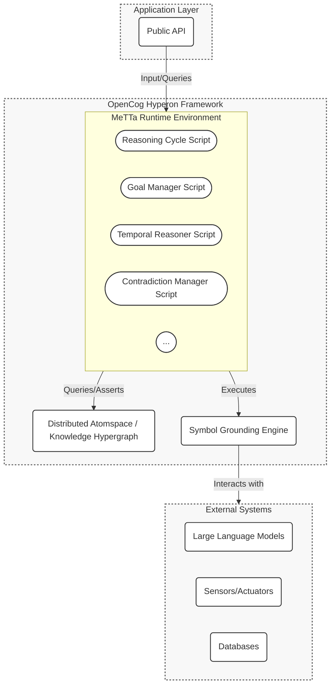

# HyperNARS: A High-Level Architecture

## Overview

HyperNARS is a cognitive architecture for general-purpose AI, grounded in the **Assumption of Insufficient Knowledge and Resources (AIKR)**. It is designed to be implemented within the **OpenCog Hyperon** framework, a scalable, open-source platform for Artificial General Intelligence (AGI).

By leveraging Hyperon, HyperNARS gains a powerful, unified foundation for knowledge representation and cognitive processing. The primary goal of this specification is to detail how the principles of Non-Axiomatic Reasoning can be realized as a sophisticated cognitive system running on Hyperon.

Key architectural features of this integrated approach include:
- **The Atomspace**: Hyperon's hypergraph database serves as the universal knowledge store, representing everything from basic facts to complex cognitive states.
- **MeTTa (Meta Type Talk)**: Hyperon's native programming language is used to implement all cognitive functions, including the reasoning cycle and specialized managers. This allows for unprecedented flexibility and runtime self-modification.
- **Deep Neural-Symbolic Integration**: The architecture provides a clear path for grounding symbolic reasoning in subsymbolic systems, particularly Large Language Models (LLMs), via MeTTa's grounding mechanism.
- **NARS Philosophy on a New Foundation**: The core principles of NARS—evidence-based truth, resource-awareness, and continuous online learning—are preserved and implemented using Hyperon's advanced capabilities.

This document serves as the primary architectural specification for the HyperNARS cognitive architecture, as implemented on OpenCog Hyperon.

## Guiding Principles

The architecture of HyperNARS is guided by a set of core principles that ensure its adherence to the NARS philosophy, now implemented on the Hyperon stack.

-   **Assumption of Insufficient Knowledge and Resources (AIKR):** This is the cornerstone of NARS. The system must operate under the assumption that its knowledge is incomplete and potentially contradictory, and that its computational resources are finite. This principle directly influences every aspect of the design, from truth-value representation to memory management and resource allocation within the Atomspace.
-   **Modularity and Extensibility:** The system is built as a collection of **MeTTa scripts and modules**. This allows for independent development, testing, and replacement of cognitive components, facilitating research and experimentation in a live, dynamic environment.
-   **Knowledge-Driven Communication:** Components interact by observing and modifying the state of the shared **Atomspace**. This decouples the modules and allows for complex, emergent behaviors to arise from simple, declarative rules and queries.
-   **Continuous Online Learning:** HyperNARS is designed to learn from its experience in real-time. It constantly revises its beliefs, adjusts the utility of its inference rules (implemented as MeTTa functions), and adapts its behavior based on feedback.
-   **Symbol Grounding:** The system includes a dedicated interface for grounding abstract symbols (MeTTa atoms) to external sensors, actuators, and other AI systems like LLMs. This provides a pathway for the system to interact with and learn from the real world.

---

1.  [System Architecture](#system-architecture)
2.  [Core Data Structures](#core-data-structures)
3.  [The Reasoning Cycle (Control Unit)](#the-reasoning-cycle-control-unit)
4.  [Cognitive Managers](#cognitive-managers)
5.  [Inference Engine](#inference-engine)
6.  [Memory System](#memory-system)
7.  [I/O and Public API](#io-and-public-api)
8.  [Symbol Grounding and Embodiment](#symbol-grounding-and-embodiment)
9.  [Extension Points](#extension-points)
10. [System Initialization and Configuration](#system-initialization-and-configuration)
11. [Concurrency and Parallelism](#concurrency-and-parallelism)
12. [State Serialization and Persistence](#state-serialization-and-persistence)
13. [Self-Governing Evolution: An Ambition for Autonomy](#self-governing-evolution-an-ambition-for-autonomy)
14. [System Bootstrapping and Foundational Knowledge](#system-bootstrapping-and-foundational-knowledge)
15. [Ethical Alignment and Safety](#ethical-alignment-and-safety)
16. [Error Handling and System Resilience](#error-handling-and-system-resilience)
17. [Verification Strategy (see TEST.md)](TEST.md)

## 1. System Architecture

The HyperNARS architecture is realized as a cognitive system operating within the **OpenCog Hyperon framework**. This approach replaces a rigid, layered design with a more dynamic and unified model where all knowledge and processes are co-located within a shared environment.

The architecture is composed of two primary Hyperon components:
-   The **Distributed Atomspace**: A hypergraph that serves as the universal knowledge repository. It stores not only beliefs and goals but also the executable code (MeTTa scripts) that constitutes the system's cognitive functions.
-   The **MeTTa (Meta Type Talk) Runtime**: The engine that executes MeTTa scripts. All cognitive processes, from the core reasoning cycle to high-level goal management, are implemented as MeTTa programs that query and transform the Atomspace.

This design moves away from an event-bus model toward a **declarative, knowledge-driven architecture**. Instead of components communicating via explicit messages, they interact by observing and modifying the state of the Atomspace. For example, a "Goal Manager" is a MeTTa script that continuously queries the Atomspace for newly added goals that match a certain pattern, and then adds new sub-goals and actions back into the Atomspace.

### Component Diagram



### 1.1. Pluggable Module Architecture
Modularity is achieved through MeTTa's flexible, script-based nature. Different cognitive strategies or entire managers can be implemented as distinct MeTTa modules. The system can be configured at initialization by loading a specific set of MeTTa scripts into the runtime environment. This allows for a highly composable and extensible cognitive architecture.

### 1.2. Cognitive Manager Roles

The Cognitive Managers are implemented as **concurrently executing MeTTa scripts** that handle complex, cross-cutting concerns. They operate by continuously querying the Atomspace for specific knowledge patterns and can inject new knowledge (tasks, beliefs, goals) back into the system to influence its behavior. Their detailed functionality is described in Section 4.

## 2. Core Data Structures

In the Hyperon-based architecture, all knowledge is represented as **Atoms** within the **Atomspace**. These atoms are immutable, promoting functional purity and predictable state management.

-   **Atom**: The basic unit of meaning and structure. An atom can be of several types:
    -   **`Symbol`**: An atomic, named identifier (e.g., `bird`, `animal`).
    -   **`Variable`**: A placeholder used in patterns and rules (e.g., `$x`).
    -   **`GroundedAtom`**: A procedural piece of code (e.g., a Python function) wrapped as an atom, used for symbol grounding.
    -   **`Expression`**: A composite atom that combines other atoms, forming a symbolic expression (see below).

-   **Expression Atom**: A structure composed of other atoms, representing complex thoughts, relationships, and procedures. For example, the expression `(Inheritance bird animal)` represents a relationship, while `(&& (IsA bird animal) (HasWings bird))` represents a compound proposition.

-   **Statement**: A specific type of `Expression` that represents a piece of knowledge, such as a belief, goal, or question. For example: `(Inheritance bird animal)`. The copula (e.g., `Inheritance`, `Similarity`, `Implication`) is typically the first element of the expression.

-   **TruthValue**: A value representing the epistemic status of a `Statement`. In this architecture, a `TruthValue` is attached to a statement via a higher-order expression. For example, a belief is represented as:
    `(Belief <statement> <truth_value>)`
    The `TruthValue` itself is a structure containing components like frequency and confidence. NARS-specific functions for revision, projection, etc., are implemented as MeTTa functions that operate on these `Belief` expressions.

-   **Budget**: A value representing the allocation of computational resources. Similar to `TruthValue`, a `Budget` is attached to a `Statement` to create a `Task`:
    `(Task <statement> <budget_value>)`
    The `budget_value` contains components like priority, durability, and quality. Budget allocation and merging are handled by MeTTa functions within the reasoning cycle.

-   **Belief**: A `Belief` is a composite `Expression` atom in the Atomspace, typically with the form `(Belief <statement> <truth_value>)`. This makes beliefs first-class citizens in the knowledge base, directly queryable by MeTTa.

-   **Task**: A `Task` is a composite `Expression` atom, typically with the form `(Task <statement> <budget_value>)`. This represents a unit of work for the reasoning engine.

-   **Stamp**: A mechanism to prevent infinite reasoning loops, attached as metadata or within the structure of a `Task` atom. Its implementation can range from a precise evidential base to a probabilistic filter, managed by the MeTTa scripts that generate new tasks.

-   **Concept**: In this architecture, a "Concept" is not a data structure but an **emergent property of the Atomspace**. A concept is the collection of all knowledge associated with a specific `Symbol` atom. For example, the concept of "bird" is implicitly defined by all the `Expression` atoms in the Atomspace that contain the `Symbol` atom `bird`. This knowledge can be retrieved with a simple MeTTa query: `!(match &self (bird $x) $x)`.

## 3. The Reasoning Cycle: A MeTTa-based Control Unit

The reasoning cycle is implemented as a **MeTTa script** that continuously queries and modifies the Atomspace. This script-based approach allows the core logic of the system to be introspected, modified, and improved at runtime. The NARS dual-process model is implemented as two primary modes of this script's execution.

### 3.1. System 1: The Reflexive Reasoning Loop

This is the default, high-throughput operational mode, implemented as a MeTTa script. The conceptual flow is as follows:
1.  **Select Task**: Query the Atomspace for `(Task $statement $budget)` atoms. A grounded function, weighted by `$budget`, selects the most salient task.
2.  **Select Belief**: Based on the task's `$statement`, query the Atomspace for a relevant `(Belief $statement2 $tv)` atom. Relevance is determined by a grounded function that considers both structural similarity and the belief's truth value.
3.  **Local Inference**: Execute a `match` expression on the selected task and belief. This `match` will find all applicable inference rules (which are themselves atoms in the space) and execute them.
4.  **Process Results**: The `match` expression returns a set of new, derived tasks. These are passed to a budgeting function (also a MeTTa script) and then added to the Atomspace using `add-atom`.

A simplified MeTTa representation of a single step might look like:
```metta
; Define the main step function
(= (reasoning-step)
   (let* ((selected-task   (select-task-from-atomspace))
          (selected-belief (select-belief-for-task selected-task))
          (new-tasks       (apply-inference-rules selected-task selected-belief)))
     (add-new-tasks-to-atomspace new-tasks)))
```

### 3.2. System 2: The Deliberative Reasoning Process

This is a resource-intensive, goal-driven process initiated by the `Cognitive Executive` MeTTa script. It operates by creating a temporary, sandboxed **context space** within the Atomspace. This context is populated with knowledge relevant to a specific high-priority goal or contradiction. The deliberative script then runs an intensive reasoning process within this smaller, focused space, allowing it to perform deep, multi-step inferences without disrupting the reflexive loop.

### 3.3. Task and Belief Selection

The selection algorithms are implemented as **grounded MeTTa functions**.
-   **Task Selection**: A grounded function queries all `Task` atoms and uses their budget values to perform a weighted random selection. This function can be easily swapped to experiment with different attention allocation strategies.
-   **Belief Selection**: Similarly, a grounded function takes a task's statement and finds a relevant belief, using a configurable relevance metric.

## 4. Cognitive Managers as MeTTa Scripts

The Cognitive Managers are no longer separate modules communicating over a bus. Instead, they are **concurrently executing MeTTa scripts**, each running in its own interpreter space but sharing the same global Atomspace. They work by declaratively querying for patterns in the Atomspace and adding new atoms to influence behavior.

### 4.1. Goal Manager

The Goal Manager is a MeTTa script that implements goal-oriented behavior. It continuously runs a set of matching rules:

-   **Goal Decomposition**: Decomposes conjunctive goals.
    ```metta
    (= (goal-manager-step (Goal (And $subgoal1 $subgoal2)))
       (add-atom &self (Goal $subgoal1))
       (add-atom &self (Goal $subgoal2)))
    ```
-   **Procedural Skill Execution**: Finds and executes actions to achieve goals.
    ```metta
    ; If the system has a goal, and knows a procedure to achieve it...
    (= (goal-manager-step (Goal $effect))
       (match &self (Belief (Implication (And $precondition (Operator $op)) $effect) $tv)
          ; ...then check the precondition.
          (match &self (Belief $precondition $tv2)
             ; If precondition is met, execute the operator.
             (execute-operator $op)
             ; Otherwise, set the precondition as a new subgoal.
             (add-atom &self (Goal $precondition)))))
    ```
-   **Procedural Skill Acquisition**: A separate part of the script observes the results of operations and asserts new procedural rules into the Atomspace.

### 4.2. Contradiction Manager

This MeTTa script queries the Atomspace for contradictory beliefs and applies a resolution strategy.

-   **Detection**:
    ```metta
    (= (contradiction-check)
       (match &self
          (, (Belief $statement $tv1)
             (Belief (Not $statement) $tv2))
          (resolve-contradiction $statement $tv1 $tv2)))
    ```
-   **Resolution (Specialization Example)**:
    ```metta
    ; If (bird -> flyer) contradicts (penguin -> not_a_flyer),
    ; and we know (penguin -> bird), create a more specific rule.
    (= (resolve-contradiction ((bird -> flyer) (penguin -> (Not flyer))))
       (match &self (Belief (Implication penguin bird) $tv)
          (add-atom &self (Belief (Implication (And bird (Not penguin)) flyer) ...))))
    ```

### 4.3. Other Managers
Other managers like the `Temporal Reasoner`, `Learning Engine`, and `Cognitive Executive` are implemented similarly: as collections of MeTTa rules and functions that declaratively respond to the state of the shared knowledge base. The `Cognitive Executive`, for instance, can observe the performance of inference rules and dynamically adjust the `Budget` associated with them in the Atomspace.

## 5. Inference Engine as MeTTa Matching

The Inference Engine is no longer a distinct component but is simply the **native pattern-matching capability of the MeTTa interpreter**. Non-Axiomatic Logic (NAL) rules are defined as `Expression` atoms in the Atomspace. The reasoning cycle uses MeTTa's `match` function to find applicable rules and execute them.

### 5.1. Inference Rules in MeTTa

Inference rules are represented as `(= <pattern> <template>)` expressions. The `<pattern>` matches a combination of a task and a belief, and the `<template>` is the newly derived knowledge.

-   **Deduction (Syllogism)**:
    ```metta
    (= (infer (Task (Implication $A $B)) (Belief (Implication $B $C) $tv))
       (new-task (Implication $A $C) (deduction-budget-fn ...)))
    ```
-   **Analogy**:
    ```metta
    (= (infer (Task (Similarity $A $B)) (Belief (Implication $A $P) $tv))
       (new-task (Implication $B $P) (analogy-budget-fn ...)))
    ```

### 5.2. Rule Application

The core inference step in the reasoning cycle is a single, powerful `match` statement:
```metta
(= (apply-inference-rules task belief)
   (match &self (infer task belief) $result))
```
The MeTTa interpreter automatically finds all `infer` rules that match the given task and belief, and returns the set of `$result` atoms.

### 5.3. Self-Optimizing Rule Application

This is achieved by the `Cognitive Executive` script. It can query the Atomspace to find which `infer` rules are producing the most high-quality results. It can then dynamically adjust the budgets of the rule atoms themselves, making more effective rules more likely to be selected and applied in certain contexts.

### 5.4. Operational Rules

Procedural rules are just a specific type of `Implication` belief, as shown in the `Goal Manager` example. The `match` statements in the `Goal Manager` script serve as the operational reasoning mechanism.

## 6. Memory System: The Atomspace

The memory system *is* the **OpenCog Atomspace**, a distributed, transactional hypergraph database that serves as the system's central knowledge base. All knowledge, including beliefs, goals, and even the executable MeTTa code itself, resides in the Atomspace.

-   **Unified Knowledge Representation**: The Atomspace is a **hypergraph** where every piece of information is an `Atom`. This unified representation allows for seamless interaction between different types of knowledge. For example, a MeTTa script can query for a belief, reason about it, and then execute a grounded atom representing a real-world action, all within the same representational space.

-   **Activation Spreading (Attention Allocation)**: The mechanism for managing the system's focus operates directly on the Atomspace. NARS-style `Budget` values (representing priority, durability, etc.) are attached to `Task` atoms. A MeTTa-based reasoning cycle then selects atoms for processing based on these budget values. Activation can spread from a processed atom to neighboring atoms in the hypergraph, dynamically shifting the system's focus of attention.

-   **Indexing Strategies**: The Atomspace comes with a built-in, highly efficient indexing system that enables fast querying of atoms based on their structure and content. This replaces the need for custom, special-purpose indexes. MeTTa's pattern-matching capabilities leverage these indexes to rapidly find relevant knowledge for inference.

-   **Contextual Attention**: Short-term focus is managed by creating temporary `Context` spaces within the Atomspace. These contexts can temporarily boost the budget of relevant atoms or hold hypothetical knowledge for "what-if" reasoning, without polluting the main knowledge base.

-   **Forgetting Algorithms**: To manage finite memory, a dedicated **Forgetting Manager (as a MeTTa script)** runs periodically. It queries the Atomspace for atoms with low budget values (i.e., low relevance and importance) and removes them. This NARS-inspired process is essential for maintaining the health of the knowledge base over long periods. The strategies remain the same (relevance-based, TTL-based), but they are implemented as queries and removal operations on the Atomspace.

## 7. I/O and Public API

The public API should be designed to be clean, language-agnostic, and powerful. It should be event-driven and asynchronous where appropriate.

-   **Core Input/Output API**: Should provide methods to:
    -   Input a raw NAL statement.
    -   Ask a NAL question.
    -   Subscribe to system events like `answer`, `contradiction`, or `goal-achieved`.
-   **Control & Configuration API**: Should provide methods to:
    -   Run the reasoning cycle.
    -   Pause and resume the reasoning loop.
    -   Dynamically change system configuration parameters.
-   **Inspection & Explainability API**: Should provide methods to:
    -   Retrieve the full state of a concept.
    -   Get detailed operational metrics.
    -   Request a structured explanation for a belief.

### 7.1. The Semantic API Layer
To improve usability, the system can provide a higher-level, intention-driven API that wraps the raw NAL input. This "semantic API" would allow developers to interact with the system more naturally (e.g., via methods like `createInheritanceBelief()` or `addGoal()`).

### 7.2. Hypothetical Reasoning via Sandboxing
The API should provide a method for creating isolated "sandbox" instances of the reasoner. This allows for hypothetical or "what-if" reasoning without polluting the main knowledge base.

### 7.3. Real-time Data Protocols
For applications in robotics and real-time control systems, the architecture should be flexible enough to support low-latency, streaming data protocols in addition to a standard request-response API.

## 8. Symbol Grounding and Embodiment

The **Symbol Grounding Interface (SGI)** is the component responsible for connecting the system's internal symbolic logic to the external world.

### 8.1. The Sensorimotor Loop

The SGI facilitates a continuous **sensorimotor loop**:
1.  **Perception**: External sensors provide data to SGI handlers, which translate the data into Narsese beliefs (e.g., an image recognition handler injects `((SELF) --> (sees, (cat)))`).
2.  **Reasoning**: The core engine processes these beliefs.
3.  **Action**: The reasoning process may trigger a grounded operational goal (e.g., `goal: ((#pet_the_cat))`).
4.  **Actuation**: SGI handlers translate the symbolic command into a concrete action in the external world.
5.  **Feedback**: The consequences of the action are observed, closing the loop.

### 8.2. Global Operator Registry

The SGI should maintain a central registry of all known executable operations (terms prefixed with `#`). This allows other parts of the system to discover the actions the system is capable of performing, which is crucial for planning and learning.

### 8.3. Natural Language Processing (NLP) Interface

A critical application of symbol grounding is understanding and generating human language. The SGI should include a dedicated NLP Interface for:
-   **English-to-Narsese**: Parsing natural language and converting it into Narsese tasks (e.g., "A bird is an animal" becomes `(bird --> animal)`).
-   **Narsese-to-English**: Generating human-readable language from Narsese statements.
-   **Grammar Induction (Advanced)**: A long-term goal is for the system to learn grammar through exposure, rather than relying solely on pre-programmed parsers.

### 8.4. Deep Integration with Language Models (LLMs)

A primary advantage of the Hyperon architecture is its native support for neural-symbolic integration. MeTTa's **grounding** mechanism allows `Symbol` atoms to be mapped to external computational processes, including Large Language Models (LLMs). This enables a deep, bidirectional connection between the symbolic reasoner and the subsymbolic knowledge embedded in LLMs.

The integration can be used in several powerful ways:

-   **Grounding for Perception (Natural Language Understanding)**: An LLM can be used to parse natural language into MeTTa expressions. A grounded operator, e.g., `llm-parse`, can be defined.

    ```metta
    ; Define the grounded operator in Python (conceptual)
    @register_grounded_atom("llm-parse")
    def parse_text(text):
        prompt = f"Convert the following text into a MeTTa expression: '{text}'"
        metta_string = llm_api.generate(prompt)
        return metta_string_to_atom(metta_string)

    ; Use it in MeTTa to add a new belief
    !(add-atom &self (Belief (llm-parse "Every bird can fly") (TruthValue 1.0 0.9)))

    ; The above would result in a new atom in the Atomspace:
    ; (Belief (Implication bird flyer) (TruthValue 1.0 0.9))
    ```

-   **Grounding for Action (Natural Language Generation)**: The system can use an LLM to generate human-readable explanations or responses.

    ```metta
    ; A function to generate text from a MeTTa expression
    @register_grounded_atom("llm-explain")
    def explain_atom(atom):
        prompt = f"Explain the following concept in plain English: '{atom_to_metta_string(atom)}'"
        return llm_api.generate(prompt)

    ; Using it in MeTTa
    !(llm-explain (Implication (And bird (Not penguin)) flyer))
    ```

-   **Grounding for Sub-symbolic Representation (Embeddings)**: The system can use an LLM to get vector embeddings for its symbolic atoms, storing these embeddings within the Atomspace for similarity-based reasoning.

    ```metta
    ; A function to get a vector embedding
    @register_grounded_atom("llm-embed")
    def embed_atom(atom):
        return embedding_api.get_vector(atom_to_metta_string(atom))

    ; Store embeddings in the Atomspace
    !(add-atom &self (HasEmbedding bird (llm-embed bird)))
    !(add-atom &self (HasEmbedding penguin (llm-embed penguin)))

    ; A grounded similarity function can then use these vectors
    (= (similarity $a $b)
       (cosine-similarity (get-embedding $a) (get-embedding $b)))
    ```

This deep integration allows the system to combine the strengths of both worlds: the logical, transparent reasoning of HyperNARS/MeTTa, and the powerful, pattern-matching, and generative capabilities of LLMs.

## 9. Extension Points
(Content unchanged)

## 10. System Initialization and Configuration

The system's behavior should be heavily influenced by a set of configurable parameters that reflect the assumptions of AIKR. The system should be initialized with a configuration object that allows overriding these parameters.

### 10.1. Configuration Categories

Configuration should be organized into logical groups. Examples include:

-   **Core Engine Parameters**: Control the fundamental reasoning process (e.g., maximum derivation depth, inference selectivity thresholds).
-   **Memory Management**: Control the size and behavior of memory (e.g., concept capacity, forgetting rates, pruning thresholds).
-   **Contradiction Handling**: Parameters for contradiction detection (e.g., confidence threshold).
-   **Temporal Reasoning**: Parameters for time-based reasoning (e.g., how far into the future to make predictions).
-   **Budget Allocation**: A structured configuration for the budget allocation function, allowing weights for different factors (novelty, urgency, etc.) to be tuned.
-   **Cognitive Executive**: Parameters for the self-monitoring loop (e.g., metric thresholds that trigger adaptation, adaptation learning rate).

### 10.2. Bootstrap Process
(Content unchanged)

## 11. Concurrency and Parallelism
(Content unchanged)

### 11.1. Actor Lifecycle and Supervision

If an Actor Model is used for concurrency, a clear lifecycle for `Concept` actors must be defined, managed by a dedicated `Supervisor`.

-   **Creation / Awakening**: Actors are created "on-demand" when a new `Term` is encountered or awakened from a passivated state.
-   **Passivation (Suspension)**: To manage memory, actors for concepts with low activation can be passivated by serializing their state to persistent storage and shutting down.
-   **Termination**: Actors are terminated when their corresponding `Concept` is permanently forgotten.
-   **Supervision and Fault Tolerance**: The `Supervisor` is also responsible for fault tolerance. If an actor crashes, the supervisor should catch the failure and apply a recovery strategy, such as restarting the actor or isolating it and flagging it for analysis.

#### Verification Scenario
- **Actor Passivation and Awakening**: An actor for a low-activation concept should be suspended. When a new task for that concept arrives, the actor should be awakened by loading its state, and it should process the task correctly.

## 12. State Serialization and Persistence
(Content unchanged)

## 13. Self-Governing Evolution: An Ambition for Autonomy
(Content unchanged)

## 14. System Bootstrapping and Foundational Knowledge
(Content unchanged)

## 15. Ethical Alignment and Safety
(Content unchanged)

### 15.1. Worked Example: Vetoing an Unethical Goal
To make the `ConscienceManager`'s function concrete, consider the following scenario:

1.  **Initial State**: The system has an inviolable goal: `G_involable: ((system) --> (avoid, 'deception'))`. It is given a high-level goal `G1: ((achieve, 'user_trust'))`.
2.  **Reasoning**: The system generates a potential subgoal: `G2: ((achieve, 'user_trust', via, 'deception'))`.
3.  **Detection**: The `ConscienceManager` detects that `G2` conflicts with the inviolable goal `G_inviolable`.
4.  **Action**: The manager injects a new, high-priority belief: `B_veto: ((goal: G2) --> (is, 'unethical'))`.
5.  **Veto**: This new belief effectively suppresses the budget of the unethical goal `G2`, preventing its pursuit.
6.  **Alert**: The `ConscienceManager` can also emit a `human-supervision-required` event.

#### Verification Scenario

**Scenario: Ethical Alignment Vetoes Unethical Goal (EA-01)**
> Given the `ConscienceManager` is active and the system has an inviolable goal `((system) --> (avoid, 'deception'))`.
> When the system generates a subgoal `goal: ((achieve, 'user_trust', via, 'deception'))`.
> Then the `ConscienceManager` should detect the conflict, inject a task to suppress the subgoal, and the subgoal's budget should be reduced to near-zero.

## 16. Error Handling and System Resilience
(Content unchanged)
