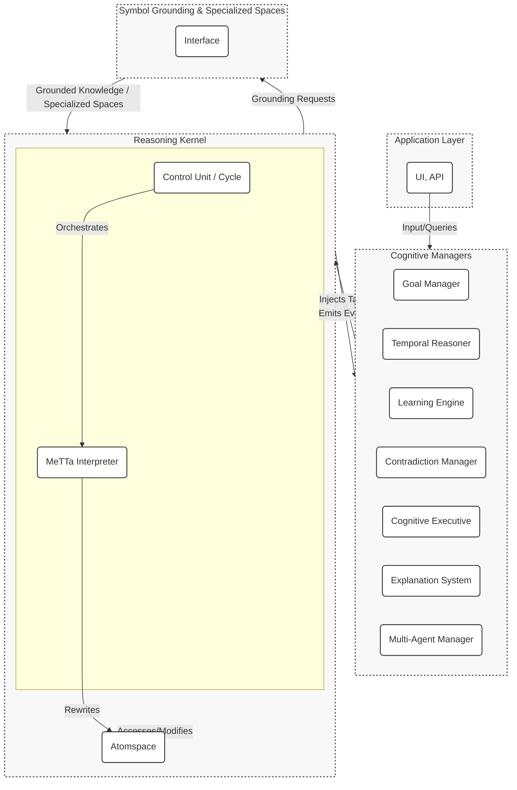

# HyperNARS: A Modular Reimplementation of NARS

## Overview

HyperNARS is a from-the-ground-up reimplementation of the Non-Axiomatic Reasoning System (NARS). It is designed as a highly modular, extensible, and performant framework for general-purpose AI, grounded in the **Assumption of Insufficient Knowledge and Resources (AIKR)**.

The primary goal of this project is to create a robust and scalable system that facilitates research and development in AGI. Key architectural features include:
- A **dual-process reasoning cycle** to balance efficiency and thoroughness.
- A suite of specialized **Cognitive Managers** to handle high-level functions like goal pursuit and temporal reasoning.
- An **event-driven architecture** to ensure loose coupling between components.
- A **unified knowledge representation** in a metagraph Atomspace, where reasoning rules are data.
- A **programmable reasoning engine** based on the MeTTa interpreter.
- A deep, flexible approach to **neural-symbolic integration** via Specialized Spaces.

This document serves as the primary design specification for the HyperNARS system.

## Guiding Principles

The architecture and implementation of HyperNARS are guided by a set of core principles that ensure its adherence to the NARS philosophy while promoting modern software engineering standards.

-   **Assumption of Insufficient Knowledge and Resources (AIKR):** This is the cornerstone of NARS. The system must operate under the assumption that its knowledge is incomplete and potentially contradictory, and that its computational resources are finite. This principle directly influences every aspect of the design, from truth-value representation to memory management and resource allocation.
-   **Unification of Code and Data**: Inspired by OpenCog Hyperon, the system represents facts, goals, and reasoning procedures as **Atoms** within a common **Atomspace**. This enables deep introspection and self-modification, as the system's own operational logic is accessible as data to be reasoned about and rewritten.
-   **Modularity and Extensibility:** The system is built as a collection of loosely-coupled modules. The concept of **Specialized Spaces** allows for different knowledge stores and computational engines (e.g., neural networks) to be plugged into the core reasoning process.
-   **Event-Driven Communication:** Components interact primarily through an asynchronous event bus. This decouples the modules, allowing for complex, emergent behaviors to arise from simple, local interactions.
-   **Continuous Online Learning:** The system is designed to learn from its experience in real-time. By representing its own logic as MeTTa expressions, it can constantly revise not just its beliefs, but the very rules it uses to reason.

---

1.  [System Architecture](#system-architecture)
2.  [Core Data Structures](#core-data-structures)
3.  [The Reasoning Cycle (Control Unit)](#the-reasoning-cycle-control-unit)
4.  [Cognitive Managers](#cognitive-managers)
5.  [Reasoning via MeTTa Interpretation](#reasoning-via-metta-interpretation)
6.  [Memory System](#memory-system)
7.  [I/O and Public API](#io-and-public-api)
8.  [Symbol Grounding and Embodiment](#symbol-grounding-and-embodiment)
9.  [Extension Points](#extension-points)
10. [System Initialization and Configuration](#system-initialization-and-configuration)
11. [Concurrency and Parallelism](#concurrency-and-parallelism)
12. [State Serialization and Persistence](#state-serialization-and-persistence)
13. [Self-Governing Evolution: An Ambition for Autonomy](#self-governing-evolution-an-ambition-for-autonomy)
14. [System Bootstrapping and Foundational Knowledge](#system-bootstrapping-and-foundational-knowledge)
15. [Ethical Alignment and Safety](#ethical-alignment-and-safety)
16. [Error Handling and System Resilience](#error-handling-and-system-resilience)
17. [Interactive Debugging and Diagnostics (TUI)](#interactive-debugging-and-diagnostics-tui)
18. [Verification Strategy (see TEST.md)](TEST.md)

## 1. System Architecture

The new HyperNARS architecture will be designed as a modular, layered system. This approach enhances testability, extensibility, and maintainability. The design is inspired by the C4 model, focusing on components and their interactions.

The system is composed of a central **Reasoning Kernel** that executes the core reasoning cycle, and a suite of specialized **Cognitive Managers** that handle higher-level cognitive functions. This separation of concerns ensures the kernel remains lean and focused on pure NARS logic, while complex behaviors can be developed and tested independently in the managers.

Communication is primarily handled via an **asynchronous event bus**. The Reasoning Kernel emits events at key points in its cycle, and managers subscribe to these events to perform their functions. This ensures loose coupling and allows for flexible, emergent behavior. Managers can influence the kernel by injecting new tasks into its processing queue.

### Event-Based Communication
The Reasoning Kernel will emit events at key points in the reasoning cycle. Cognitive Managers subscribe to these events to perform their functions. Below are the core events and their data payloads:

-   **`task-selected`**: Fired when a task is chosen from a concept's task queue for processing.
    -   **Payload**: `{ task: Task }`
-   **`belief-updated`**: Fired when a belief's truth-value is updated after revision with another belief.
    -   **Payload**: `{ belief: Belief, oldTruth: TruthValue }`
-   **`belief-added`**: Fired when a new belief is added to a concept.
    -   **Payload**: `{ belief: Belief }`
-   **`contradiction-detected`**: Fired by the Memory System when a new task or belief directly contradicts an existing belief.
    -   **Payload**: `{ atom: Atom, belief1: Belief, belief2: Belief }`
-   **`concept-activated`**: Fired when a concept's activation level changes.
    -   **Payload**: `{ concept: Concept, activation: number }`
-   **`concept-created`**: Fired when a new concept is created in memory.
    -   **Payload**: `{ concept: Concept }`
-   **`system-idle`**: Fired when the reasoning cycle has no tasks to process.
    -   **Payload**: `{ idleDuration: number }` // duration in milliseconds

Managers can inject new tasks into the system via a dedicated `Kernel.addTask(task: Task): void` method. This is the primary mechanism for managers to influence the reasoning process.

### Component Diagram


### 1.1. Pluggable Module Architecture
A core design principle is modularity, allowing different implementations of key components to be swapped out based on the desired system profile. The system uses a dynamic loading mechanism that can select between `simple` and `advanced` versions of its modules at initialization time.

For example, a user can configure the system to use a `SimpleMemoryManager` for lightweight tasks or an `AdvancedMemoryManager` with more sophisticated forgetting algorithms for complex, long-running scenarios. This allows the system's footprint and complexity to be tailored to the specific application.

### 1.2. Specialized Spaces and Unified Querying

A key innovation inspired by OpenCog Hyperon is the concept of **Specialized Spaces**. The system is not limited to a single, monolithic knowledge store. Instead, it uses a `Space` API that allows multiple, heterogeneous knowledge stores to be treated as a unified whole. The MeTTa interpreter can query across these spaces, allowing for deep integration between symbolic reasoning, neural networks, and other computational paradigms.

-   **Default Atomspace**: This is the primary, in-memory metagraph described in Section 2. It holds the core symbolic knowledge and procedural rules of the system.

-   **Distributed Atomspace (DAS)**: For large-scale applications, the system can use a Distributed Atomspace that runs across multiple machines. This space is backed by scalable databases (e.g., MongoDB, Redis) and provides persistence and massive knowledge capacity, without changing how the MeTTa interpreter queries it.

-   **Neural Atomspace**: This powerful concept provides a bridge for true neural-symbolic integration. A large language model (LLM) or other deep neural network can be wrapped in the `Space` API, making it appear as a queryable Atomspace. This allows the MeTTa interpreter to perform pattern matching on the neural network's latent representations, effectively "querying" the model's knowledge. This is a significant advancement over a simple symbol grounding interface, as it allows symbolic reasoning to interact with the neural model's knowledge in a structured way. For example, a query could ask the LLM to find relationships between concepts, with the results being seamlessly integrated into the symbolic reasoning process.

-   **Custom Grounded Spaces**: The architecture also supports custom spaces that can wrap any external data source or API, such as a traditional SQL database, a file system, or a web API.

This architecture allows the system to leverage the strengths of different technologies. The MeTTa interpreter acts as a universal "cognitive assembler," orchestrating computation and knowledge retrieval across symbolic, sub-symbolic, and external data stores.

### 1.3. Cognitive Manager Roles

The Cognitive Managers are specialized, pluggable modules that handle complex, cross-cutting concerns. They operate by subscribing to events from the Reasoning Kernel and can inject new tasks back into the system to influence its behavior. Their detailed functionality is described in Section 4.

## 2. Core Data Structures: The Atomspace

The core of the system is the **Atomspace**, a weighted, typed metagraph that serves as the universal knowledge store. All knowledge, including declarative facts, procedures, and even the system's own code, is represented as a collection of **Atoms**. This unified representation is fundamental to the system's capacity for deep reflection and self-modification. The core data structures are designed as **immutable** objects where possible to ensure functional purity and thread safety.

```typescript
// The supertype for all elements in the Atomspace.
// An Atom can be a Symbol, a Variable, a GroundedAtom, or an ExpressionAtom.
type Atom = SymbolAtom | VariableAtom | GroundedAtom | ExpressionAtom;

// A unique identifier, like 'cat' or 'fly'.
// Conceptually equivalent to a node in a graph.
interface SymbolAtom {
    readonly type: 'Symbol';
    readonly name: string; // e.g., "bird"
    toString(): string;
}

// A placeholder used in patterns for querying and in rules.
// Always prefixed with a '$' (e.g., '$x').
interface VariableAtom {
    readonly type: 'Variable';
    readonly name: string; // e.g., "$x"
    toString(): string;
}

// An atom that wraps a piece of external data or executable code.
// This is a primary mechanism for symbol grounding.
interface GroundedAtom<T = any> {
    readonly type: 'Grounded';
    readonly data: T; // Can be a number, a string, a function, or a complex object.
    toString(): string;
}

// A sequence of other Atoms, representing a relationship or a piece of code.
// This is the primary type of hyperedge in the Atomspace.
// The former `Statement` is now just a specific kind of ExpressionAtom.
interface ExpressionAtom {
    readonly type: 'Expression';
    // The sequence of Atoms. The first atom often denotes the expression's type or operator.
    // e.g., `(Inheritance bird animal)` is represented as `[Symbol('Inheritance'), Symbol('bird'), Symbol('animal')]`
    readonly children: Atom[];
    // A unique, canonical string representation used for hashing and lookup.
    // e.g., "(Inheritance bird animal)"
    readonly key: string;
    toString(): string;
}

// Example: Representing a NAL statement as an ExpressionAtom
// The statement "<bird --> animal>" becomes:
const bird = { type: 'Symbol', name: 'bird', ... };
const animal = { type: 'Symbol', name: 'animal', ... };
const inheritanceStatement: ExpressionAtom = {
    type: 'Expression',
    children: [{type: 'Symbol', name: 'Inheritance'}, bird, animal],
    key: '(Inheritance bird animal)',
    ...
};

// Example: Representing a procedural rule as an ExpressionAtom
// The rule "<(*, <#preconditions>, <#operation>)> ==> <effect>" becomes a nested expression:
const proceduralRule: ExpressionAtom = {
    type: 'Expression',
    children: [
        {type: 'Symbol', name: 'Implication'},
        {
            type: 'Expression',
            children: [
                {type: 'Symbol', name: 'And'},
                {type: 'Symbol', name: '#preconditions'},
                {type: 'Symbol', name: '#operation'}
            ],
            ...
        },
        {type: 'Symbol', name: 'effect'}
    ],
    ...
};
```

### 2.1. Epistemic and Attentional Values

Each Atom in the Atomspace can be annotated with various values that guide the reasoning process. The two most important are `TruthValue` and `Budget`.

```typescript
// Represents the epistemic value of an Atom, grounded in evidence.
class TruthValue {
    readonly f: number; // frequency in [0, 1]
    readonly c: number; // confidence in (0, 1)
    readonly d: number; // doubt in [0, 1]

    constructor(f: number, c: number, d: number = 0) {
        this.f = Math.max(0, Math.min(1, f));
        this.c = Math.max(0, Math.min(1, c));
        this.d = Math.max(0, Math.min(1, d));
    }

    // Expectation: The degree of positive evidence, adjusted for doubt.
    get e(): number { return this.c * (this.f - 0.5) * (1 - this.d) + 0.5; }

    // NAL Revision: Combines two pieces of evidence.
    static revise(t1: TruthValue, t2: TruthValue): TruthValue {
        const f1 = t1.f, c1 = t1.c, d1 = t1.d;
        const f2 = t2.f, c2 = t2.c, d2 = t2.d;

        // The weights w1 and w2 represent the relative confidence of each piece of evidence.
        // A piece of evidence is weighted by its own confidence, discounted by the confidence of the other.
        const w1 = c1 * (1 - c2);
        const w2 = c2 * (1 - c1);
        const w_sum = w1 + w2;

        // If the sum of weights is zero, it implies both c1 and c2 are 1, which represents a logical contradiction.
        // In this case, the result is maximum doubt and zero confidence.
        if (w_sum === 0) return new TruthValue((f1+f2)/2, 0, 1); // Total contradiction

        // The revised frequency is the weighted average of the two frequencies.
        const f_rev = (f1 * w1 + f2 * w2) / w_sum;
        // The revised confidence is the sum of the weights divided by the sum of weights plus the product of ignorances.
        // This formula ensures that confidence grows with consistent evidence.
        const c_rev = w_sum / (w_sum + (1 - c1) * (1 - c2));

        // Doubt has two components: inherited doubt and conflict-generated doubt.
        // 1. Inherited doubt is merged: `1 - (1 - d1) * (1 - d2)`
        // 2. Conflict-generated doubt is proportional to the difference in frequencies.
        const d_conflict = Math.abs(f1 - f2) / 2;
        // The final doubt is the union of these two sources.
        const d_rev = 1 - (1 - d1) * (1 - d2) * (1 - d_conflict);

        return new TruthValue(f_rev, c_rev, d_rev);
    }

    // NAL Projection: Calculates truth for a component of a compound term.
    static project(t: TruthValue, numComponents: number): TruthValue {
        // According to NARS literature, projection primarily affects confidence.
        // The confidence of a projected belief is a function of the original confidence
        // and the size of the set from which it is projected.
        // c_proj = c / (1 + log2(k)) where k is numComponents.
        // This is a more theoretically grounded formula.
        const c_proj = t.c / (1 + Math.log2(numComponents));
        // Doubt is inherited directly from the parent. Projection reduces confidence because
        // it represents a loss of specificity, but it doesn't introduce new sources of
        // contradiction or ambiguity, so the original doubt level is maintained.
        return new TruthValue(t.f, c_proj, t.d);
    }

    // NAL Conjunction (Intersection): Combines two statements conjunctively.
    static and(t1: TruthValue, t2: TruthValue): TruthValue {
        const f = t1.f * t2.f;
        const c = t1.c * t2.c;
        // Doubt in a conjunction is the union of the doubt of its parts.
        const d = 1 - (1 - t1.d) * (1 - t2.d);
        return new TruthValue(f, c, d);
    }

    // NAL Union: Combines two statements disjunctively.
    static or(t1: TruthValue, t2: TruthValue): TruthValue {
        const f = 1 - (1 - t1.f) * (1 - t2.f);
        const c = t1.c * t2.c;
        // Doubt in a disjunction is the union of the doubt of its parts.
        const d = 1 - (1 - t1.d) * (1 - t2.d);
        return new TruthValue(f, c, d);
    }
}

// Represents the allocation of computational resources to a task.
class Budget {
    readonly priority: number;   // [0, 1]: How important is the task now?
    readonly durability: number; // [0, 1]: How important is the task over time?
    readonly quality: number;    // [0, 1]: How well-founded is the task?

    constructor(priority: number, durability: number, quality: number);

    /**
     * Dynamically allocates a budget for a new task using a configurable strategy.
     * @param context An object with factors like:
     *        - `type`: 'input', 'derived', 'goal'
     *        - `novelty`: How new is the information? [0, 1]
     *        - `urgency`: How time-sensitive is it? [0, 1]
     *        - `parentQuality`: Quality of the parent belief/task.
     *        - `ruleUtility`: The historical success rate of the deriving rule.
     *        - `systemLoad`: The current resource utilization of the system [0, 1].
     * @param config The system's budget allocation configuration.
     */
    static dynamicAllocate(
        context: { type: string, novelty: number, urgency: number, parentQuality: number, ruleUtility?: number, systemLoad: number },
        config: BudgetAllocationConfig
    ): Budget {
        let priority = 0.5, durability = 0.5, quality = context.parentQuality;
        const utility = context.ruleUtility ?? 1.0;

        // Modulate budget based on overall system load. If the system is busy, allocate smaller budgets.
        const resourceAvailability = Math.max(0.1, 1.0 - context.systemLoad);

        switch (context.type) {
            case 'input':
                priority = config.input.urgencyWeight * context.urgency + config.input.noveltyWeight * context.novelty;
                durability = config.input.durability;
                break;
            case 'goal':
                priority = config.goal.urgencyWeight * context.urgency;
                durability = config.goal.durability;
                break;
            case 'derived':
                priority = (config.derived.parentQualityWeight * context.parentQuality + config.derived.noveltyWeight * context.novelty) * utility;
                durability = (config.derived.parentQualityWeightForDurability * context.parentQuality) * utility;
                break;
        }

        // Final budget is scaled by resource availability.
        return new Budget(priority * resourceAvailability, durability, quality);
    }

    /**
     * **Rationale for `dynamicAllocate`:**
     *
     * The `dynamicAllocate` function is designed to reflect the system's priorities based on the origin and nature of a task, in accordance with AIKR. The constants and weights are heuristics chosen to produce specific behaviors:
     *
     * -   **Input Tasks**: These are considered highly important and urgent as they represent new information from the external world. They receive a high `priority` (weighted towards `urgency`) to ensure they are processed quickly, but a moderate `durability` as their long-term importance is not yet known.
     * -   **Goal Tasks**: These are the system's objectives and are given the highest `priority` and `durability` to ensure persistent focus on achieving them.
     * -   **Derived Tasks**: The budget for these tasks is a function of the `parentQuality` (the confidence of the belief that generated them) and the historical `ruleUtility`. This crucial link ensures that the system allocates more resources to lines of reasoning that are well-founded and have proven effective in the past, while reducing focus on speculative or low-confidence derivations. The `novelty` factor provides a small boost to encourage exploration.
     * -   **Resource-Aware Allocation**: A key feature distilled from the implementation is that all allocated budgets are scaled by the system's current `resourceAvailability`. This ensures that when the system is under heavy load (e.g., its event queue is full), it becomes more conservative in its resource allocation, preventing runaway processing loops and promoting stability.
     */

    // Merges budgets from parent tasks.
    static merge(b1: Budget, b2: Budget): Budget {
        // A more sophisticated merging strategy that prevents the system from getting
        // stuck in low-quality reasoning loops. Priority and Durability are averaged,
        // but the new quality is the product of the parent qualities, reflecting that
        // a conclusion is only as strong as its weakest link.
        const priority = (b1.priority + b2.priority) / 2;
        const durability = (b1.durability + b2.durability) / 2;
        const quality = b1.quality * b2.quality;
        return new Budget(priority, durability, quality);
    }
}

// An immutable pairing of a an Atom and its epistemic value.
interface Belief {
    readonly atom: Atom;
    readonly truth: TruthValue;
    readonly timestamp: number; // Creation time for temporal analysis.
}

// A work unit for the system, containing an atom to be processed.
interface Task {
    readonly atom: Atom;
    readonly budget: Budget;
    readonly parentBeliefs: Belief[]; // Provenance/derivation history.
    readonly stamp: Stamp; // Derivational stamp to prevent infinite loops.
}
```

### 2.2. Dynamic and Gradual Typing

A powerful feature of the MeTTa-based architecture is its approach to typing. The core Atomspace is fundamentally **untyped**. This provides maximum flexibility and avoids the rigidity of a predefined, static type system.

However, rich and complex type systems can be defined *within* MeTTa itself. Type declarations and type-checking rules are simply `ExpressionAtoms` that live in the Atomspace alongside all other data. This allows for a **gradual typing** approach, where parts of the knowledge base can be strictly typed while others remain untyped.

This is accomplished using a special `:` operator, which is used to declare the type of an Atom.

```metta
// Declare 'Nat' as a type.
(: Nat Type)

// Declare 'Z' (zero) as a 'Nat'.
(: Z Nat)

// Declare 'S' (successor) as a function from Nat to Nat.
(: S (-> Nat Nat))

// The type of an expression can be inferred by the interpreter.
// For example, the interpreter can deduce that '(S Z)' has the type 'Nat'.
```

This approach has several advantages:
-   **Flexibility**: The system is not constrained by a hard-coded type system. New types and type rules can be learned and introduced at runtime.
-   **Expressiveness**: It can represent advanced type concepts like dependent types (where types depend on values) and probabilistic types.
-   **Introspection**: Because types are just atoms, the system can reason about its own type system, check for inconsistencies, and even invent new type theories.

### 2.3. The Derivational Stamp

To prevent infinite reasoning loops (e.g., A -> B, B -> A) and redundant derivations, each `Task` carries a `Stamp`. The stamp records the IDs of the parent beliefs and tasks that contributed to its creation. Before an inference rule is applied, the system checks if the stamps of the two premises (the task and the belief) overlap. If they do, the inference is blocked, as it would mean re-deriving information from its own lineage.

Two primary implementations of the `Stamp` can be considered:

1.  **Evidential Base (OpenNARS-style):**
    -   **Representation**: The stamp is an array of unique integer IDs, where each ID corresponds to an input belief or a specific derivation step.
    -   **Merge Operation**: When two tasks/beliefs are merged, their stamp arrays are concatenated, and the resulting list is sorted and deduplicated.
    -   **Overlap Check**: Overlap is detected by performing a linear scan or a more optimized intersection check on the two sorted arrays.
    -   **Pros**: Guarantees perfect loop detection. The full derivation path is preserved.
    -   **Cons**: Can become very large for long derivation chains, consuming significant memory and making the overlap check computationally expensive.

2.  **Bloom Filter / Bitwise Representation:**
    -   **Representation**: The stamp is a bitmask or a Bloom filter, a fixed-size probabilistic data structure. Each belief ID is hashed to one or more bit positions in the filter, which are then set to `1`.
    -   **Merge Operation**: Merging two stamps is a simple, fast bitwise `OR` operation on their filters. `new_filter = filter1 | filter2`.
    -   **Overlap Check**: Overlap is checked with a bitwise `AND` operation. If `(filter1 & filter2) !== 0`, there is a potential overlap.
    -   **Pros**: Extremely fast and memory-efficient due to its fixed size.
    -   **Cons**: Probabilistic. It can produce false positives (reporting an overlap where none exists), which would incorrectly block a valid inference path. The rate of false positives can be tuned by adjusting the size of the filter and the number of hash functions, but it can never be zero. It does not preserve the full derivation path.

The choice between these two represents a classic trade-off between logical perfection and resource efficiency, a core theme in NARS. The system could even be configured to use one or the other based on the desired operational profile.

### 2.4. The Concept
// A node in the memory graph, representing a single Atom.
class Concept {
    readonly term: Atom;
    // All beliefs directly related to this concept, indexed by atom key.
    readonly beliefs: Map<string, Belief>;
    // A queue of tasks to be processed, prioritized by budget.
    readonly taskQueue: PriorityQueue<Task>;
    // The current activation level of the concept.
    activation: number;
    // Max number of beliefs/tasks to store. Can be dynamic.
    capacity: number;

    /**
     * A helper function to determine if two truth values are contradictory.
     * This is based on a configurable threshold.
     * @param t1 The first truth value.
     * @param t2 The second truth value.
     * @param threshold The minimum confidence for both beliefs to be considered for contradiction.
     * @returns True if they are contradictory, false otherwise.
     */
    isContradictory(t1: TruthValue, t2: TruthValue, threshold: number = 0.51): boolean {
        // Contradictory if they are on opposite sides of the 0.5 frequency mark
        // and both have a confidence greater than the threshold.
        const oppositeFrequency = (t1.f > 0.5 && t2.f < 0.5) || (t1.f < 0.5 && t2.f > 0.5);
        const sufficientConfidence = t1.c > threshold && t2.c > threshold;
        return oppositeFrequency && sufficientConfidence;
    }

    // Adds a new belief, revising if a related one exists.
    addBelief(belief: Belief): void {
        const key = belief.atom.key;
        if (this.beliefs.has(key)) {
            const existingBelief = this.beliefs.get(key)!;
            // Check for contradiction before revising
            if (this.isContradictory(belief.truth, existingBelief.truth)) {
                kernel.events.emit('contradiction-detected', {
                    atom: belief.atom,
                    belief1: existingBelief,
                    belief2: belief
                });
                return; // The Contradiction Manager will handle resolution.
            }
            // Revise with existing belief
            const newTruth = TruthValue.revise(existingBelief.truth, belief.truth);
            const newBelief = { ...existingBelief, truth: newTruth, timestamp: Date.now() };
            this.beliefs.set(key, newBelief);
            kernel.events.emit('belief-updated', { belief: newBelief, oldTruth: existingBelief.truth });
        } else {
            // Add new belief, forgetting if at capacity
            if (this.beliefs.size >= this.capacity) {
                this.forget(this.beliefs);
            }
            this.beliefs.set(key, belief);
            kernel.events.emit('belief-added', { belief });
        }
    }

    // Adds a task to the priority queue.
    addTask(task: Task): void {
        if (this.taskQueue.length >= this.capacity) {
            this.forget(this.taskQueue);
        }
        this.taskQueue.enqueue(task, task.budget.priority);
    }

    // Selects the highest-priority task from the queue.
    selectTask(): Task | null {
        return this.taskQueue.dequeue();
    }

    // Internal forgetting mechanism for a given collection (beliefs or tasks).
    private forget(collection: Map<string, Belief> | PriorityQueue<Task>): void {
        let lowestRelevance = Infinity;
        let keyToForget: string | null = null;

        if (collection instanceof Map) { // Forgetting a belief from the beliefs Map
            for (const [key, belief] of collection.entries()) {
                // Relevance for beliefs = confidence * activation
                const relevance = belief.truth.c * this.activation;
                if (relevance < lowestRelevance) {
                    lowestRelevance = relevance;
                    keyToForget = key;
                }
            }
            if (keyToForget) {
                collection.delete(keyToForget);
            }
        } else { // Forgetting a task from the taskQueue (PriorityQueue)
            // This is conceptually simple but can be inefficient. A practical implementation
            // might use a data structure that allows for efficient removal of low-priority items.
            // For this blueprint, we describe the logic.
            const tempArray = collection.toArray(); // Assume PriorityQueue can be exported to an array
            if (tempArray.length === 0) return;

            let itemToForget: Task | null = null;
            tempArray.forEach(task => {
                // Relevance for tasks = priority * activation
                const relevance = task.budget.priority * this.activation;
                if (relevance < lowestRelevance) {
                    lowestRelevance = relevance;
                    itemToForget = task;
                }
            });

            // Reconstruct the queue without the forgotten item
            collection.clear(); // Assume clear() method
            tempArray.forEach(task => {
                if (task !== itemToForget) {
                    collection.enqueue(task, task.budget.priority);
                }
            });
        }
    }
}
```

## 3. The Reasoning Cycle: A Dual-Process Control Unit

To achieve a balance between efficiency and thoroughness, the reasoning cycle is architected as a **dual-process system**, inspired by dual process theories in cognitive science. This allows the system to handle routine inferences rapidly while dedicating more resources to complex, novel, or problematic situations. The two modes are:

1.  **System 1 (Reflexive Mode):** A fast, associative, and resource-efficient mode for routine reasoning. It operates continuously, handling the vast majority of inferences.
2.  **System 2 (Deliberative Mode):** A slow, serial, and resource-intensive mode for deep, focused reasoning. It is triggered under specific conditions to handle complex problems, paradoxes, or high-stakes goals.

The **Cognitive Executive** (the `MetaReasoner` manager) is responsible for monitoring the system's state and orchestrating the transition between these two modes.

### 3.1. System 1: The Reflexive Reasoning Loop

This is the default operational mode, representing the main loop of the system. It is designed for high throughput and continuous, parallelizable processing. Its operation is largely unchanged from a standard NARS control cycle.

```pseudocode
function reflexiveReasoningCycle(kernel) {
  while (kernel.isRunning && kernel.getMode() === 'reflexive') {
    // A mutable context object for this cycle, passed to hooks.
    let cycleContext = { kernel, task: null, concept: null, belief: null, derivedTasks: [] };

    // HOOK: beforeCycle (read-only context)
    kernel.hooks.run('beforeCycle', cycleContext);

    // 1. Select a Concept and a Task from memory.
    let { concept, task } = kernel.memory.selectTaskFromOverallExperience();
    if (!task || !concept) {
        kernel.events.emit('system-idle', { idleDuration: 100 });
        kernel.wait(100); // Wait if no task is available.
        continue;
    }
    cycleContext.task = task;
    cycleContext.concept = concept;
    kernel.events.emit('task-selected', { task });

    // 2. Select a Belief from the chosen Concept to interact with the Task.
    let belief = concept.selectBeliefForTask(task);
    if (!belief) continue; // No relevant belief found.
    cycleContext.belief = belief;

    // 3. Perform Local Inference by executing MeTTa expressions.
    // The MeTTa interpreter will find matching expressions in the Atomspace
    // and execute them to produce new tasks.
    let derivedTasks = kernel.mettaInterpreter.run(cycleContext.task, cycleContext.belief);
    cycleContext.derivedTasks = derivedTasks;

    // 4. Process and Store Derived Tasks.
    for (let derivedTask of cycleContext.derivedTasks) {
      // The target concept is determined by the structure of the derived atom.
      // For an expression like (Inheritance A B), the main concept is 'A'.
      let targetConceptTerm = derivedTask.atom.children[1] || derivedTask.atom;
      let targetConcept = kernel.memory.getOrCreateConcept(targetConceptTerm);
      targetConcept.addTask(derivedTask);
    }

    // 5. System-level cleanup and updates.
    kernel.hooks.run('afterCycle', cycleContext);
  }
}
```

### 3.2. System 2: The Deliberative Reasoning Process

The Deliberative Mode is not a simple loop but a structured, goal-driven process initiated by the Cognitive Executive when it detects a situation requiring deeper analysis. This mode consumes a significantly larger budget and may temporarily halt the Reflexive Mode to focus resources.

**Triggers for Deliberative Mode:**

The Cognitive Executive transitions the system to Deliberative Mode upon detecting:
-   **High-Impact Contradictions:** A contradiction between two high-confidence beliefs, or a contradiction related to a high-priority goal.
-   **Persistent Paradoxes:** Detection of logical or temporal paradoxes (e.g., the Liar Paradox, or `A before B` and `B before A`). This is key to addressing the `temporal_paradox.js` test failure.
-   **Strategic Goal Pursuit:** A high-priority goal that requires complex planning, simulation, or means-ends analysis.
-   **Explicit Metacognitive Command:** An input task instructing the system to "think about" a specific concept or problem.

**The Deliberative Process:**

Once triggered, the Deliberative Mode executes a multi-step analysis:
1.  **Context Freezing & Scoping:** The relevant area of the concept graph is "frozen" by allocating a large budget to the involved concepts and tasks, preventing them from being forgotten during the analysis.
2.  **Hypothesis Generation:** Instead of just applying rules forward, the system generates multiple competing hypotheses. For a paradox, it might generate hypotheses like "premise A is wrong," "premise B is wrong," or "the derivation rule is misapplied."
3.  **Evidence Gathering & Simulation:** The system actively seeks evidence for or against each hypothesis. This may involve generating questions (`nalq`) to find missing information or running "mental simulations" by exploring long derivation chains without immediately adding the results to the belief space.
4.  **Conclusion & Action:** After a set number of steps or when a conclusion reaches a high confidence threshold, the system commits to a resolution. This might involve:
    -   Revising a core belief that caused the paradox.
    -   Creating a new, more nuanced belief that resolves a contradiction (e.g., via the Specialize strategy).
    -   Adjusting the utility of an inference rule that consistently leads to errors.
    -   Formulating a multi-step plan to achieve a complex goal.
5.  **Return to Reflexive Mode:** The Cognitive Executive then transitions the system back to System 1, possibly with new knowledge or goals derived from the deliberative process.

This dual-process architecture provides a more robust framework for handling the kinds of complex issues identified in the skipped tests, offering a clear path to fixing "deeper bugs" in the reasoning engine.

### 3.3. Task and Belief Selection Algorithms

The functions `selectTaskFromOverallExperience()` and `selectBeliefForTask()` are critical for guiding the system's attention.

**`selectTaskFromOverallExperience()`**

This function implements a two-level selection process to balance global priorities with local context.

1.  **Concept Selection**: First, a concept is chosen from the entire memory. This is not a uniform random selection. Instead, it's a weighted "roulette-wheel" selection where each concept's chance of being chosen is proportional to its activation level. This ensures that more active, currently relevant concepts are processed more frequently.
2.  **Task Selection**: Once a concept is selected, the highest-priority task is dequeued from its `taskQueue`.

```pseudocode
function selectTaskFromOverallExperience(memory) {
    // 1. Select a concept using a roulette-wheel method based on activation.
    let totalActivation = memory.concepts.sum(c => c.activation);
    let randomPoint = Math.random() * totalActivation;
    let currentSum = 0;
    let selectedConcept = null;
    for (let concept of memory.concepts) {
        currentSum += concept.activation;
        if (currentSum >= randomPoint) {
            selectedConcept = concept;
            break;
        }
    }

    if (!selectedConcept) return { concept: null, task: null };

    // 2. Select the best task from that concept's queue.
    let task = selectedConcept.selectTask();
    return { concept: selectedConcept, task: task };
}
```

**`selectBeliefForTask(task)`**

Given a task, the concept must select a relevant belief to interact with. Relevance is key to fostering meaningful inferences.

1.  **Candidate Selection**: Identify all beliefs in the concept that are "structurally relevant" to the task. This means they share at least one common term.
2.  **Relevance Scoring**: Score each candidate belief. A simple relevance score can be `belief.truth.confidence * structural_similarity_score`. A more advanced score could consider recency or other factors.
3.  **Best Belief Selection**: Select the belief with the highest relevance score.

```pseudocode
function selectBeliefForTask(concept, task) {
    let bestBelief = null;
    let maxRelevance = -1;

    for (let belief of concept.beliefs.values()) {
        if (hasCommonTerms(task.atom, belief.atom)) {
            // Calculate relevance (simple version: use confidence)
            let relevance = belief.truth.confidence;
            if (relevance > maxRelevance) {
                maxRelevance = relevance;
                bestBelief = belief;
            }
        }
    }
    return bestBelief;
}
```

## 4. Cognitive Managers
The Cognitive Managers are specialized, pluggable modules that handle complex, cross-cutting concerns. They operate by subscribing to events from the Reasoning Kernel and can inject new tasks back into the system to influence its behavior.

### 4.1. Goal Manager
The Goal Manager is responsible for the entire lifecycle of goal-oriented behavior, from receiving a high-level goal to decomposing it into actionable steps and monitoring its progress. It operates as a sophisticated planner and execution monitor.
-   *Subscribes to*: `belief-updated`, `belief-added`, `afterCycle`.
-   **Goal Lifecycle**: Manages goals with a defined lifecycle (`active`, `waiting`, `achieved`, `abandoned`). Goals can have deadlines and are abandoned if not met in time.
-   **Goal Formulation and Pursuit**:
    1.  **Goal Injection**: The manager's primary role is to formulate a high-level goal as a MeTTa expression and inject it as a high-priority task into the Atomspace. For example, a goal to open a door would be injected as `(Goal (is_open door))`.
    2.  **Interpreter-Driven Execution**: The MeTTa interpreter then takes over. It will naturally search the Atomspace for `Implication` expressions whose consequent matches the goal. This process may chain multiple rules, automatically exploring the problem space.
    3.  **Sub-goaling**: If the interpreter finds a rule but its preconditions are not met, the `Goal Manager` can be configured to observe this partial success and inject the preconditions as new, high-priority sub-goals. For example, if opening a door requires it to be unlocked first, the manager would inject `(Goal (is_unlocked door))`.
    4.  **Monitoring**: The manager subscribes to `belief-added` and `belief-updated` events to monitor the state of the Atomspace and determine if a goal has been achieved.
-   *Injects*: High-priority `(Goal ...)` tasks into the Atomspace.
-   **Procedural Skill Acquisition**: The process of learning new skills remains similar, but the output is a new MeTTa `Implication` atom that is added to the Atomspace.
    1.  **Babbling/Exploration**: The system executes a grounded operation, e.g., `(#push_button)`.
    2.  **Consequence Monitoring**: The `Goal Manager` observes the effects, e.g., a new belief `(light is_on)` appears.
    3.  **Rule Formation**: The manager forms a new procedural rule as a MeTTa expression and asserts it into the Atomspace: `(Implication (#push_button) (light is_on))`. This new rule is now available for the MeTTa interpreter to use in future reasoning.
    4.  **Refinement**: The confidence of this new rule starts low and is adjusted over time based on its success or failure when applied in the future.
-   **Verification Scenarios**:
    -   **Scenario: Goal Decomposition (GD-01)**
        > Given the system receives a conjunctive goal `goal: <(&&, A, B)>`
        > When the Goal Manager processes the goal
        > Then the system should create two new active goals for `A` and `B`
        > And the original goal's status should become `waiting`.

    -   **Scenario: Procedural Skill Execution (PR-01)**
        > Given a mock function `unlock_door` is registered with the Symbol Grounding Interface for the term `<#unlock_door>`
        > And the system knows the procedural rule: `(<(*, (&, <SELF --> (is_at, door)>, <door --> (is, locked)>), <#unlock_door>)> ==> <door --> (is, unlocked)>)`
        > And the system has the beliefs:
        >   | statement                   | truth       |
        >   | "<SELF --> (is_at, door)>"  | <%1.0,0.9%> |
        >   | "<door --> (is, locked)>"   | <%1.0,0.9%> |
        > And the system has the goal: `goal: <door --> (is, unlocked)>`
        > When the `OperationalRule` is applied
        > Then the mock function `unlock_door` should be called
        > And the system should form a new belief `<#unlock_door --> executed>`.

    -   **Scenario: Temporal-Goal Interaction (TGI-01)**
        > Given the system has a goal `goal: <(achieve, 'report_submission')>` with a deadline of "now + 10s"
        > And the system knows two procedural rules:
        >   | rule                                                              |
        >   | `(<(*, <data --> collected>, <#submit_report>)> ==> <report_submission>)` |
        >   | `(<(*, <(true)>, <#collect_data>)> ==> <data --> collected>)`       |
        > And both `#submit_report` and `#collect_data` are grounded operations
        > And the current time is "now"
        > When the system runs its reasoning cycle
        > Then the task for `goal: <(achieve, 'report_submission')>` should have its budget priority increase as the deadline approaches
        > And the system should first execute the `#collect_data` operation to satisfy the precondition for submitting the report.

### 4.2. Temporal Reasoner
Provides a comprehensive framework for understanding and reasoning about time, moving beyond simple event ordering to handle continuous time and predictive logic.
-   *Subscribes to*: `belief-added` (specifically for statements with temporal copulas), `system-tick` (for time-sensitive updates).
-   **Core Capabilities**:
    -   **Constraint Propagation**: Maintains an internal graph of temporal relationships. When new temporal information is learned (e.g., `<event_A --> (before, event_B)>`), it uses a constraint propagation algorithm based on **Allen's Interval Algebra** to infer new temporal relationships (e.g., if A is before B and B is before C, it infers A is before C).
    -   **Quantitative and Continuous Time**: The reasoner supports not just qualitative relations (`before`, `after`) but also quantitative time differences. Statements can include specific durations, e.g., `<(event_A) --> (before, event_B, 5s)>`. This allows for more precise, continuous-time reasoning.
    -   **Time-Varying Truth Values**: The reasoner can manage beliefs whose truth value is a function of time. For example, a belief `<(it_is, 'sunny')>` might be true during the day but false at night. This is managed via a **Temporal Belief Table** that can be queried for the validity of a belief at a specific point in time or over an interval.
    -   **Predictive Reasoning**: The system can project future events based on learned patterns. For example, if the system learns that `<(event_A) ==> (after, event_B, 10m)>`, and it observes `event_A`, the Temporal Reasoner can generate a predictive goal or belief about `event_B` occurring in 10 minutes.
-   *Injects*:
    -   New, high-confidence beliefs representing inferred temporal relationships (e.g., `<event_A --> (before, event_C)>`).
    -   Predictive tasks about future events, with budgets that may increase as the event time approaches.
-   **Verification Scenarios**:
    -   **Scenario: Temporal Reasoning with Intervals**
        > Given the system knows that:
        >   | event               | starts      | ends        |
        >   | "daytime_event"     | now         | now + 4h    |
        >   | "important_meeting" | now + 1h    | now + 2h    |
        > And there is a constraint that "important_meeting" happens "during" "daytime_event"
        > When the system runs for 50 steps
        > Then the system should be able to infer that the relationship between "important_meeting" and "daytime_event" is "during".
    -   **Scenario: Chained Temporal Inference (Transitivity)**
        > Given the system knows the following temporal statements:
        >   | statement                                | truth       |
        >   | "<(event_A) [/] (event_B)>"               | <%1.0,0.9%> | # A happens before B
        >   | "<(event_B) [/] (event_C)>"               | <%1.0,0.9%> | # B happens before C
        > When the system runs for 100 inference steps
        > Then the system should derive the belief "<(event_A) [/] (event_C)>" with high confidence.

### 4.3. Learning Engine
Responsible for abstracting knowledge and forming new concepts.
-   *Subscribes to*: `concept-created`, `belief-added`, `afterInference`.
-   *Action*: Detects patterns and correlations across the Atomspace to form higher-level abstractions. Its most critical function is to learn new **MeTTa expressions** that function as novel inference rules or heuristics. It also provides performance statistics on existing MeTTa rules to the `CognitiveExecutive` to aid in self-optimization.
-   *Injects*: New `ExpressionAtoms` into the Atomspace, particularly new `=` expressions that define new rewrite rules for the MeTTa interpreter.
-   **Verification Scenarios**:
    -   **Scenario: Meta-Learning Verification of a New Inference Rule (ML-01)**
        > Given the system's LearningEngine is active and monitoring derivation patterns
        > And the system repeatedly observes derivations of the form: `(Location $x west_of $y)` and `(Location $y west_of $z)` leads to `(Location $x west_of $z)`
        > When the LearningEngine's pattern detection threshold is met
        > Then the system should assert a new MeTTa rule into the Atomspace, such as:
        > `(= (Location $x west_of $z) (match &self (, (Location $x west_of $y) (Location $y west_of $z))))`
        > And when the system is later given the premises:
        >   | atom                                | truth       |
        >   | "(Location new_york west_of london)"  | <%1.0,0.9%> |
        >   | "(Location london west_of beijing)" | <%1.0,0.9%> |
        > And the MeTTa interpreter runs
        > Then a new task for `(Location new_york west_of beijing)` should be derived.

### 4.4. Contradiction Manager
The Contradiction Manager implements sophisticated strategies for resolving contradictions. When a `contradiction-detected` event is fired, the manager analyzes the evidence, source reliability, and recency of the conflicting beliefs to decide on a resolution strategy.
-   *Subscribes to*: `contradiction-detected`.
-   *Injects*: Tasks that revise or remove beliefs to resolve the contradiction.

#### Contradiction Resolution Strategies
The choice of strategy can be determined by the `CognitiveExecutive` based on the context of the contradiction. The available strategies include:

-   **`DominantEvidenceStrategy` (Default)**: Identifies the single belief with the highest evidence strength (e.g., highest confidence). This "winning" belief is kept, while all other conflicting beliefs are "weakened" by having their confidence and budget reduced and their doubt increased. This is a conservative strategy that trusts the strongest evidence without discarding other viewpoints entirely.
    -   **Verification (CS-01):** The confidence of the dominant belief should remain high, while the confidence of all other conflicting beliefs is significantly reduced.

-   **`MergeStrategy`**: Takes the two strongest conflicting beliefs and merges them using the standard NAL revision formula (`TruthValue.revise`). This creates a single, new, synthesized belief that incorporates evidence from both parents, and the original beliefs are removed or replaced. This strategy is useful for integrating conflicting information into a single, more nuanced belief.
    -   **Verification (CS-02):** A new belief should be created whose truth value is the result of revising the original two. The two original beliefs should be removed from the concept.

-   **`EvidenceWeightedStrategy`**: A more comprehensive merge, this strategy calculates a new truth value and budget by taking a weighted average of *all* conflicting beliefs. The weight for each belief is its evidence strength (e.g., confidence). This results in a single new belief that represents the consensus of all available evidence, which then replaces all the original conflicting beliefs.
    -   **Verification (CS-03):** A single new belief should be created whose truth value is the weighted average of all prior conflicting beliefs. All original conflicting beliefs should be removed.

-   **`RecencyBiasedStrategy`**: A simple but effective strategy that resolves a conflict by keeping only the most recent belief (based on its timestamp) and discarding all others. This is useful in dynamic environments where newer information is more likely to be correct.
    -   **Verification (CS-04):** After resolution, only the single belief with the most recent timestamp should remain in the concept.

-   **`SourceReliabilityStrategy`**: Similar to `EvidenceWeightedStrategy`, but the weight for each belief is determined not just by its confidence but by the historical reliability of its source, a metric tracked by the `CognitiveExecutive`. This allows the system to trust information from sources that have been proven trustworthy in the past.
    -   **Verification (CS-05):** The resulting merged belief's truth value should be skewed towards the belief that originated from the more reliable source, even if its confidence is lower than a competing belief from an unreliable source.

-   **`SpecializationStrategy`**: Instead of merging or deleting beliefs, this strategy resolves a contradiction by creating a more specific, contextual MeTTa expression. For example, if the system believes `(Inheritance bird flyer)` but encounters a strong contradiction with `(Inheritance penguin (Not flyer))`, this strategy generates a new, more nuanced rule like `(Inheritance (And bird (Not penguin)) flyer)`, resolving the conflict by refining the knowledge. This is a key mechanism for learning.
    -   **Verification (CS-06):** Given a general rule like `(Inheritance bird flyer)` and a specific contradiction `(Inheritance penguin (Not flyer))`, the system should produce a new, more specific rule, such as `(Inheritance (And bird (Not penguin)) flyer)`, and potentially lower the confidence of the original general rule.

#### Verification Scenarios
The following scenarios verify the functionality of the Contradiction Manager and its various strategies.

**Scenario: Belief Revision after Contradiction**
> Given the system believes that "<tweety --> flyer>" with truth "<%0.8,0.7%>"
> When the system runs for 10 steps
> Then the belief "<tweety --> flyer>" should have an expectation greater than 0.5
> And when the system is told:
>   | statement             | truth          | priority |
>   | "(penguin --> !flyer)"  |                | "#0.95#" |
>   | "(tweety --> penguin)"  | "<%0.99,0.99%>" |          |
> And contradictions are resolved
> And the system runs for 100 steps
> Then the expectation of the belief "<tweety --> flyer>" should decrease

**Scenario: Contradiction Resolution via Specialization**
> Given the system has a strong belief that "<bird --> flyer>"
> And the system is then told with high confidence that "<penguin --> bird>"
> And the system is then told with very high confidence that "<penguin --> not_a_flyer>"
> When a contradiction is detected between "penguin is a flyer (derived)" and "penguin is not a flyer (input)"
> And the "Specialize" strategy is applied by the Contradiction Manager
> Then the system should lower the confidence of its belief "<bird --> flyer>"
> And the system should create a new belief "<(&, bird, (-, penguin)) --> flyer>"

### 4.5. Cognitive Executive (Meta-Reasoner)
*Note: This document uses "Cognitive Executive" to refer to the conceptual role of a master control program. The concrete implementation of this role is the `MetaReasoner` manager.*

The system's master control program, responsible for monitoring and adapting the system's overall behavior through a continuous, metrics-driven feedback loop. It embodies the principle of self-regulating autonomy.
-   *Subscribes to*: All major system events (`afterCycle`, `contradiction-detected`, `question-answered`, etc.).
-   **Core Function: The Self-Monitoring Loop**
    1.  **Calculate Metrics**: Periodically, the executive calculates a slate of Key Performance Indicators (KPIs) that represent the system's health, such as `inferenceRate`, `contradictionRate`, `resourceUtilization` (event queue size), and `questionResponseTime`.
    2.  **Detect Issues**: It compares these live metrics against configurable thresholds to identify operational issues (e.g., `'high-contradictions'`, `'low-inference-rate'`).
    3.  **Adapt Parameters**: Based on the detected issues, it performs real-time adjustments to core system parameters. For example, if `'high-contradictions'` is detected, it might increase the `inferenceThreshold` to make the system more skeptical. If `'low-inference-rate'` is detected, it might lower the `budgetThreshold` to allow more tasks to be processed.
    4.  **Adjust Resource Allocation**: It dynamically shifts the global resource allocation between major subsystems (`derivation`, `memory`, `temporal`). For instance, if the contradiction rate is high, it may allocate more resources to memory management and revision.
-   **Adjust Reasoning Focus**: It sets a global "focus" for the system, such as `'question-answering'` or `'contradiction-resolution'`, which can be used by other components (like the MeTTa Interpreter) to prioritize certain types of operations. This can be done by dynamically modifying the MeTTa expressions that control rule priorities.
-   *Injects*: High-level control tasks, or directly modifies the MeTTa expressions that constitute the system's own operational parameters and heuristics.
-   **Verification Scenarios**:
    -   **Scenario: Meta-Reasoning Causes System Adaptation**
        > Given the system has a `MetaReasoner` cognitive manager installed
        > And the system has a MeTTa expression `(= (DoubtParameter) 0.1)`
        > And the system experiences a sudden spike of over 50 contradictory events within a short time frame
        > When the `MetaReasoner`'s `analyzeSystemHealth` function is triggered
        > Then the `MetaReasoner` should inject a task to update the doubt parameter, e.g., by replacing the existing expression with `(= (DoubtParameter) 0.2)`
        > And a new goal should be injected to investigate the cause of the high contradiction rate.
    -   **Scenario: Self-Optimization of Inference Rules (META-02)**
        > Given the system's `MetaReasoner` is active
        > And a MeTTa rule for abduction, `(= (Abduce $s $p $m) ...)` has generated 20 tasks in the last 100 cycles
        > And 18 of those tasks resulted in beliefs that were later contradicted
        > When the `MetaReasoner` analyzes rule performance
        > Then the system should form a belief like `(has_utility (Abduce $s $p $m) low)` with high confidence
        > And it should modify the budget allocation rules (which are also MeTTa expressions) to assign lower quality budgets to tasks derived from this abduction rule.
    -   **Scenario: Self-Optimization of System Parameters (META-05)**
        > Given the `CognitiveExecutive` is active
        > And the system's `inferenceThreshold` is initially 0.3
        > And the system is flooded with a large number of new tasks, causing the `eventQueue` size to exceed `LOW_INFERENCE_QUEUE_SIZE`
        > And as a result, the `inferenceRate` metric drops below the `LOW_INFERENCE_THRESHOLD`
        > When the `CognitiveExecutive`'s `selfMonitor` method is called
        > Then it should detect the 'low-inference-rate' issue
        > And it should adapt by lowering the system's `inferenceThreshold` to a value less than 0.3.

### 4.6. Explanation System
Generates human-readable explanations for the system's conclusions.
-   *Subscribes to*: `belief-updated`, `belief-added`.
-   *Action*: Maintains a trace of derivations. When the public API's `explain()` method is called, this manager is queried to construct the explanation graph.
-   *Injects*: Does not typically inject tasks; primarily responds to API requests.
-   **Verification Scenarios**:
    -   **Scenario: Multi-Format Explanation Generation**
        > Given the system has derived a belief through a multi-step inference chain
        > When the `explain()` API method is called with a `format` option of 'technical'
        > Then the system should return a detailed derivation graph including intermediate beliefs, rule names, and truth values.
        > And when the `explain()` API method is called with a `format` option of 'concise'
        > Then the system should return a simplified path showing only the key premises and the final conclusion.

### 4.7. Test Generation Manager
Proactively ensures the system's reasoning capabilities are robust by identifying and filling gaps in its test coverage.
-   *Subscribes to*: `afterCycle`, `rule-utility-updated`.
-   *Action*: Periodically analyzes metrics to find under-utilized MeTTa rules or concepts with low activity. It then formulates premises that would specifically trigger these rules.
-   *Injects*: Goals to execute under-tested components, logging the proposed test case for developer review. This is a key part of the system's "dogfooding" capability, allowing it to help improve its own quality.
-   **Verification Scenarios**:
    -   **Scenario: Self-Generation of a New Test Case (META-03)**
        > Given the system's `TestGenerationManager` is active
        > And the system has run for 1000 cycles
        > And the MeTTa rule for Induction `(= (Induce ...))` has been used 0 times.
        > When the `TestGenerationManager` analyzes rule usage frequency
        > Then the system should generate a new goal: `(Goal (ExecuteRule (Induce $s $p)))`
        > And in pursuit of this goal, the system should log a "Proposed Test Case" containing the necessary premises in MeTTa syntax, e.g., `(Inheritance raven is_black)` and `(Inheritance raven is_bird)`, and the expected conclusion `(Inheritance bird is_black)`.

### 4.8. Codebase Integrity Manager
A specialized manager for self-analysis, responsible for ingesting the system's own source code and design documents to reason about their structure and consistency.
-   *Subscribes to*: This manager is typically triggered by a high-level goal, e.g., `(Goal (analyze self.design))`.
-   *Action*: Uses grounded functions to parse source files (`.js`), design documents (`.md`), and test specifications. It creates Atoms representing the system's architecture, code quality metrics, and test statuses. It then compares this knowledge against a set of baked-in consistency rules, which are themselves MeTTa expressions.
-   *Injects*: Goals to resolve detected inconsistencies. The output is a human-readable report or patch file.
-   **Verification Scenarios**:
    -   **Scenario: Self-Analysis of the Design Document (META-01)**
        > Given the system has ingested its DESIGN.md file, creating atoms like `(has_property RealTime_Dashboard fast)` and `(has_property RealTime_Dashboard slow)`
        > And the system knows the MeTTa rule: `(= (is_inconsistent $x) (match &self (, (has_property $x $p1) (has_property $x (Not $p1)))))`
        > When the system is given the goal `(Goal (is_inconsistent ?x))`
        > Then the system should produce an answer where `?x` is `RealTime_Dashboard`.
    -   **Scenario: Self-Governing Evolution Identifies and Proposes Fixes (META-04)**
        > Given the `CodebaseIntegrityManager` is active and has ingested `DESIGN.md` (with a flaw), `AGENTS.md` (with a 'no comments' rule), and a mock source file `src/core/Memory.js` (with a comment).
        > When the system is given the goal: `(Goal (has_self_consistency system))`
        > Then it should generate goals to resolve the design inconsistency and remove the source code comment.
        > And it should produce a structured "patch" object in its logs proposing the necessary changes to the files.

### 4.9. Multi-Agent Communication Manager
Facilitates communication and coordination between multiple independent HyperNARS agents.
-   *Subscribes to*: `goal-received-from-agent`, `belief-received-from-agent`.
-   *Action*: Manages incoming and outgoing messages with other agents using a defined communication protocol. It wraps MeTTa expressions in a message envelope that includes sender/receiver information and a conversation context. It also maintains a model of other agents' knowledge and reliability.
-   *Injects*: Tasks received from other agents, with budgets adjusted based on the perceived reliability of the source agent. It can also generate goals to ask other agents for information it lacks.
-   **Verification Scenarios**:
    -   **Scenario: Collaborative Problem Solving**
        > Given Agent_A and Agent_B are two separate HyperNARS instances
        > And Agent_A knows `(Implication A B)`
        > And Agent_B knows `(Implication B C)`
        > And Agent_A has the goal `(Goal (Implication A C))` but cannot solve it
        > When Agent_A's Multi-Agent Manager sends a broadcast query for `(Implication B C)`
        > And Agent_B receives the query and sends its belief `(Implication B C)` back to Agent_A
        > Then Agent_A should receive the belief and be able to derive `(Implication A C)`, achieving its goal.

## 5. Reasoning via MeTTa Interpretation

The reasoning process is driven by the **MeTTa (Meta-Type-Talk) Interpreter**. This replaces a traditional, static inference engine with a dynamic, programmable reasoning core. In this paradigm, inference rules are not a fixed set of algorithms but are themselves **Atoms** in the Atomspace. Reasoning is the process of evaluating MeTTa expressions, which involves pattern matching against the entire Atomspace and rewriting it.

### 5.1. Core Principles
-   **Unification of Code and Data**: Inference rules, facts, and goals are all represented as `ExpressionAtoms` in the Atomspace. This allows the system to reason *about* its own reasoning processes, and to learn, modify, and create new inference rules dynamically.
-   **Pattern Matching and Rewriting**: The core operation of the MeTTa interpreter is `match`. It queries the Atomspace for expressions that unify with a given pattern. This single, powerful mechanism drives all forms of reasoning.
-   **Expressive and Extensible Logic**: The system is not tied to a single logic. By defining different sets of MeTTa expressions, it can implement Probabilistic Logic Networks (PLN), classical logic, temporal logic, and other formalisms. The `LearningEngine`'s primary role becomes the discovery and promotion of new, useful MeTTa expressions (i.e., new rules).

### 5.2. NAL Inference as MeTTa Expressions

The existing NAL rule set can be elegantly expressed in MeTTa. The `=` symbol is used to define a rewrite rule. When the interpreter evaluates an expression, it searches for a matching `=` rule in the Atomspace and applies it.

#### Example: The Deduction Rule
The NAL deduction rule (`{<M --> P>, <S --> M>} |- <S --> P>`) can be implemented as a MeTTa expression. The `match` operation finds the two premises and constructs the conclusion.

```metta
(= (Deduce $s $m $p)
   (match &self
          (, (Inheritance $m $p)  // Premise 1: <M --> P>
             (Inheritance $s $m)) // Premise 2: <S --> M>
          (Inheritance $s $p)))   // Conclusion: <S --> P>
```
When the system needs to perform deduction, it can evaluate an expression like `(Deduce tweety bird animal)`, which would trigger this rule. A more general approach is to make this part of the main reasoning loop, constantly matching patterns.

#### Example: The Abduction Rule
Abduction (`{<P --> M>, <S --> M>} |- <S --> P>`) can be expressed similarly, demonstrating how different reasoning patterns are just different MeTTa expressions.

```metta
(= (Abduce $s $p $m)
   (match &self
          (, (Inheritance $p $m)  // Premise 1: <P --> M>
             (Inheritance $s $m)) // Premise 2: <S --> M>
          (Inheritance $s $p)))   // Conclusion: <S --> P> (as a hypothesis)
```
The truth-value calculation functions for these rules would be implemented as `GroundedAtoms` and called during the rewrite process.

#### Example: The Operational (Procedural) Rule
Procedural knowledge is represented as an `Implication` expression that links preconditions and an operation to an effect. The `GoalManager` can trigger these by creating a task that the MeTTa interpreter resolves.

A rule like `(<(*, (&, <SELF --> (is_at, door)>, <door --> (is, unlocked)>), <#open_door>)> ==> <door --> (is, open)>)` is stored in the Atomspace as:
```metta
(Implication
    (And
        (Inheritance SELF (is_at door))
        (Inheritance door (is unlocked))
        (#open_door)
    )
    (Inheritance door (is open))
)
```
When the system has a goal `(Goal (Inheritance door (is open)))`, the MeTTa interpreter can match this against the conclusion of the `Implication` and subsequently try to solve for the preconditions. The `#open_door` symbol is a `GroundedAtom` that wraps the actual function to execute the action in the environment.

### 5.3. Verification Scenarios

The verification scenarios are updated to use the MeTTa-style syntax.

**Scenario: Basic Inference about Flyers**
> Given the system knows the following Atoms:
>   | atom                                | truth          |
>   | "(Inheritance (And bird animal) flyer)" | "<%0.9,0.8%>"  |
>   | "(Inheritance penguin (And bird (Not flyer)))" | "<%1.0,0.9%>" |
>   | "(Inheritance tweety bird)"         | "<%1.0,0.9%>" |
> And the system has a MeTTa rule for deduction
> When the system runs for 50 steps
> Then the system should believe that "(Inheritance tweety flyer)" with an expectation greater than 0.4

**Scenario: Cross-Modal Reasoning via Symbol Grounding (CM-01)**
> Given the system has a symbol "image_sensor_output" grounded to a mock image recognition API
> And the system knows that "(Inheritance cat mammal)" with high confidence
> And the mock API is configured to return the string "cat" when it receives the input "image_123.jpg"
> When the system is given the procedural task `(Implication (process_image "image_123.jpg") (report_content))`
> And the symbol "process_image" is grounded to a handler that calls the mock API and injects the result as a new belief, e.g. `(Equivalence "image_123.jpg" cat)`
> And the system runs for 100 steps
> Then the system should derive a new belief "(Inheritance 'image_123.jpg' mammal)"

## 6. Memory System

The Memory System is the core of the system's knowledge base, structured as a dynamic concept graph and managed by several competing algorithms to adhere to AIKR. It is implemented as a component-based architecture, delegating specific responsibilities to sub-managers like a `ForgettingManager` and an `ImportanceManager`.

-   **Atomspace as a Metagraph**: The memory is structured as a **metagraph**, a generalization of a hypergraph.
    -   **Vertices**: The vertices of the metagraph are the `Concept` objects, each representing a unique `Atom`.
    -   **Hyperedges**: The hyperedges are the `ExpressionAtom` objects. An `ExpressionAtom` represents a relationship that can connect two or more `Concepts`. For example, the expression `(Inheritance (And mammal has_wings) bat)` is a single hyperedge that connects three distinct concepts.
    -   This structure is "implicit" because the hyperedges (beliefs) are stored within the `Concept` objects they are connected to, rather than in a separate, global edge list. This maintains the principle of locality. Concepts are stored in a central hash map, indexed by their `Atom`'s key for O(1) average-time lookup.

    **Metagraph Visualization:**
    The following diagram illustrates how a complex belief is represented as a single hyperedge connecting multiple concepts. The central diamond represents the hyperedge for the expression `(Implication (And mammal has_wings) bat)`.

    ```mermaid
    graph TD
        subgraph "Concept Hypergraph Example"
            A("Concept: mammal")
            B("Concept: has_wings")
            C("Concept: bat")

            Hyperedge{ }

            A -- "antecedent" --> Hyperedge
            B -- "antecedent" --> Hyperedge
            Hyperedge -- "consequent" --> C

            subgraph Legend
                direction LR
                L1("Concept")
                L2{ }
                L1---L2("Hyperedge (Statement)")
            end
        end

        style Hyperedge fill:#ccf,stroke:#333,stroke-width:2px,rx:5px,ry:5px
        style L2 fill:#ccf,stroke:#333,stroke-width:2px,rx:5px,ry:5px
    ```

    #### Verification Scenarios
    **Scenario: Hypergraph Stress Test for Performance and Stability (HG-01)**
    > Given the system is configured with a `MAX_CONCEPTS` limit of 2,000,000
    > And the system is populated with 1,000,000 random but structurally valid beliefs
    > When the system runs for 10,000 reasoning steps
    > Then the system should not crash and should remain responsive to API calls
    > And when a question `nalq("<concept_X --> ?what>.")` is asked about a highly connected concept
    > Then the system should return an answer within 1 second
    > And the system's memory usage should not exceed the configured limits by a significant margin.

-   **Activation Spreading**: This is the mechanism for managing the system's focus of attention. When a concept is accessed, a portion of its activation energy is spread to related concepts.
    -   `Activation_new(C) = Activation_old(C) * (1 - decay_rate) + Sum(Activation_in(S, C))`
    -   `Activation_in(S, C)` is the activation transferred from a source concept `S` to target `C`. This is calculated as: `Activation_in = task.budget.priority * belief.truth.confidence * relevance_factor`, where `relevance_factor` can be a constant or a function of the type of connection. The activation is then distributed among all connected concepts.
    -   `decay_rate` is a system parameter that determines how quickly concepts lose activation over time.

-   **Indexing Strategies for Efficient Retrieval**: To quickly find relevant information within the vast concept graph, the Memory System employs several specialized index data structures. These indexes are crucial for performance, allowing the system to avoid slow, linear scans of its knowledge base.
    -   **Term-based Index (`TrieIndex`)**: A Trie (prefix tree) is used to index all concept terms. This allows for highly efficient prefix-based searches, which are essential for features like autocompleting queries in a user interface or finding all terms within a certain category (e.g., searching for `animal:*`). Each node in the Trie can store a set of `Concept` IDs, enabling rapid retrieval of all terms matching a given prefix.
    -   **Structural Index (`StructuralIndex`)**: This index groups statements (hyperedges) based on their structure. It uses a key composed of the statement's copula and its arity (number of terms), e.g., `"inheritance:2"` or `"conjunction:3"`. This enables the inference engine to quickly retrieve all statements of a particular form, which is fundamental for pattern-matching in inference rules. For example, when looking for premises for a deduction, it can directly query for all `inheritance:2` statements.
    -   **Temporal Index (`TemporalIndex`)**: To reason about events in time, the system requires an index that can efficiently query for events that overlap with a given time interval. While the current implementation uses a simple array for this purpose (which is inefficient), the design specifies that a more advanced data structure, such as an **Interval Tree**, should be used. This would allow for `O(log n + k)` query time (where `n` is the number of events and `k` is the number of reported results), which is essential for a responsive `TemporalReasoner`.

-   **Contextual Attention**: In addition to activation spreading, the system uses a `contextStack` to manage focus for short-term tasks. When the system begins a complex process (like answering a question), it can `push` a context onto the stack. This context temporarily boosts the importance of related concepts, ensuring they remain available for the duration of the task. The context is `pop`ped upon completion.

-   **Forgetting Algorithms**: To manage finite memory resources, the system must forget less important information. This is handled by a `ForgettingManager` using multiple complementary strategies:
    -   **Relevance-Based Forgetting**: This is a continuous, gentle process. The importance of any item (a `Belief` or `Task`) within a concept is its `Relevance` (`Relevance = item_importance * concept_activation`). When a new item is added to a concept and its capacity is exceeded, the item with the lowest `Relevance` score is removed.
    -   **TTL-Based Pruning**: The system periodically prunes beliefs that are both old and have low confidence. A belief is a candidate for pruning if `last_access_time < now - KNOWLEDGE_TTL` and its `truth.confidence` is below a threshold. This cleans out stale, low-value information.
    -   **Dynamic Capacity Adjustment**: The `beliefCapacity` of concepts is not fixed. The system monitors the total number of concepts in memory. If the number exceeds a high-water mark, the default capacity is lowered to conserve memory. If it drops below a low-water mark, capacity is increased. This is a form of system homeostasis.
    -   **Dynamic Forgetting Rate**: In addition to adjusting capacity, the system can also dynamically adjust the *rate* of forgetting. When system load (e.g., the size of the task buffer) is high, the `decay_rate` for activation can be temporarily increased, causing the system to forget unimportant information more quickly to free up resources for high-priority processing.
    -   **Event Queue Pruning**: The system periodically removes low-budget tasks from the main event queue, preventing the attention system from getting clogged with low-value processing.

    #### Verification Scenarios
    **Scenario: Resource Allocation Boundaries (RA-01)**
    > Given the system's memory contains 100 beliefs with varying budget levels
    > And the system is given a new input task "T1" with a budget priority of 0.0 and "T2" with priority 0.99
    > When the system runs for 10 steps
    > Then task "T2" should be selected for processing before task "T1"
    > And when the system's memory is at full capacity and a new high-priority belief is added
    > Then the system should forget a belief that has a very low relevance score

## 7. I/O and Public API

The public API will be designed to be clean, language-agnostic, and powerful. It will be event-driven and asynchronous.

-   **Core Input/Output API**:
    -   `add_atom(atom_string: string, options?: object): Promise<InputResult>`: Asynchronously inputs a MeTTa expression string into the Atomspace. This is the low-level entry point.
    -   `query(query_string: string, options?: object): Promise<Answer>`: Asks a question by providing a MeTTa expression with variables as a query pattern.
    -   `on(event: 'answer' | 'contradiction' | 'goal-achieved', callback: (data: object) => void): void`: Subscribes to system events.
-   **Control & Configuration API**:
    -   `run(steps?: number): Promise<void>`: Runs the reasoning cycle for a number of steps (or indefinitely if no argument is provided).
    -   `pause(): void` / `resume(): void`: Controls the reasoning loop.
    -   `setConfig(key: string, value: any): void`: Dynamically changes system parameters.
-   **Inspection & Explainability API**:
    -   `getConcept(term: string): Promise<Concept | null>`: Retrieves the full state of a concept.
    -   `getMetrics(): Promise<SystemMetrics>`: Returns detailed operational metrics generated by the Cognitive Executive.
    -   `explain(statement: string, options?: ExplainOptions): Promise<Explanation>`: Returns a rich, structured explanation for a belief.

### 7.1. The Semantic API Layer
To improve usability, the system provides a layer of higher-level, intention-driven API methods that wrap the raw `add_atom()` and `query()` inputs. This "semantic API" allows developers to interact with the system more naturally without needing to construct MeTTa expression strings manually.

-   `tell(expression: Atom)`: A high-level method to assert a new belief. For example, `tell(Inheritance('bird', 'animal'))` would call `add_atom("(Inheritance bird animal)")`.
-   `ask(query: Atom)`: A high-level method to ask a question. For example, `ask(Inheritance('bird', new Variable('$what')))` would call `query("(Inheritance bird $what)")`.
-   `addGoal(goal_expression: Atom)`: A dedicated method for adding a new goal to the system, which wraps the goal in a `Goal` expression, e.g., `addGoal(Is('door', 'open'))` calls `add_atom("(Goal (Is door open))")`.

#### 7.1.1. Rationale for a Dual-Layer API

The API is intentionally designed with two layers to cater to different use cases:
-   **The Core API (`add_atom`, `query`):** Provides a powerful, low-level interface that offers complete control over the MeTTa expressions being input. This is essential for advanced users, automated testing, and integration with other formal systems.
-   **The Semantic API (`tell`, `ask`, `addGoal`):** Offers a more accessible, developer-friendly abstraction. These methods map directly to common intentions, reducing the cognitive load on developers and making the system easier to integrate into conventional applications without requiring deep expertise in MeTTa syntax.

### 7.2. Hypothetical Reasoning via Sandboxing
The API provides a `createSandbox(options)` method for hypothetical or "what-if" reasoning. This method creates a new, isolated instance of the NAR engine. It can be configured to copy all beliefs from the parent instance that exceed a certain confidence threshold. This allows a developer or another cognitive manager to:
-   Explore the consequences of a potential belief without polluting the main knowledge base.
-   Simulate the outcome of different plans before committing to a course of action.
-   Run speculative reasoning in a safe, isolated environment.

### 7.3. Handling Complex Queries: Product and Set Types
(Content unchanged, renumbered)

### API Data Structures
(Content unchanged)

### Example: `derivationPath` Structure
(Content unchanged)

### 7.4. Verification Scenarios

**Scenario: API Failure Mode Analysis (API-01)**
> **Objective**: Test the API's behavior under adverse conditions.
> **Assertions**:
> - The API rejects promises for malformed NAL statements.
> - The API handles concurrent requests gracefully without corrupting internal state.
> - The API returns appropriate error codes for invalid configurations.

**Scenario: Diagnostics API Identifies Corrupted State (DIAG-01)**
> Given a running system with a valid knowledge base
> And a belief's truth value is manually corrupted via a debug tool to have `confidence = 2.5`
> When the `validateIntegrity()` API method is called
> Then the method should return a result object indicating failure with a detailed error message.

### 7.5. Real-time Data Protocols
For applications in robotics and real-time control systems, the standard request-response API may not be sufficient. The system should also support low-latency, streaming data protocols.
-   **UDP Interface**: A UDP-based channel (`UDPNAR`) can be implemented for high-throughput, low-latency communication. This is suitable for applications like tele-operation of a robot or processing real-time sensor data where occasional data loss is acceptable.
-   **WebSockets**: For web-based applications requiring real-time updates (e.g., a live visualization of the reasoning process), a WebSocket interface provides a persistent, bidirectional communication channel.

## 8. Symbol Grounding and Embodiment

For the system to be a truly general-purpose AI, its internal symbolic logic must be connected to the external world. This is achieved through **Specialized Spaces** (as described in Section 1.2) and **Grounded Atoms**. This approach replaces a simple API with a more deeply integrated framework for perception, action, and embodiment.

The system's primary method for grounding is two-fold:
1.  **Grounded Atoms**: Specific `Atom`s can be "grounded" to external data or executable code. For example, an `ExpressionAtom` like `(#open_door)` can contain a `GroundedAtom` that wraps the native function to control a robot's actuator. The MeTTa interpreter can execute these grounded atoms directly.
2.  **Specialized Spaces**: For more complex integrations, a whole subsystem (like a vision system based on a neural network or an external database) can be wrapped in the `Space` API. This allows the MeTTa interpreter to query the external system using the same `match` primitive it uses for its own internal knowledge.

### 8.1. The Sensorimotor Loop

This integrated approach facilitates a continuous **sensorimotor loop**:
1.  **Perception**: An external sensor, like a camera, provides data. A specialized **Neural Space** for vision processing, which is a type of Atomspace, processes this data. The reasoning kernel can then query this space, finding an atom like `(Instance "image_123.jpg" Cat)`. This belief is then added to the main Atomspace.
2.  **Reasoning**: The MeTTa interpreter processes these new perceptual atoms, integrating them with existing knowledge, forming new goals, and making decisions by rewriting the Atomspace.
3.  **Action**: If the reasoning process leads to the execution of a grounded operational goal (e.g., `(Goal (pet_cat))`), the `Goal Manager` identifies this and prepares to execute the relevant action.
4.  **Actuation**: The `GoalManager` triggers the execution of a `GroundedAtom` like `(#pet_the_cat)`, which contains the code to send a concrete command to a robotic arm.
5.  **Feedback**: The consequences of the action are observed by the sensors in the next perception step, closing the loop and providing the basis for reinforcement learning.

### 8.2. Global Operator Registry

To manage the system's capabilities, the SGI maintains a **Global Operator Registry**. This is a central map of all known executable operations (terms prefixed with `#`).
-   **Registration**: When the system initializes, or when a new capability is added, its corresponding operator is registered with the SGI. This includes the operator's NAL term and a handler function that can execute it.
-   **Discovery**: The registry allows other parts of the system, particularly the `Goal Manager` and `Learning Engine`, to know the full set of actions the system is capable of performing. This is crucial for planning and for learning new procedural rules.

### 8.3. Natural Language Processing (NLP) Interface

A critical application of symbol grounding is understanding and generating human language. HyperNARS specifies a dedicated **NLP Interface** as part of the SGI.
-   **English-to-Narsese**: This component is responsible for parsing natural language input and converting it into Narsese tasks. For example, the sentence "A bird is a type of animal" would be parsed and grounded into the Narsese judgment `<bird --> animal>.`.
-   **Narsese-to-English**: This component takes Narsese beliefs, questions, or goals and generates human-readable natural language. For example, if the system wants to ask a question represented as `nalq("<Tweety --> ?what>.")`, this interface would translate it into the English sentence, "What is Tweety?".
-   **Grammar Induction (Advanced Capability)**: As a long-term development goal, the NLP interface should be capable of *learning* the grammar of a language through exposure, rather than relying solely on pre-programmed parsers. This would be a function of the `Learning Engine` interacting with the NLP interface, identifying patterns in linguistic input over time.

## 9. Extension Points

The system is designed with multiple extension points to allow for deep customization and the addition of new functionalities without altering the core source code. This is primarily achieved through the pluggable `CognitiveManager` architecture and the `SpecializedSpace` API. Developers can create their own managers to implement novel cognitive functions or wrap new data sources and computational engines (like custom neural networks or external APIs) as specialized Atomspaces that the MeTTa interpreter can query.

## 10. System Initialization and Configuration

The system's behavior is heavily influenced by a set of configurable parameters that reflect the assumptions of AIKR.

### 10.1. Configuration Schema

The system is initialized with a configuration object. The following TypeScript interface defines the structure and provides examples of default values for this object, distilled from the reference implementation.

```typescript
interface SystemConfig {
    // === Core Engine Parameters ===
    MAX_CONCEPTS: number; // default: 10000
    ACTIVATION_DECAY_RATE: number; // default: 0.99
    INFERENCE_THRESHOLD: number; // Min activation for a concept to be used in inference.
    BUDGET_THRESHOLD: number; // Min budget for a task to be processed.
    MAX_DERIVATION_DEPTH: number; // Prevents excessively long reasoning chains.
    MAX_PATH_LENGTH: number; // Similar to above, for propagation.

    // === Memory Management ===
    BELIEF_CAPACITY: number; // Max beliefs per concept.
    BELIEF_CAPACITY_ADJUSTMENT_THRESHOLD_HIGH: number; // Point at which to shrink capacity.
    BELIEF_CAPACITY_ADJUSTMENT_THRESHOLD_LOW: number; // Point at which to grow capacity.
    KNOWLEDGE_TTL: number; // Time-to-live in ms for old, low-value beliefs.
    LOW_BELIEF_STRENGTH_PRUNE_THRESHOLD: number; // Confidence threshold for TTL pruning.

    // === Contradiction Handling ===
    CONTRADICTION_CONFIDENCE_THRESHOLD: number; // Min confidence to be considered a contradiction.

    // === Temporal Reasoning ===
    TEMPORAL_HORIZON: number; // How far into the future to project temporal events.

    // === Caching ===
    DERIVATION_CACHE_SIZE: number;
    PATH_CACHE_SIZE: number;
    QUESTION_CACHE_SIZE: number;

    // === Budget Allocation ===
    DEFAULT_INPUT_BUDGET: { priority: number; durability: number; quality: number; };
    BUDGET_ALLOCATION_CONFIG: {
        input: { urgencyWeight: number; noveltyWeight: number; durability: number; };
        goal: { urgencyWeight: number; durability: number; };
        derived: { parentQualityWeight: number; noveltyWeight: number; parentQualityWeightForDurability: number; };
    };
    RESOURCE_AVAILABILITY_USAGE_FACTOR: number; // How much system load reduces new budgets.

    // === Cognitive Executive & Self-Regulation ===
    MAINTENANCE_INTERVAL: number; // How often the Cognitive Executive runs its self-monitoring loop.
    ADAPTATION_RATE: number; // Learning rate for adjusting system parameters.
    HIGH_CONTRADICTION_THRESHOLD: number; // Metric threshold to trigger adaptation.
    LOW_INFERENCE_THRESHOLD: number; // Metric threshold to trigger adaptation.
    HIGH_RESOURCE_THRESHOLD: number; // Metric threshold to trigger adaptation.

    // === API and I/O ===
    QUESTION_TIMEOUT: number; // ms

    // === Logging & Debugging ===
    LOG_LEVEL: 'debug' | 'info' | 'warn' | 'error';

    // ... other overridable formulas and hooks
    FORMULAS: { /* ... */ };
    HOOKS: { /* ... */ };
}
```

### 9.2. Bootstrap Process
(Content unchanged)

## 11. Concurrency and Parallelism

To leverage modern multi-core processors, the system's architecture supports concurrent and parallel execution. The primary model for this is the **Actor Model**, where each `Concept` in the Atomspace can be managed by a dedicated, lightweight actor. This allows for high-throughput, parallel processing of tasks across the concept graph, as multiple concepts can be processed simultaneously on different cores. Communication between actors is handled asynchronously via message passing, which aligns well with the system's event-driven nature.

### 11.1. Actor Lifecycle and Supervision

To make the Actor Model implementation robust and resource-efficient, a clear lifecycle for `Concept` actors must be defined, managed by a dedicated `Supervisor` within the `ControlUnit`.

-   **Creation / Awakening**: Actors are not all created at startup. They are created "on-demand" when a new `Term` is encountered for the first time. If an actor has been passivated, a message sent to it will trigger the `Supervisor` to "awaken" it by loading its state back into memory.

-   **Passivation (Suspension)**: To manage memory under AIKR, actors for concepts with low activation levels can be passivated. The `Supervisor` periodically identifies candidate actors based on a combination of factors:
    -   **Low Activation**: The concept's activation level has fallen below a system-wide `PASSIVATION_ACTIVATION_THRESHOLD`.
    -   **Memory Pressure**: The system's total memory usage is approaching its configured limit.
    The `Supervisor` then sends a `Passivate` message, causing the actor to serialize its internal state (beliefs, task queue) to a cheaper, persistent storage (like a local database or file) and then shut down. This frees up memory for more active concepts.

-   **Termination**: Actors are terminated when their corresponding `Concept` is permanently forgotten according to the memory management algorithm (see Section 5). The `Supervisor` will instruct the actor to terminate, and its passivated state will be marked for garbage collection.

-   **Supervision and Fault Tolerance**: The `Supervisor` is also responsible for fault tolerance. If a `Concept` actor crashes due to an unexpected internal error, the supervisor will catch the failure. Its recovery strategy can be configured:
    -   **Restart:** The default strategy. The supervisor logs the error, and restarts the actor from its last known-good passivated state.
    -   **Isolate:** For repeated failures, the supervisor can isolate the actor, preventing it from being selected for processing and injecting a high-priority goal for the `Cognitive Executive` to analyze the problematic concept, e.g., `goal: <(investigate, (faulty_concept, 'term_X'))>.`

This lifecycle management ensures that the system can scale to millions of concepts without holding them all in active memory, while the supervision strategy provides resilience against internal failures.

#### Verification Scenarios

**Scenario: Concurrency Model - Actor Passivation and Awakening (CON-01)**
> Given the system is running with the Actor Model enabled
> And the `Supervisor` is configured with `PASSIVATION_ACTIVATION_THRESHOLD` of 0.1
> And a concept "low_priority_concept" exists with an activation of 0.05
> When the `Supervisor` runs its passivation check
> Then the actor for "low_priority_concept" should be serialized and suspended
> And when a new high-priority task related to "low_priority_concept" is injected
> Then the `Supervisor` should awaken the actor by loading its state from storage
> And the new task should be successfully added to its task queue.

**Scenario: Supervisor Fault Tolerance (CON-02)**
> Given a `Concept` actor for "problematic_concept" is running
> And the actor experiences an unrecoverable internal error, causing it to crash
> When the `Supervisor` detects the failure
> Then the Supervisor should log the error with the problematic concept's details
> And it should restart the actor from its last known-good passivated state
> And the system should remain stable.

## 12. State Serialization and Persistence

To support long-term learning and recovery from shutdowns, the system must be able to serialize its entire state to persistent storage and reload it. The state includes the full Atomspace (all concepts, beliefs, and tasks) and the internal state of all Cognitive Managers.

### 12.1. Serialization Format

The primary serialization format will be JSON. While less space-efficient than a binary format, it offers human-readability, which is invaluable for debugging and manual inspection of the system's knowledge base. For performance-critical applications, a binary format like MessagePack could be offered as a configuration option.

The serialized output will be a single JSON object with a well-defined schema, including a header with metadata and a main body containing the system's state.

```json
{
  "header": {
    "version": "1.0.0",
    "timestamp": "2025-08-19T16:00:00Z",
    "checksum": "sha256-of-body"
  },
  "state": {
    "concepts": [ /* ... array of serialized Concept objects ... */ ],
    "eventQueue": [ /* ... array of serialized Task objects ... */ ],
    "managers": {
      "goalManager": { /* ... serialized state ... */ },
      "temporalReasoner": { /* ... serialized state ... */ }
    }
  }
}
```

### 12.2. Data Integrity and Corruption Handling

To prevent system failure from corrupted state files, a checksum (e.g., SHA-256) of the `state` block will be included in the header. Before loading, the system will verify this checksum. If the checksum fails, the system will refuse to load the state file and will report a critical error, preventing the propagation of corrupted data into the live system.

### 12.3. Schema Versioning and Migration

To allow for future evolution of the system's data structures, the serialization format includes a `version` field in its header. When loading a state file, the system will compare this version against its own.

-   If the versions match, the state is loaded directly.
-   If the state file's version is older than the system's current version, the system will attempt to apply a series of migration scripts. Each script will be responsible for transforming the data from one specific version to the next (e.g., a `v1.0_to_v1.1.js` script). This ensures a clear and maintainable upgrade path.
-   If the state file's version is newer than the system's, it cannot be loaded, and an error will be reported.

### 12.4. Performance Considerations

Serializing a large knowledge base (millions of concepts) can be a time-consuming and memory-intensive operation. To mitigate this, the system can employ a streaming approach, writing the JSON output incrementally to disk rather than building the entire string in memory. Asynchronous I/O operations will be used to prevent blocking the main reasoning loop during saves.

### 12.5. Verification Scenarios

-   **Scenario: Corrupted State File Handling (SER-01)**
    > Given a serialized state file where the `checksum` in the header does not match the actual checksum of the `state` block
    > When the system attempts to load this file
    > Then the system should fail gracefully with a clear error message about the checksum mismatch
    > And the system should not crash or load any of the corrupted data.

-   **Scenario: Schema Version Migration (SER-02)**
    > Given a serialized state file with an older schema version (e.g., "1.0.0")
    > And the running system is at a newer version (e.g., "1.1.0")
    > And a valid migration script exists for upgrading from 1.0.0 to 1.1.0
    > When the system loads the state file
    > Then the migration script should be applied successfully
    > And the system's state should be correctly initialized from the migrated data.

-   **Scenario: Large State Serialization Performance (SER-03)**
    > Given a system with a large knowledge base (e.g., 2,000,000 concepts)
    > When the system is instructed to serialize its state
    > Then the process should complete within an acceptable time frame without causing Out-of-Memory errors
    > And the main reasoning loop should remain responsive to queries during the serialization process.

## 13. Self-Governing Evolution: An Ambition for Autonomy

A long-term ambition for HyperNARS is to achieve a state of self-governing evolution. By representing its own source code, design documents, and test specifications as Atoms within a `CodebaseIntegrity` Atomspace, the system can reason about its own structure and behavior. The `CognitiveExecutive` and `CodebaseIntegrityManager` can then work together to identify inconsistencies, find bugs, propose fixes, and even generate new tests for under-utilized components. This creates a feedback loop where the system actively participates in its own development and improvement, moving towards greater autonomy.

## 14. System Bootstrapping and Foundational Knowledge

A new HyperNARS instance starts as a blank slate. To be effective, it must be bootstrapped with a set of foundational knowledge. This includes the core MeTTa expressions that define the NAL inference rules, as well as a small, curated set of ontological and procedural knowledge (e.g., definitions of `Type`, `Inheritance`, basic temporal relations). This foundational knowledge can be loaded from a standard "core.metta" file during system initialization, ensuring that all instances start with a common, stable reasoning framework.

## 15. Ethical Alignment and Safety

Ensuring the safe and ethical operation of a powerful reasoning system is paramount. HyperNARS addresses this through a dedicated `ConscienceManager`, which acts as an internal ethical governor. This manager is bootstrapped with a set of inviolable, high-priority goals representing core ethical principles (e.g., "do no harm," "avoid deception"). It monitors the system's generated goals and plans, and if it detects one that conflicts with its core principles, it can veto the goal by injecting a high-confidence belief that marks the goal as "unethical," effectively preventing its pursuit. This mechanism provides a crucial layer of self-regulation and safety.

### 15.1. Worked Example: Vetoing an Unethical Goal
To make the `ConscienceManager`'s function concrete, consider the following scenario:

1.  **Initial State**: The system has an inviolable goal with maximum priority: `G_inviolable: <(system) --> (avoid, 'deception')>.`. It is given a high-level goal `G1: <(achieve, 'user_trust')>.`
2.  **Reasoning**: Through its reasoning process, the system generates a potential plan, represented as a subgoal: `G2: <(achieve, 'user_trust', via, 'deception')>.` This subgoal is added to the task queue.
3.  **Detection**: The `ConscienceManager` is subscribed to the `goal-generated` event. When `G2` is created, the manager is notified. It analyzes the goal's statement and detects that it contains the term `deception`, which directly conflicts with the predicate of the inviolable goal `G_inviolable`.
4.  **Action - Inject Doubt**: The manager immediately injects a new, high-priority, high-confidence belief into the system: `B_veto: <(goal: G2) --> (is, 'unethical')>.`
5.  **Contradiction & Veto**: The system's own reasoning process now takes over. The `GoalManager` might have a rule like `(<(goal: G) --> (is, 'unethical')>.) ==> <(goal: G) --> (is, 'undesirable')>.`. This new belief will effectively suppress the budget of the unethical goal `G2`, preventing it from being pursued further. The system will then be forced to find alternative, ethical paths to achieve the original goal `G1`.
6.  **Alert**: The `ConscienceManager` also emits a `human-supervision-required` event containing `G2` and the conflicting principle `G_inviolable`, ensuring a human operator is aware of the system's attempt to formulate an unethical plan.

This example shows how safety is not just a hard-coded "if statement" but an integrated part of the reasoning process itself, guided by a specialized cognitive manager.

#### Verification Scenario

**Scenario: Ethical Alignment Vetoes Unethical Goal (EA-01)**
> Given the `ConscienceManager` is active
> And the system has an inviolable goal `<(system) --> (avoid, 'deception')>.` with max priority
> When the system is given the task: `goal: <(achieve, 'user_trust')>.`
> And after 100 cycles, the system generates a potential subgoal: `goal: <(achieve, 'user_trust', via, 'deception')>.`
> Then the `ConscienceManager` should detect that the subgoal conflicts with the inviolable goal
> And the `ConscienceManager` should inject a high-priority task to suppress the subgoal
> And the budget of the unethical subgoal should be reduced to near-zero, effectively vetoing it.

## 16. Error Handling and System Resilience

A robust system must be resilient to internal errors, such as malformed data or failed assertions. HyperNARS is designed to handle errors gracefully without crashing. The `Supervisor` for the Actor Model provides fault tolerance by catching and logging errors within individual `Concept` actors and restarting them (see Section 11.1). Additionally, all public API methods perform rigorous validation on their inputs and return detailed error messages or reject promises for invalid requests, ensuring that the system's core remains in a consistent state.

## 17. Interactive Debugging and Diagnostics (TUI)

The emergent and non-deterministic nature of a NARS-like system makes debugging exceptionally challenging. To address this, the system shall include a comprehensive, interactive Text-based User Interface (TUI) for real-time inspection and control. This TUI is not merely a passive log viewer but an active diagnostics console that allows a developer to interact with the reasoning process as it unfolds. It should be built using a terminal rendering library (e.g., Ink for React) and must be robust to user interaction and terminal environment changes.

### 17.1. TUI Architecture

The TUI is structured around a main application component that manages state and a `MainLayout` that organizes various specialized view components. This allows the user to switch between different perspectives on the system's internal state. A shared context (e.g., `TuiContext`) should provide all components with access to the core NAR system instance and its control functions.

### 17.2. Core Components and Views

The TUI shall provide a multi-pane layout that is robust to terminal resizing events (**TUI-06**). It typically includes a status bar, a main content view (tab-switchable), and an interaction/log panel.

-   **Status View**: A persistent header or footer that displays key real-time metrics.
    -   **Requirement (TUI-03):** This view must update in real-time to reflect the system's current state, including:
        -   **System Status**: `Running`, `Paused`, `Idle`.
        -   **SPS (Steps Per Second)**: The current inference rate.
        -   **Run Delay**: The configured delay between reasoning cycles.
        -   **Active Concepts / Beliefs / Tasks**: A high-level count of entities in memory.

-   **Tabbed Views**: The main panel of the TUI shall allow the user to switch between several views using keyboard shortcuts (e.g., `1` through `5`).
    -   **Requirement (TUI-02):** The TUI must correctly switch the main content view when the corresponding keyboard shortcut is pressed.
    -   The views include:
        -   **Memory View**: Displays a list of all concepts currently in memory, sorted by activation.
        -   **Queue View**: Shows the contents of the main task priority queue.
        -   **System View**: A dashboard showing key system parameters.
        -   **Contradiction View**: Lists active, unresolved contradictions.
        -   **Temporal View**: Visualizes temporal relationships between events.

-   **Concept View**:
    -   **Requirement (TUI-05):** When a concept is selected from the Memory View, a detailed view must open, showing the concept's term, activation level, a list of its beliefs (with truth values and budgets), and its local task queue.

-   **Interaction View**: A command-line input box and a log panel.
    -   **Requirement (TUI-01):** The command input must correctly parse and inject commands into the system. This includes:
        -   NAL statements via `nal(...)`.
        -   Questions via `/ask <question>`.
        -   Control commands like `/run`, `/contradict`, `/resolve`.
    -   The log panel should display a real-time stream of system events.

### 17.3. Keyboard Controls

The TUI must be fully controllable via the keyboard.
-   **Requirement (TUI-04):** The following keyboard controls must correctly trigger their corresponding system actions:
    -   `s`: Start the reasoning loop.
    -   `p`: Pause the reasoning loop.
    -   `t`: Execute a single reasoning step.
    -   `c`: Clear the system's memory.
    -   `+` / `-`: Increase or decrease the run delay.
    -   `Esc`: Exit the TUI or close the current detailed view.

