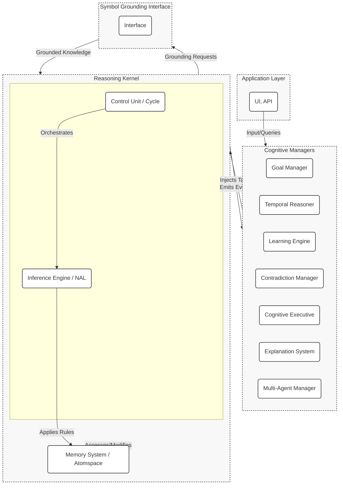

# HyperNARS: A Modular Reimplementation of NARS

## Overview

HyperNARS is a from-the-ground-up reimplementation of the Non-Axiomatic Reasoning System (NARS). It is designed as a highly modular, extensible, and performant framework for general-purpose AI, grounded in the **Assumption of Insufficient Knowledge and Resources (AIKR)**.

The primary goal of this project is to create a robust and scalable system that facilitates research and development in AGI. Key architectural features include:
- A **dual-process reasoning cycle** to balance efficiency and thoroughness.
- A suite of specialized **Cognitive Managers** to handle high-level functions like goal pursuit and temporal reasoning.
- An **event-driven architecture** to ensure loose coupling between components.
- A comprehensive **Symbol Grounding Interface** to connect abstract knowledge to real-world sensors and actuators.

This document serves as the primary design specification for the HyperNARS system.

## Guiding Principles

The architecture and implementation of HyperNARS are guided by a set of core principles that ensure its adherence to the NARS philosophy while promoting modern software engineering standards.

-   **Assumption of Insufficient Knowledge and Resources (AIKR):** This is the cornerstone of NARS. The system must operate under the assumption that its knowledge is incomplete and potentially contradictory, and that its computational resources are finite. This principle directly influences every aspect of the design, from truth-value representation to memory management and resource allocation.
-   **Modularity and Extensibility:** The system is built as a collection of loosely-coupled modules (e.g., Reasoning Kernel, Cognitive Managers). This allows for independent development, testing, and replacement of components, facilitating research and experimentation.
-   **Event-Driven Communication:** Components interact primarily through an asynchronous event bus. This decouples the modules, allowing for complex, emergent behaviors to arise from simple, local interactions.
-   **Continuous Online Learning:** HyperNARS is designed to learn from its experience in real-time. It constantly revises its beliefs, adjusts the utility of its inference rules, and adapts its behavior based on feedback.
-   **Symbol Grounding:** The system includes a dedicated interface for grounding abstract symbols to external sensors and actuators, providing a pathway for the system to interact with and learn from the real world.

---

1.  [System Architecture](#system-architecture)
2.  [Core Data Structures](#core-data-structures)
3.  [The Reasoning Cycle (Control Unit)](#the-reasoning-cycle-control-unit)
4.  [Cognitive Managers](#cognitive-managers)
5.  [Inference Engine](#inference-engine)
6.  [Memory System](#memory-system)
7.  [I/O and Public API](#io-and-public-api)
8.  [Symbol Grounding and Embodiment](#symbol-grounding-and-embodiment)
9.  [Extension Points](#extension-points)
10. [System Initialization and Configuration](#system-initialization-and-configuration)
11. [Concurrency and Parallelism](#concurrency-and-parallelism)
12. [State Serialization and Persistence](#state-serialization-and-persistence)
13. [Self-Governing Evolution: An Ambition for Autonomy](#self-governing-evolution-an-ambition-for-autonomy)
14. [System Bootstrapping and Foundational Knowledge](#system-bootstrapping-and-foundational-knowledge)
15. [Ethical Alignment and Safety](#ethical-alignment-and-safety)
16. [Error Handling and System Resilience](#error-handling-and-system-resilience)
17. [Interactive Debugging and Diagnostics (TUI)](#interactive-debugging-and-diagnostics-tui)
18. [Verification Strategy (see TEST.md)](TEST.md)

## 1. System Architecture

The new HyperNARS architecture will be designed as a modular, layered system. This approach enhances testability, extensibility, and maintainability. The design is inspired by the C4 model, focusing on components and their interactions.

The system is composed of a central **Reasoning Kernel** that executes the core reasoning cycle, and a suite of specialized **Cognitive Managers** that handle higher-level cognitive functions. This separation of concerns ensures the kernel remains lean and focused on pure NARS logic, while complex behaviors can be developed and tested independently in the managers.

Communication is primarily handled via an **asynchronous event bus**. The Reasoning Kernel emits events at key points in its cycle, and managers subscribe to these events to perform their functions. This ensures loose coupling and allows for flexible, emergent behavior. Managers can influence the kernel by injecting new tasks into its processing queue.

### Event-Based Communication
The Reasoning Kernel will emit events at key points in the reasoning cycle. Cognitive Managers subscribe to these events to perform their functions. Below are the core events and their data payloads:

-   **`task-selected`**: Fired when a task is chosen from the Atomspace for processing.
    -   **Payload**: `{ task: Task }`
-   **`belief-updated`**: Fired when a belief's truth-value is updated after revision with another belief.
    -   **Payload**: `{ belief: Belief, oldTruth: TruthValue }`
-   **`belief-added`**: Fired when a new belief is added to the Atomspace.
    -   **Payload**: `{ belief: Belief }`
-   **`contradiction-detected`**: Fired by the Memory System when a new task or belief directly contradicts an existing belief.
    -   **Payload**: `{ statement: ExpressionAtom, belief1: Belief, belief2: Belief }`
-   **`atom-activated`**: Fired when an atom's activation level changes.
    -   **Payload**: `{ atom: Atom, activation: number }`
-   **`atom-created`**: Fired when a new atom is created in memory.
    -   **Payload**: `{ atom: Atom }`
-   **`system-idle`**: Fired when the reasoning cycle has no tasks to process.
    -   **Payload**: `{ idleDuration: number }` // duration in milliseconds

Managers can inject new tasks into the system via a dedicated `Kernel.addTask(task: Task): void` method. This is the primary mechanism for managers to influence the reasoning process.

### Component Diagram


### 1.1. Pluggable Module Architecture
A core design principle is modularity, allowing different implementations of key components to be swapped out based on the desired system profile. The system uses a dynamic loading mechanism that can select between `simple` and `advanced` versions of its modules at initialization time.

For example, a user can configure the system to use a `SimpleMemoryManager` for lightweight tasks or an `AdvancedMemoryManager` with more sophisticated forgetting algorithms for complex, long-running scenarios. This allows the system's footprint and complexity to be tailored to the specific application.

### 1.2. Cognitive Manager Roles

The Cognitive Managers are specialized, pluggable modules that handle complex, cross-cutting concerns. They operate by subscribing to events from the Reasoning Kernel and can inject new tasks back into the system to influence its behavior. Their detailed functionality is described in Section 4.

### 1.3. Specialized and Distributed Spaces

A key architectural enhancement inspired by OpenCog Hyperon is the move from a single monolithic memory system to a collection of **Specialized Spaces**. The system can interface with multiple `Space` objects, each optimized for a different type of knowledge or computation. All spaces adhere to a common API, allowing the Reasoning Kernel to interact with them in a uniform way.

This provides a powerful framework for scalability and neural-symbolic integration:

-   **In-Memory Atomspace**: The primary space for high-speed symbolic and logical reasoning, as described in Section 6. It holds the core set of active atoms and their contexts.
-   **Distributed Atomspace (DAS)**: For massive scalability, the system can connect to a DAS that spans multiple machines. The DAS can hold a vast, long-term knowledge base, with the in-memory Atomspace acting as a high-speed cache. This allows the system to scale to billions or trillions of atoms.
-   **Neural Spaces**: To achieve deep neural-symbolic integration, external neural networks (like LLMs or image recognition models) can be wrapped in a `Neural Space`. The Reasoning Kernel can then query the neural network as if it were just another knowledge space. For example, a query to a `Neural Space` wrapping an LLM could translate a MeTTa expression into a natural language question and return the answer.
-   **Grounded Spaces**: For embodied agents, a `Grounded Space` can provide an interface to external environments, such as a physics simulator or a robot's sensorimotor hardware. This allows the system to reason directly about and interact with the state of the external world.

## 2. Core Data Structures: The Atomspace and MeTTa

The system's knowledge is represented in a **Metagraph** called the **Atomspace**, a concept adapted from OpenCog Hyperon. The core data structures are defined by the **MeTTa (Meta-Type-Talk)** language, a flexible language for representing and transforming knowledge. All data structures are designed as **immutable** objects where possible to ensure functional purity and thread safety.

### 2.1. Atoms: The Building Blocks of Knowledge

The fundamental unit in the Atomspace is the `Atom`. Atoms are globally unique, immutable, and serve as the vertices and hyperedges of the knowledge metagraph.

```typescript
// An Atom is the basic unit of meaning. It can be a Symbol, Variable, GroundedAtom, or an Expression.
type Atom = SymbolAtom | VariableAtom | GroundedAtom | ExpressionAtom;

// A Symbol is a named identifier, like 'cat' or 'inheritance'.
interface SymbolAtom {
    readonly type: 'Symbol';
    readonly name: string;
}

// A Variable is a placeholder used in patterns and rules, e.g., '$x'.
interface VariableAtom {
    readonly type: 'Variable';
    readonly name: string;
}

// A GroundedAtom wraps external, non-symbolic data or executable code.
// This is the core of the Symbol Grounding mechanism.
interface GroundedAtom {
    readonly type: 'Grounded';
    // The data can be any external object, function, or value.
    readonly data: any;
    // A string representation for display and hashing.
    toString(): string;
}

// An Expression is a sequence of other Atoms, forming a tuple-like structure.
// This is the primary way to represent complex knowledge, statements, and rules.
// Example: (inheritance (Symbol 'cat') (Symbol 'animal'))
interface ExpressionAtom {
    readonly type: 'Expression';
    // An ordered array of Atoms.
    readonly children: Atom[];
    // A unique, canonical string representation used for hashing.
    readonly key: string;
    toString(): string;
}
```

### 2.2. From NAL Statements to MeTTa Expressions

The traditional NARS `Statement` is represented as an `ExpressionAtom` in MeTTa. The `copula` is typically the first `SymbolAtom` in the expression, and the terms follow. This makes the knowledge representation more uniform and extensible.

**Example Mappings:**

-   A NAL Inheritance statement `<cat --> animal>` becomes a MeTTa expression:
    `(Inheritance (Symbol "cat") (Symbol "animal"))`

-   A higher-order statement like `(<cat --> animal> ==> <mammal --> animal>)` can be represented by nesting expressions:
    `(Implication (Expression (Inheritance (Symbol "cat") (Symbol "animal"))) (Expression (Inheritance (Symbol "mammal") (Symbol "animal"))))`

This structure, where expressions can contain other expressions, is what makes the Atomspace a **Metagraph**.

### 2.3. Formal Foundations

The design of MeTTa and the Atomspace is influenced by formal systems like **Type Theory** and **Category Theory**. While MeTTa itself is untyped at its core, it is powerful enough to define complex, dependent, and even probabilistic type systems within itself. This allows for a high degree of formal verification and mathematical rigor, without imposing a rigid type system on the core logic.


// Represents the epistemic value of a statement, grounded in evidence.
class TruthValue {
    readonly f: number; // frequency in [0, 1]
    readonly c: number; // confidence in (0, 1)
    readonly d: number; // doubt in [0, 1]

    constructor(f: number, c: number, d: number = 0) {
        this.f = Math.max(0, Math.min(1, f));
        this.c = Math.max(0, Math.min(1, c));
        this.d = Math.max(0, Math.min(1, d));
    }

    // Expectation: The degree of positive evidence, adjusted for doubt.
    get e(): number { return this.c * (this.f - 0.5) * (1 - this.d) + 0.5; }

    // NAL Revision: Combines two pieces of evidence.
    static revise(t1: TruthValue, t2: TruthValue): TruthValue {
        const f1 = t1.f, c1 = t1.c, d1 = t1.d;
        const f2 = t2.f, c2 = t2.c, d2 = t2.d;

        // The weights w1 and w2 represent the relative confidence of each piece of evidence.
        // A piece of evidence is weighted by its own confidence, discounted by the confidence of the other.
        const w1 = c1 * (1 - c2);
        const w2 = c2 * (1 - c1);
        const w_sum = w1 + w2;

        // If the sum of weights is zero, it implies both c1 and c2 are 1, which represents a logical contradiction.
        // In this case, the result is maximum doubt and zero confidence.
        if (w_sum === 0) return new TruthValue((f1+f2)/2, 0, 1); // Total contradiction

        // The revised frequency is the weighted average of the two frequencies.
        const f_rev = (f1 * w1 + f2 * w2) / w_sum;
        // The revised confidence is the sum of the weights divided by the sum of weights plus the product of ignorances.
        // This formula ensures that confidence grows with consistent evidence.
        const c_rev = w_sum / (w_sum + (1 - c1) * (1 - c2));

        // Doubt has two components: inherited doubt and conflict-generated doubt.
        // 1. Inherited doubt is merged: `1 - (1 - d1) * (1 - d2)`
        // 2. Conflict-generated doubt is proportional to the difference in frequencies.
        const d_conflict = Math.abs(f1 - f2) / 2;
        // The final doubt is the union of these two sources.
        const d_rev = 1 - (1 - d1) * (1 - d2) * (1 - d_conflict);

        return new TruthValue(f_rev, c_rev, d_rev);
    }

    // NAL Projection: Calculates truth for a component of a compound term.
    static project(t: TruthValue, numComponents: number): TruthValue {
        // According to NARS literature, projection primarily affects confidence.
        // The confidence of a projected belief is a function of the original confidence
        // and the size of the set from which it is projected.
        // c_proj = c / (1 + log2(k)) where k is numComponents.
        // This is a more theoretically grounded formula.
        const c_proj = t.c / (1 + Math.log2(numComponents));
        // Doubt is inherited directly from the parent. Projection reduces confidence because
        // it represents a loss of specificity, but it doesn't introduce new sources of
        // contradiction or ambiguity, so the original doubt level is maintained.
        return new TruthValue(t.f, c_proj, t.d);
    }

    // NAL Conjunction (Intersection): Combines two statements conjunctively.
    static and(t1: TruthValue, t2: TruthValue): TruthValue {
        const f = t1.f * t2.f;
        const c = t1.c * t2.c;
        // Doubt in a conjunction is the union of the doubt of its parts.
        const d = 1 - (1 - t1.d) * (1 - t2.d);
        return new TruthValue(f, c, d);
    }

    // NAL Union: Combines two statements disjunctively.
    static or(t1: TruthValue, t2: TruthValue): TruthValue {
        const f = 1 - (1 - t1.f) * (1 - t2.f);
        const c = t1.c * t2.c;
        // Doubt in a disjunction is the union of the doubt of its parts.
        const d = 1 - (1 - t1.d) * (1 - t2.d);
        return new TruthValue(f, c, d);
    }
}

// Represents the allocation of computational resources to a task.
class Budget {
    readonly priority: number;   // [0, 1]: How important is the task now?
    readonly durability: number; // [0, 1]: How important is the task over time?
    readonly quality: number;    // [0, 1]: How well-founded is the task?

    constructor(priority: number, durability: number, quality: number);

    /**
     * Dynamically allocates a budget for a new task using a configurable strategy.
     * @param context An object with factors like:
     *        - `type`: 'input', 'derived', 'goal'
     *        - `novelty`: How new is the information? [0, 1]
     *        - `urgency`: How time-sensitive is it? [0, 1]
     *        - `parentQuality`: Quality of the parent belief/task.
     *        - `ruleUtility`: The historical success rate of the deriving rule.
     *        - `systemLoad`: The current resource utilization of the system [0, 1].
     * @param config The system's budget allocation configuration.
     */
    static dynamicAllocate(
        context: { type: string, novelty: number, urgency: number, parentQuality: number, ruleUtility?: number, systemLoad: number },
        config: BudgetAllocationConfig
    ): Budget {
        let priority = 0.5, durability = 0.5, quality = context.parentQuality;
        const utility = context.ruleUtility ?? 1.0;

        // Modulate budget based on overall system load. If the system is busy, allocate smaller budgets.
        const resourceAvailability = Math.max(0.1, 1.0 - context.systemLoad);

        switch (context.type) {
            case 'input':
                priority = config.input.urgencyWeight * context.urgency + config.input.noveltyWeight * context.novelty;
                durability = config.input.durability;
                break;
            case 'goal':
                priority = config.goal.urgencyWeight * context.urgency;
                durability = config.goal.durability;
                break;
            case 'derived':
                priority = (config.derived.parentQualityWeight * context.parentQuality + config.derived.noveltyWeight * context.novelty) * utility;
                durability = (config.derived.parentQualityWeightForDurability * context.parentQuality) * utility;
                break;
        }

        // Final budget is scaled by resource availability.
        return new Budget(priority * resourceAvailability, durability, quality);
    }

    /**
     * **Rationale for `dynamicAllocate`:**
     *
     * The `dynamicAllocate` function is designed to reflect the system's priorities based on the origin and nature of a task, in accordance with AIKR. The constants and weights are heuristics chosen to produce specific behaviors:
     *
     * -   **Input Tasks**: These are considered highly important and urgent as they represent new information from the external world. They receive a high `priority` (weighted towards `urgency`) to ensure they are processed quickly, but a moderate `durability` as their long-term importance is not yet known.
     * -   **Goal Tasks**: These are the system's objectives and are given the highest `priority` and `durability` to ensure persistent focus on achieving them.
     * -   **Derived Tasks**: The budget for these tasks is a function of the `parentQuality` (the confidence of the belief that generated them) and the historical `ruleUtility`. This crucial link ensures that the system allocates more resources to lines of reasoning that are well-founded and have proven effective in the past, while reducing focus on speculative or low-confidence derivations. The `novelty` factor provides a small boost to encourage exploration.
     * -   **Resource-Aware Allocation**: A key feature distilled from the implementation is that all allocated budgets are scaled by the system's current `resourceAvailability`. This ensures that when the system is under heavy load (e.g., its event queue is full), it becomes more conservative in its resource allocation, preventing runaway processing loops and promoting stability.
     */

    // Merges budgets from parent tasks.
    static merge(b1: Budget, b2: Budget): Budget {
        // A more sophisticated merging strategy that prevents the system from getting
        // stuck in low-quality reasoning loops. Priority and Durability are averaged,
        // but the new quality is the product of the parent qualities, reflecting that
        // a conclusion is only as strong as its weakest link.
        const priority = (b1.priority + b2.priority) / 2;
        const durability = (b1.durability + b2.durability) / 2;
        const quality = b1.quality * b2.quality;
        return new Budget(priority, durability, quality);
    }
}

// An immutable pairing of an ExpressionAtom (a statement) and its epistemic value.
interface Belief {
    readonly statement: ExpressionAtom;
    readonly truth: TruthValue;
    readonly timestamp: number; // Creation time for temporal analysis.
}

// A work unit for the system, containing an Atom to be processed.
interface Task {
    readonly atom: Atom;
    readonly budget: Budget;
    readonly parentBeliefs: Belief[]; // Provenance/derivation history.
    readonly stamp: Stamp; // Derivational stamp to prevent infinite loops.
}

### 2.4. Atom Context: Bridging Global Knowledge with Local Processing

To balance the global, unified nature of the Atomspace with the NARS principle of localized, attention-driven processing, each `Atom` is associated with an `AtomContext`. This context holds the transient, activation-dependent information related to the atom, such as its local beliefs and tasks.

```typescript
// The context associated with each unique Atom in the Atomspace.
// This re-introduces the concept of a "Concept" from NARS as a local
// processing hub for a given Atom.
class AtomContext {
    readonly atom: Atom;
    // All beliefs directly related to this atom, indexed by statement key.
    readonly beliefs: Map<string, Belief>;
    // A queue of tasks to be processed, prioritized by budget.
    readonly taskQueue: PriorityQueue<Task>;
    // The current activation level of the atom.
    activation: number;
    // Max number of beliefs/tasks to store. Can be dynamic.
    capacity: number;

    // Methods for adding/selecting beliefs and tasks, and for forgetting,
    // would be similar to the original Concept class, but operating on Atoms.
    addBelief(belief: Belief): void { /* ... */ }
    addTask(task: Task): void { /* ... */ }
    selectTask(): Task | null { /* ... */ }
    private forget(): void { /* ... */ }
}
```

### 2.5. The Derivational Stamp

To prevent infinite reasoning loops (e.g., A -> B, B -> A) and redundant derivations, each `Task` carries a `Stamp`. The stamp records the IDs of the parent beliefs and tasks that contributed to its creation. Before an inference rule is applied, the system checks if the stamps of the two premises (the task and the belief) overlap. If they do, the inference is blocked, as it would mean re-deriving information from its own lineage.

Two primary implementations of the `Stamp` can be considered:

1.  **Evidential Base (OpenNARS-style):**
    -   **Representation**: The stamp is an array of unique integer IDs, where each ID corresponds to an input belief or a specific derivation step.
    -   **Merge Operation**: When two tasks/beliefs are merged, their stamp arrays are concatenated, and the resulting list is sorted and deduplicated.
    -   **Overlap Check**: Overlap is detected by performing a linear scan or a more optimized intersection check on the two sorted arrays.
    -   **Pros**: Guarantees perfect loop detection. The full derivation path is preserved.
    -   **Cons**: Can become very large for long derivation chains, consuming significant memory and making the overlap check computationally expensive.

2.  **Bloom Filter / Bitwise Representation:**
    -   **Representation**: The stamp is a bitmask or a Bloom filter, a fixed-size probabilistic data structure. Each belief ID is hashed to one or more bit positions in the filter, which are then set to `1`.
    -   **Merge Operation**: Merging two stamps is a simple, fast bitwise `OR` operation on their filters. `new_filter = filter1 | filter2`.
    -   **Overlap Check**: Overlap is checked with a bitwise `AND` operation. If `(filter1 & filter2) !== 0`, there is a potential overlap.
    -   **Pros**: Extremely fast and memory-efficient due to its fixed size.
    -   **Cons**: Probabilistic. It can produce false positives (reporting an overlap where none exists), which would incorrectly block a valid inference path. The rate of false positives can be tuned by adjusting the size of the filter and the number of hash functions, but it can never be zero. It does not preserve the full derivation path.

The choice between these two represents a classic trade-off between logical perfection and resource efficiency, a core theme in NARS. The system could even be configured to use one or the other based on the desired operational profile.
```

## 3. The Reasoning Cycle: A Dual-Process Control Unit

To achieve a balance between efficiency and thoroughness, the reasoning cycle is architected as a **dual-process system**, inspired by dual process theories in cognitive science. This allows the system to handle routine inferences rapidly while dedicating more resources to complex, novel, or problematic situations. The two modes are:

1.  **System 1 (Reflexive Mode):** A fast, associative, and resource-efficient mode for routine reasoning. It operates continuously, handling the vast majority of inferences.
2.  **System 2 (Deliberative Mode):** A slow, serial, and resource-intensive mode for deep, focused reasoning. It is triggered under specific conditions to handle complex problems, paradoxes, or high-stakes goals.

The **Cognitive Executive** (the `MetaReasoner` manager) is responsible for monitoring the system's state and orchestrating the transition between these two modes.

### 3.1. System 1: The Reflexive Reasoning Loop

This is the default operational mode, representing the main loop of the system. It is designed for high throughput and continuous, parallelizable processing. Its operation is largely unchanged from a standard NARS control cycle.

```pseudocode
function reflexiveReasoningCycle(kernel) {
  while (kernel.isRunning && kernel.getMode() === 'reflexive') {
    // A mutable context object for this cycle, passed to hooks.
    let cycleContext = { kernel, task: null, concept: null, belief: null, derivedTasks: [] };

    // HOOK: beforeCycle (read-only context)
    kernel.hooks.run('beforeCycle', cycleContext);

    // 1. Select an Atom's Context and then a Task from its local queue.
    let { atomContext, task } = kernel.memory.selectTaskFromOverallExperience();
    if (!task || !atomContext) {
        kernel.events.emit('system-idle', { idleDuration: 100 });
        kernel.wait(100); // Wait if no task is available.
        continue;
    }
    cycleContext.task = task;
    cycleContext.atomContext = atomContext;
    kernel.events.emit('task-selected', { task });

    // 2. Select a Belief from the chosen Atom's context to interact with the Task.
    let belief = atomContext.selectBeliefForTask(task);
    if (!belief) continue; // No relevant belief found.
    cycleContext.belief = belief;

    // 3. Perform Local Inference using the MeTTa interpreter.
    let derivedTasks = kernel.inferenceEngine.match(cycleContext.task, cycleContext.belief);
    cycleContext.derivedTasks = derivedTasks;

    // 4. Process and Store Derived Tasks.
    for (let derivedTask of cycleContext.derivedTasks) {
      // Find or create the context for the target atom and add the task.
      let targetAtom = derivedTask.atom.children[0]; // Simplified assumption
      let targetContext = kernel.memory.getOrCreateContext(targetAtom);
      targetContext.addTask(derivedTask);
    }

    // 5. System-level cleanup and updates.
    kernel.hooks.run('afterCycle', cycleContext);
  }
}
```

### 3.2. System 2: The Deliberative Reasoning Process

The Deliberative Mode is not a simple loop but a structured, goal-driven process initiated by the Cognitive Executive when it detects a situation requiring deeper analysis. This mode consumes a significantly larger budget and may temporarily halt the Reflexive Mode to focus resources.

**Triggers for Deliberative Mode:**

The Cognitive Executive transitions the system to Deliberative Mode upon detecting:
-   **High-Impact Contradictions:** A contradiction between two high-confidence beliefs, or a contradiction related to a high-priority goal.
-   **Persistent Paradoxes:** Detection of logical or temporal paradoxes (e.g., the Liar Paradox, or `A before B` and `B before A`). This is key to addressing the `temporal_paradox.js` test failure.
-   **Strategic Goal Pursuit:** A high-priority goal that requires complex planning, simulation, or means-ends analysis.
-   **Explicit Metacognitive Command:** An input task instructing the system to "think about" a specific concept or problem.

**The Deliberative Process:**

Once triggered, the Deliberative Mode executes a multi-step analysis:
1.  **Context Freezing & Scoping:** The relevant area of the concept graph is "frozen" by allocating a large budget to the involved concepts and tasks, preventing them from being forgotten during the analysis.
2.  **Hypothesis Generation:** Instead of just applying rules forward, the system generates multiple competing hypotheses. For a paradox, it might generate hypotheses like "premise A is wrong," "premise B is wrong," or "the derivation rule is misapplied."
3.  **Evidence Gathering & Simulation:** The system actively seeks evidence for or against each hypothesis. This may involve generating questions (`nalq`) to find missing information or running "mental simulations" by exploring long derivation chains without immediately adding the results to the belief space.
4.  **Conclusion & Action:** After a set number of steps or when a conclusion reaches a high confidence threshold, the system commits to a resolution. This might involve:
    -   Revising a core belief that caused the paradox.
    -   Creating a new, more nuanced belief that resolves a contradiction (e.g., via the Specialize strategy).
    -   Adjusting the utility of an inference rule that consistently leads to errors.
    -   Formulating a multi-step plan to achieve a complex goal.
5.  **Return to Reflexive Mode:** The Cognitive Executive then transitions the system back to System 1, possibly with new knowledge or goals derived from the deliberative process.

This dual-process architecture provides a more robust framework for handling the kinds of complex issues identified in the skipped tests, offering a clear path to fixing "deeper bugs" in the reasoning engine.

### 3.3. Task and Belief Selection Algorithms

The functions `selectTaskFromOverallExperience()` and `selectBeliefForTask()` are critical for guiding the system's attention.

**`selectTaskFromOverallExperience()`**

This function implements the NARS-style two-level selection process to balance global priorities with local context.

1.  **Atom Selection**: First, an `AtomContext` is chosen from the entire memory. This is not a uniform random selection. Instead, it's a weighted "roulette-wheel" selection where each context's chance of being chosen is proportional to its `activation` level. This ensures that more active, currently relevant atoms are processed more frequently.
2.  **Task Selection**: Once a context is selected, the highest-priority `Task` is dequeued from its local `taskQueue`.

```pseudocode
function selectTaskFromOverallExperience(memory) {
    // 1. Select an AtomContext using a roulette-wheel method based on activation.
    let totalActivation = memory.contexts.sum(c => c.activation);
    let randomPoint = Math.random() * totalActivation;
    let currentSum = 0;
    let selectedContext = null;
    for (let context of memory.contexts) {
        currentSum += context.activation;
        if (currentSum >= randomPoint) {
            selectedContext = context;
            break;
        }
    }

    if (!selectedContext) return { atomContext: null, task: null };

    // 2. Select the best task from that context's local queue.
    let task = selectedContext.selectTask();
    return { atomContext: selectedContext, task: task };
}
```

**`selectBeliefForTask(task)`**

Given a task, the `AtomContext` must select a relevant belief from its local belief cache to interact with. Relevance is key to fostering meaningful inferences.

1.  **Candidate Selection**: Identify all beliefs in the `atomContext.beliefs` that are "structurally relevant" to the task's atom. This means they share at least one common `SymbolAtom`.
2.  **Relevance Scoring**: Score each candidate belief. A simple relevance score can be `belief.truth.confidence * structural_similarity_score`.
3.  **Best Belief Selection**: Select the belief with the highest relevance score.

```pseudocode
function selectBeliefForTask(atomContext, task) {
    let bestBelief = null;
    let maxRelevance = -1;

    for (let belief of atomContext.beliefs.values()) {
        if (hasCommonSymbols(task.atom, belief.statement)) {
            // Calculate relevance (simple version: use confidence)
            let relevance = belief.truth.confidence;
            if (relevance > maxRelevance) {
                maxRelevance = relevance;
                bestBelief = belief;
            }
        }
    }
    return bestBelief;
}
```

## 4. Cognitive Managers
The Cognitive Managers are specialized, pluggable modules that handle complex, cross-cutting concerns. They operate by subscribing to events from the Reasoning Kernel and can inject new tasks back into the system to influence its behavior.

### 4.1. Goal Manager
The Goal Manager is responsible for the entire lifecycle of goal-oriented behavior, from receiving a high-level goal to decomposing it into actionable steps and monitoring its progress. It operates as a sophisticated planner and execution monitor.
-   *Subscribes to*: `belief-updated`, `belief-added`, `afterCycle`.
-   **Goal Lifecycle**: Manages goals with a defined lifecycle (`active`, `waiting`, `achieved`, `abandoned`). Goals can have deadlines and are abandoned if not met in time.
-   **Action - The Execution Loop**:
    1.  **Prioritization**: In each cycle, the manager identifies the most urgent active goal based on its priority and proximity to its deadline.
    2.  **Satisfaction Check**: It first checks if the goal is already satisfied by querying the system's belief base against a configurable `achievedThreshold`.
    3.  **Action Selection**: If the goal is not met, it searches for known procedural rules (`<(*, Pre, Op)> ==> <Effect>`) where the `Effect` matches the current goal. It scores all applicable actions based on a utility calculation: `score = (reliability * goal_utility) - (action_cost)`. `Reliability` is the confidence of the procedural rule, and `action_cost` is derived from the budget of the operation.
    4.  **Execution & Sub-goaling**:
        - If a suitable action is found and its preconditions are met, the manager triggers the `OperationalRule` to execute it.
        - If no single action can satisfy the goal, the manager attempts to **decompose** it. If the goal is a conjunction (e.g., `goal: <(&&, A, B)>`), it creates new sub-goals for `A` and `B` and sets the parent goal's status to `waiting`.
        - If preconditions for a selected action are not met, it generates new, high-priority sub-goals to satisfy those preconditions.
-   *Injects*: New sub-goals to decompose complex problems or satisfy the preconditions for an action. It also injects high-priority tasks to find information relevant to its current goal.
-   **Procedural Skill Acquisition**: Beyond executing known procedures, a key function of the Goal Manager is to learn new ones. The system learns by observing the consequences of its operations. The learning process is as follows:
    1.  **Babbling/Exploration**: The system may execute an operation without a known outcome, either randomly or because it is part of a high-level exploration goal.
    2.  **Consequence Monitoring**: After executing an operation (e.g., `#op`), the Goal Manager monitors the system for significant changes in its belief state in the subsequent cycles.
    3.  **Rule Formation**: If a reliable correlation is detected between the operation and a resulting state change (e.g., `effect`), the system forms a new procedural belief. It captures the state *before* the operation as the precondition (`pre`). This results in a new rule: `<(*, pre, #op)> ==> effect>`.
    4.  **Refinement**: The confidence of this new rule starts low and is adjusted over time based on its success or failure when applied in the future.
-   **Verification Scenarios**:
    -   **Goal Decomposition**: A test verifies that a conjunctive goal like `goal: <(&&, A, B)>` is correctly decomposed. The system should create two new active goals for `A` and `B`, and the original goal's status should become `waiting`.
    -   **Procedural Skill Execution**: A test verifies that the system can execute a grounded action to achieve a goal.
        > Given a mock function `unlock_door` is registered with the Symbol Grounding Interface for the term `<#unlock_door>`
        > And the system knows the procedural rule: `(<(*, (&, <SELF --> (is_at, door)>, <door --> (is, locked)>), <#unlock_door>)> ==> <door --> (is, unlocked)>)`
        > And the system has the beliefs:
        >   | statement                   | truth       |
        >   | "<SELF --> (is_at, door)>"  | <%1.0,0.9%> |
        >   | "<door --> (is, locked)>"   | <%1.0,0.9%> |
        > And the system has the goal: `goal: <door --> (is, unlocked)>`
        > When the `OperationalRule` is applied
        > Then the mock function `unlock_door` should be called
        > And the system should form a new belief `<#unlock_door --> executed>`
    -   **Scenario: Temporal-Goal Interaction (TGI-01)**
        > Given the system has a goal `goal: <(achieve, 'report_submission')>` with a deadline of "now + 10s"
        > And the system knows two procedural rules:
        >   | rule                                                              |
        >   | `(<(*, <data --> collected>, <#submit_report>)> ==> <report_submission>)` |
        >   | `(<(*, <(true)>, <#collect_data>)> ==> <data --> collected>)`       |
        > And both `#submit_report` and `#collect_data` are grounded operations
        > And the current time is "now"
        > When the system runs its reasoning cycle
        > Then the task for `goal: <(achieve, 'report_submission')>` should have its budget priority increase as the deadline approaches
        > And the system should first execute the `#collect_data` operation to satisfy the precondition for submitting the report.

### 4.2. Temporal Reasoner
Provides a comprehensive framework for understanding and reasoning about time, moving beyond simple event ordering to handle continuous time and predictive logic.
-   *Subscribes to*: `belief-added` (specifically for statements with temporal copulas), `system-tick` (for time-sensitive updates).
-   **Core Capabilities**:
    -   **Constraint Propagation**: Maintains an internal graph of temporal relationships. When new temporal information is learned (e.g., `<event_A --> (before, event_B)>`), it uses a constraint propagation algorithm based on **Allen's Interval Algebra** to infer new temporal relationships (e.g., if A is before B and B is before C, it infers A is before C).
    -   **Quantitative and Continuous Time**: The reasoner supports not just qualitative relations (`before`, `after`) but also quantitative time differences. Statements can include specific durations, e.g., `<(event_A) --> (before, event_B, 5s)>`. This allows for more precise, continuous-time reasoning.
    -   **Time-Varying Truth Values**: The reasoner can manage beliefs whose truth value is a function of time. For example, a belief `<(it_is, 'sunny')>` might be true during the day but false at night. This is managed via a **Temporal Belief Table** that can be queried for the validity of a belief at a specific point in time or over an interval.
    -   **Predictive Reasoning**: The system can project future events based on learned patterns. For example, if the system learns that `<(event_A) ==> (after, event_B, 10m)>`, and it observes `event_A`, the Temporal Reasoner can generate a predictive goal or belief about `event_B` occurring in 10 minutes.
-   *Injects*:
    -   New, high-confidence beliefs representing inferred temporal relationships (e.g., `<event_A --> (before, event_C)>`).
    -   Predictive tasks about future events, with budgets that may increase as the event time approaches.
-   **Verification Scenarios**:
    -   **Scenario: Temporal Reasoning with Intervals**
        > Given the system knows that:
        >   | event               | starts      | ends        |
        >   | "daytime_event"     | now         | now + 4h    |
        >   | "important_meeting" | now + 1h    | now + 2h    |
        > And there is a constraint that "important_meeting" happens "during" "daytime_event"
        > When the system runs for 50 steps
        > Then the system should be able to infer that the relationship between "important_meeting" and "daytime_event" is "during"
    -   **Scenario: Chained Temporal Inference (Transitivity)**
        > Given the system knows the following temporal statements:
        >   | statement                                | truth       |
        >   | "<(event_A) [/] (event_B)>"               | <%1.0,0.9%> | # A happens before B
        >   | "<(event_B) [/] (event_C)>"               | <%1.0,0.9%> | # B happens before C
        > When the system runs for 100 inference steps
        > Then the system should derive the belief "<(event_A) [/] (event_C)>" with high confidence

### 4.3. Learning Engine
Responsible for abstracting knowledge and forming new concepts.
-   *Subscribes to*: `concept-created`, `belief-added`, `afterInference`.
-   *Action*: Detects patterns and correlations across concepts to form higher-level abstractions or new inference rules. It provides performance statistics on existing inference rules to the `CognitiveExecutive` to aid in self-optimization.
-   *Injects*: Tasks representing new concepts or learned rules.
-   **Verification Scenario: Meta-Learning Verification of a New Inference Rule (ML-01)**
    > Given the system's LearningEngine is active and monitoring derivation patterns
    > And the system repeatedly observes the following pattern:
    >   | premise1                                    | premise2                                    | conclusion                                  |
    >   | "<{X} --> (location, west_of, {Y})>"        | "<{Y} --> (location, west_of, {Z})>"        | "<{X} --> (location, west_of, {Z})>"        |
    >   | "<{A} --> (location, west_of, {B})>"        | "<{B} --> (location, west_of, {C})>"        | "<{A} --> (location, west_of, {C})>"        |
    >   | "<{E} --> (location, west_of, {F})>"        | "<{F} --> (location, west_of, {G})>"        | "<{E} --> (location, west_of, {G})>"        |
    > When the LearningEngine's pattern detection threshold is met
    > Then the system should create and register a new InferenceRule named "CUSTOM_TRANSITIVE_LOCATION_WEST_OF"
    > And when the system is later given the premises:
    >   | statement                                   | truth       |
    >   | "<(new_york) --> (location, west_of, (london))>" | <%1.0,0.9%> |
    >   | "<(london) --> (location, west_of, (beijing))>" | <%1.0,0.9%> |
    > And the new rule "CUSTOM_TRANSITIVE_LOCATION_WEST_OF" is applied
    > Then a new task for "<(new_york) --> (location, west_of, (beijing))>" should be derived

### 4.4. Contradiction Manager
The Contradiction Manager implements sophisticated strategies for resolving contradictions. When a `contradiction-detected` event is fired, the manager analyzes the evidence, source reliability, and recency of the conflicting beliefs to decide on a resolution strategy.
-   *Subscribes to*: `contradiction-detected`.
-   *Injects*: Tasks that revise or remove beliefs to resolve the contradiction.

#### Contradiction Resolution Strategies
The choice of strategy can be determined by the `CognitiveExecutive` based on the context of the contradiction. The available strategies include:
-   **`DominantEvidenceStrategy` (Default)**: Identifies the single belief with the highest evidence strength. This "winning" belief is kept, while all other conflicting beliefs are "weakened" by having their confidence and budget reduced and their doubt increased. This is a conservative strategy that trusts the strongest evidence without discarding other viewpoints entirely.
-   **`MergeStrategy`**: Takes the two strongest conflicting beliefs and merges them using the NAL revision formula (`TruthValue.revise`). This creates a new, synthesized belief that incorporates evidence from both parents. This strategy is useful for integrating conflicting information into a single, more nuanced belief.
-   **`EvidenceWeightedStrategy`**: A more comprehensive merge, this strategy calculates a new truth value and budget by taking a weighted average of *all* conflicting beliefs. The weight for each belief is its evidence strength. This results in a single new belief that represents the consensus of all available evidence.
-   **`RecencyBiasedStrategy`**: A simple but effective strategy that resolves a conflict by keeping only the most recent belief and discarding all others. This is useful in dynamic environments where newer information is more likely to be correct.
-   **`SourceReliabilityStrategy`**: Similar to `EvidenceWeightedStrategy`, but the weight for each belief is determined by the historical reliability of its source, modulated by the belief's priority. This allows the system to trust information from sources that have been proven trustworthy in the past.
-   **`SpecializationStrategy`**: Instead of merging or deleting beliefs, this strategy resolves a contradiction by creating a more specific, contextual belief. For example, if the system believes `<bird --> flyer>` but encounters a strong contradiction with `<penguin --> not_a_flyer>`, this strategy might generate a new belief like `<(&, bird, (-, penguin)) --> flyer>`, resolving the conflict by creating a more nuanced rule. This is a key mechanism for learning and refining knowledge.

#### Verification Scenarios
The following scenarios verify the functionality of the Contradiction Manager and its various strategies.

**Scenario: Belief Revision after Contradiction**
> Given the system believes that "<tweety --> flyer>" with truth "<%0.8,0.7%>"
> When the system runs for 10 steps
> Then the belief "<tweety --> flyer>" should have an expectation greater than 0.5
> And when the system is told:
>   | statement             | truth          | priority |
>   | "(penguin --> !flyer)"  |                | "#0.95#" |
>   | "(tweety --> penguin)"  | "<%0.99,0.99%>" |          |
> And contradictions are resolved
> And the system runs for 100 steps
> Then the expectation of the belief "<tweety --> flyer>" should decrease

**Scenario: Contradiction Resolution via Specialization**
> Given the system has a strong belief that "<bird --> flyer>"
> And the system is then told with high confidence that "<penguin --> bird>"
> And the system is then told with very high confidence that "<penguin --> not_a_flyer>"
> When a contradiction is detected between "penguin is a flyer (derived)" and "penguin is not a flyer (input)"
> And the "Specialize" strategy is applied by the Contradiction Manager
> Then the system should lower the confidence of its belief "<bird --> flyer>"
> And the system should create a new belief "<(&, bird, (-, penguin)) --> flyer>"

### 4.5. Cognitive Executive (Meta-Reasoner)
*Note: This document uses "Cognitive Executive" to refer to the conceptual role of a master control program. The concrete implementation of this role is the `MetaReasoner` manager.*

The system's master control program, responsible for monitoring and adapting the system's overall behavior through a continuous, metrics-driven feedback loop. It embodies the principle of self-regulating autonomy.
-   *Subscribes to*: All major system events (`afterCycle`, `contradiction-detected`, `question-answered`, etc.).
-   **Core Function: The Self-Monitoring Loop**
    1.  **Calculate Metrics**: Periodically, the executive calculates a slate of Key Performance Indicators (KPIs) that represent the system's health, such as `inferenceRate`, `contradictionRate`, `resourceUtilization` (event queue size), and `questionResponseTime`.
    2.  **Detect Issues**: It compares these live metrics against configurable thresholds to identify operational issues (e.g., `'high-contradictions'`, `'low-inference-rate'`).
    3.  **Adapt Parameters**: Based on the detected issues, it performs real-time adjustments to core system parameters. For example, if `'high-contradictions'` is detected, it might increase the `inferenceThreshold` to make the system more skeptical. If `'low-inference-rate'` is detected, it might lower the `budgetThreshold` to allow more tasks to be processed.
    4.  **Adjust Resource Allocation**: It dynamically shifts the global resource allocation between major subsystems (`derivation`, `memory`, `temporal`). For instance, if the contradiction rate is high, it may allocate more resources to memory management and revision.
    5.  **Adjust Reasoning Focus**: It sets a global "focus" for the system, such as `'question-answering'` or `'contradiction-resolution'`, which can be used by other components (like the `DerivationEngine`) to prioritize certain types of operations.
-   *Injects*: High-level control tasks or directly calls configuration methods on the kernel to enact its adaptations.
-   **Verification Scenarios**:
    -   **Scenario: Meta-Reasoning Causes System Adaptation**
        > Given the system has a `MetaReasoner` cognitive manager installed
        > And the system's default "doubt" parameter is 0.1
        > And the system experiences a sudden spike of over 50 contradictory events within a short time frame
        > When the `MetaReasoner`'s `analyzeSystemHealth` function is triggered
        > Then the system's "doubt" parameter should be increased to a value greater than 0.1
        > And a new goal should be injected to investigate the cause of the high contradiction rate
    -   **Scenario: Self-Optimization of Inference Rules (META-02)**
        > Given the system's `MetaReasoner` is active
        > And the `AbductionRule` has generated 20 tasks in the last 100 cycles
        > And 18 of those tasks resulted in beliefs that were later contradicted
        > When the `MetaReasoner` analyzes rule performance
        > Then the system should form a belief like `<(rule, 'AbductionRule') --> (has_utility, 'low')>` with high confidence
        > And the system should adjust a configuration parameter to lower the default budget quality for tasks derived from `AbductionRule`
    -   **Scenario: Self-Optimization of System Parameters (META-05)**
        > Given the `CognitiveExecutive` is active
        > And the system's `inferenceThreshold` is initially 0.3
        > And the system is flooded with a large number of new tasks, causing the `eventQueue` size to exceed `LOW_INFERENCE_QUEUE_SIZE`
        > And as a result, the `inferenceRate` metric drops below the `LOW_INFERENCE_THRESHOLD`
        > When the `CognitiveExecutive`'s `selfMonitor` method is called
        > Then it should detect the 'low-inference-rate' issue
        > And it should adapt by lowering the system's `inferenceThreshold` to a value less than 0.3

### 4.6. Explanation System
Generates human-readable explanations for the system's conclusions.
-   *Subscribes to*: `belief-updated`, `belief-added`.
-   *Action*: Maintains a trace of derivations. When the public API's `explain()` method is called, this manager is queried to construct the explanation graph.
-   *Injects*: Does not typically inject tasks; primarily responds to API requests.

### 4.7. Test Generation Manager
Proactively ensures the system's reasoning capabilities are robust by identifying and filling gaps in its test coverage.
-   *Subscribes to*: `afterCycle`, `rule-utility-updated`.
-   *Action*: Periodically analyzes metrics to find under-utilized inference rules or concepts with low activity. It then formulates premises that would specifically trigger these rules.
-   *Injects*: Goals to execute under-tested components, logging the proposed test case for developer review. This is a key part of the system's "dogfooding" capability, allowing it to help improve its own quality.
-   **Verification Scenario: Self-Generation of a New Test Case (META-03)**
    > Given the system's `TestGenerationManager` is active
    > And the system has run for 1000 cycles
    > And the `InductionRule` has been used 0 times, while other rules were used > 50 times
    > When the `TestGenerationManager` analyzes rule usage frequency
    > Then the system should generate a new goal: `goal: <(execute, (rule, 'InductionRule'))>.`
    > And in pursuit of this goal, the system should log a "Proposed Test Case" containing the necessary premises (e.g., `nal("<raven --> is_black>.")`, `nal("<raven --> is_bird>.")`) and the expected conclusion (`nalq("<bird --> is_black>.")`).

### 4.8. Codebase Integrity Manager
A specialized manager for self-analysis, responsible for ingesting the system's own source code and design documents to reason about their structure and consistency.
-   *Subscribes to*: This manager is typically triggered by a high-level goal, e.g., `goal: <(analyze, 'self.design')>`.
-   *Action*: Uses grounded functions to parse source files (`.js`), design documents (`.md`), and test specifications. It creates NAL beliefs representing the system's architecture, code quality metrics (e.g., cyclomatic complexity), and test statuses. It then compares this knowledge against a set of baked-in consistency rules (e.g., from `AGENTS.md`).
-   *Injects*: Goals to resolve detected inconsistencies between design and implementation, or to refactor code that violates quality guidelines. The output is a human-readable report or patch file.
-   **Verification Scenarios**:
    -   **Scenario: Self-Analysis of the Design Document (META-01)**
        > Given the system has ingested a version of its DESIGN.md file containing conflicting statements: `"<... 'RealTime_Dashboard') --> (has_property, 'fast')>."` and `"<... 'RealTime_Dashboard') --> (has_property, 'slow')>."`
        > And the system knows that `(<((<X --> (has_property, P)>. & <X --> (has_property, !P)>.) ==> <X --> (is, 'inconsistent')>.)`
        > When the system is given the goal `nalq("<?x --> (is, 'inconsistent')>.")`
        > Then the system should produce an answer where `x` is `(feature, 'RealTime_Dashboard')`
    -   **Scenario: Self-Governing Evolution Identifies and Proposes Fixes (META-04)**
        > Given the `CodebaseIntegrityManager` is active and has ingested `DESIGN.md` (with a flaw), `AGENTS.md` (with a 'no comments' rule), and a mock source file `src/core/Memory.js` (with a comment).
        > When the system is given the goal: `goal: <(system) --> (has, 'self_consistency')>.`
        > Then it should generate goals to resolve the design inconsistency and remove the source code comment.
        > And it should produce a structured "patch" object in its logs proposing the necessary changes to the files.

### 4.9. Multi-Agent Communication Manager
Facilitates communication and coordination between multiple independent HyperNARS agents.
-   *Subscribes to*: `goal-received-from-agent`, `belief-received-from-agent`.
-   *Action*: Manages incoming and outgoing messages with other agents using a defined communication protocol (e.g., a simplified "InterNARS" protocol). It wraps Narsese tasks in a message envelope that includes sender/receiver information and a conversation context. It also maintains a model of other agents' knowledge and reliability.
-   *Injects*: Tasks received from other agents, with budgets adjusted based on the perceived reliability of the source agent. It can also generate goals to ask other agents for information it lacks.
-   **Verification Scenario: Collaborative Problem Solving**
    > Given Agent_A and Agent_B are two separate HyperNARS instances
    > And Agent_A knows `<A --> B>`
    > And Agent_B knows `<B --> C>`
    > And Agent_A has the goal `goal: <A --> C>` but cannot solve it
    > When Agent_A's Multi-Agent Manager sends a broadcast query for `nalq("<B --> C>.")`
    > And Agent_B receives the query and sends its belief `<B --> C>` back to Agent_A
    > Then Agent_A should receive the belief and be able to derive `<A --> C>`, achieving its goal.

## 5. Inference Engine: The MeTTa Interpreter

The Inference Engine is a **MeTTa (Meta-Type-Talk) Interpreter**. This represents a fundamental shift from a system with a fixed set of inference rules to a system where **reasoning is a programmable and self-modifiable process**. Inference is achieved by executing `ExpressionAtom`s found within the Atomspace itself. This allows the system's reasoning capabilities to evolve and be dynamically extended at runtime.

### 5.1. Core Principle: Inference as Program Execution

The core of the MeTTa interpreter is the `match` operation. This is a powerful pattern-matching function that searches the Atomspace for expressions that unify with a given query pattern. The results of a match can then be used to construct and execute new expressions.

-   **From Rules to Executable Expressions**: Instead of a static `InferenceRule` registry, the system's logical rules are stored as `ExpressionAtom`s in the Atomspace. These expressions define how to transform some atoms into others.
-   **Self-Modification**: Because the rules are just another form of knowledge in the Atomspace, the system can reason about, learn, and create new inference rules. The `Learning Engine` can add new `(= ...)` expressions to the Atomspace, effectively teaching the system new ways to reason.
-   **Unification**: The pattern matcher uses unification, allowing variables in both the query and the stored expressions. This enables flexible, bi-directional reasoning (e.g., both forward and backward chaining) from a single rule definition.

### 5.2. Representing NAL Rules in MeTTa

Standard Non-Axiomatic Logic (NAL) rules are expressed as MeTTa programs. The equality operator `(= ...)` is used to define rewrite rules. When the interpreter evaluates an expression, it searches for a matching equality expression to reduce it.

#### Example: The Deduction Rule

The NAL deduction rule (`(<S --> M>., <M --> P>.) |- <S --> P>`) is implemented as a MeTTa expression that matches two `Inheritance` beliefs and generates a third.

```metta
// This rule defines forward-chaining deduction.
(= (deduction $s $m $p)
   (match &self
          (, (Inheritance $s $m)  // Find a belief "(S --> M)"
             (Inheritance $m $p)) // Find a belief "(M --> P)"
          (Inheritance $s $p)))   // Conclude "(S --> P)"

// To trigger this rule, another part of the system would execute:
// !(deduction (Symbol "tweety") (Symbol "bird") (Symbol "animal"))
```
The interpreter would search for beliefs like `(Inheritance tweety bird)` and `(Inheritance bird animal)` and, if found, would generate the new expression `(Inheritance tweety animal)`. The truth value of this new expression would be calculated using the NAL deduction formula.

#### Example: The Abduction Rule

Abduction (`(<P --> M>., <S --> M>.) |- <S --> P>`) is represented similarly, demonstrating the flexibility of pattern matching.

```metta
// Abduction: Inferring a possible cause.
(= (abduction $s $p $m)
   (match &self
          (, (Inheritance $p $m)  // Given a general rule "(P --> M)"
             (Inheritance $s $m)) // and a specific observation "(S --> M)"
          (Inheritance $s $p)))   // Hypothesize a specific case "(S --> P)"
```

#### Example: The Operational (Action) Rule

Procedural knowledge is defined by linking a set of preconditions and an operation to an expected effect. The MeTTa interpreter can use these rules to form plans.

```metta
// Rule: If you are at a door and it's unlocked, opening it makes it open.
(= (achieve-goal (is-open door))
   (match &self
          (, (is-at SELF door)
             (is-unlocked door))
          (execute #open_door))) // GroundedAtom for the action

// The `execute` function would be a GroundedAtom that triggers the
// corresponding handler in the Symbol Grounding Interface.
```
This approach makes the entire reasoning process transparent and extensible. New, complex reasoning strategies can be added to the system simply by adding new MeTTa expressions to the Atomspace.

### 5.3. Verification Scenarios

**Scenario: Basic Inference via MeTTa Execution**
> Given the Atomspace contains the following beliefs:
>   | expression                                | truth          |
>   | `(Inheritance (Symbol "tweety") (Symbol "bird"))` | "<%0.9,0.9%>"  |
>   | `(Inheritance (Symbol "bird") (Symbol "flyer"))`  | "<%0.9,0.9%>"  |
> And the Atomspace contains the MeTTa deduction rule:
> `(= (deduce $s $m $p) (match &self (, (Inheritance $s $m) (Inheritance $m $p)) (Inheritance $s $p)))`
> When the system executes the task `(deduce (Symbol "tweety") (Symbol "bird") (Symbol "flyer"))`
> Then a new belief `(Inheritance (Symbol "tweety") (Symbol "flyer"))` should be added to the Atomspace.

**Scenario: Cross-Modal Reasoning via Symbol Grounding (CM-01)**
> Given the system has a symbol "image_sensor_output" grounded to a mock image recognition API
> And the system knows that "<cat --> mammal>" with high confidence
> And the mock API is configured to return the string "cat" when it receives the input "image_123.jpg"
> When the system is given the procedural task "<(process_image, 'image_123.jpg') ==> <report_content>>"
> And the symbol "process_image" is grounded to a handler that calls the mock API and injects the result as a new belief
> And the system runs for 100 steps
> Then the system should derive a new belief "<'image_123.jpg' --> mammal>"

## 6. Memory System: The Atomspace

The Memory System is the core of the system's knowledge base. It is structured as a dynamic **Atomspace**, a distributed knowledge **Metagraph** inspired by OpenCog Hyperon. It is managed by several competing algorithms to adhere to AIKR and is implemented as a component-based architecture, delegating responsibilities to sub-managers like a `ForgettingManager` and an `ImportanceManager`.

-   **The Atomspace Metagraph**: The memory is a **metagraph**, where `Atom`s serve as both the vertices and the hyperedges. This is a crucial distinction from a simple graph or hypergraph, as it allows `Expression`s (hyperedges) to be pointed to by other `Expression`s, enabling higher-order reasoning and a fully self-referential knowledge base.
    -   **Vertices and Hyperedges**: All knowledge, from simple `Symbol`s to complex `Expression`s, are represented as `Atom`s in the Atomspace. An `ExpressionAtom` like `(Inheritance cat animal)` is a hyperedge connecting the `SymbolAtom`s `Inheritance`, `cat`, and `animal`.
    -   **Higher-Order Representation**: A more complex expression, like `(Implication (Inheritance cat animal) (Similarity cat dog))`, is a higher-order hyperedge that connects one `ExpressionAtom` to another. This allows the system to reason about its own knowledge.
    -   All Atoms are stored in a central, indexed repository for efficient retrieval. The structure is "implicit" in that the connections are defined by the `Expression`s themselves, rather than a separate edge list.

    **Metagraph Visualization:**
    The following diagram illustrates how a higher-order belief is represented as a single hyperedge (`Implication`) connecting two other hyperedges (`Inheritance` and `Similarity`).

    ```mermaid
    graph TD
        subgraph "Atomspace Metagraph Example"
            Implication("Implication")
            Inheritance("Inheritance")
            Similarity("Similarity")
            cat("cat")
            animal("animal")
            dog("dog")

            Implication -- term --> Inheritance
            Implication -- term --> Similarity
            Inheritance -- term --> cat
            Inheritance -- term --> animal
            Similarity -- term --> cat
            Similarity -- term --> dog
        end
    ```

    #### Verification Scenarios
    **Scenario: Metagraph Stress Test for Performance and Stability (HG-01)**
    > Given the system is configured with a `MAX_ATOMS` limit of 2,000,000
    > And the Atomspace is populated with 1,000,000 random but structurally valid Atoms
    > When the system runs for 10,000 reasoning steps
    > Then the system should not crash and should remain responsive to API calls
    > And when a query `(match &self (Inheritance <concept_X> $what) $what)` is executed on a highly connected concept
    > Then the system should return an answer within 1 second

-   **Activation Spreading**: This is the mechanism for managing the system's focus of attention. When an Atom is accessed, a portion of its activation energy is spread to related Atoms.
    -   `Activation_new(A) = Activation_old(A) * (1 - decay_rate) + Sum(Activation_in(S, A))`
    -   `Activation_in(S, A)` is the activation transferred from a source Atom `S` to target `A`. This is calculated as: `Activation_in = task.budget.priority * belief.truth.confidence * relevance_factor`, where `relevance_factor` can be a constant or a function of the type of connection. The activation is then distributed among all connected Atoms.
    -   `decay_rate` is a system parameter that determines how quickly Atoms lose activation over time.

-   **Indexing Strategies for Efficient Retrieval**: To quickly find relevant information within the vast Atomspace, the Memory System employs several specialized index data structures. These indexes are crucial for performance, allowing the system to avoid slow, linear scans of its knowledge base.
    -   **Atom-based Index (`TrieIndex`)**: A Trie (prefix tree) is used to index all `SymbolAtom`s. This allows for highly efficient prefix-based searches, which are essential for features like autocompleting queries or finding all atoms within a certain category (e.g., searching for `animal:*`). Each node in the Trie can store a set of `Atom` IDs, enabling rapid retrieval of all atoms matching a given prefix.
    -   **Structural Index (`StructuralIndex`)**: This index groups statements (hyperedges) based on their structure. It uses a key composed of the statement's copula and its arity (number of terms), e.g., `"inheritance:2"` or `"conjunction:3"`. This enables the inference engine to quickly retrieve all statements of a particular form, which is fundamental for pattern-matching in inference rules. For example, when looking for premises for a deduction, it can directly query for all `inheritance:2` statements.
    -   **Temporal Index (`TemporalIndex`)**: To reason about events in time, the system requires an index that can efficiently query for events that overlap with a given time interval. While the current implementation uses a simple array for this purpose (which is inefficient), the design specifies that a more advanced data structure, such as an **Interval Tree**, should be used. This would allow for `O(log n + k)` query time (where `n` is the number of events and `k` is the number of reported results), which is essential for a responsive `TemporalReasoner`.

-   **Contextual Attention**: In addition to activation spreading, the system uses a `contextStack` to manage focus for short-term tasks. When the system begins a complex process (like answering a question), it can `push` a context onto the stack. This context temporarily boosts the importance of related concepts, ensuring they remain available for the duration of the task. The context is `pop`ped upon completion.

-   **Forgetting Algorithms**: To manage finite memory resources, the system must forget less important information. This is handled by a `ForgettingManager` using multiple complementary strategies:
    -   **Relevance-Based Forgetting**: This is a continuous, gentle process. The importance of any item (a `Belief` or `Task`) within a concept is its `Relevance` (`Relevance = item_importance * concept_activation`). When a new item is added to a concept and its capacity is exceeded, the item with the lowest `Relevance` score is removed.
    -   **TTL-Based Pruning**: The system periodically prunes beliefs that are both old and have low confidence. A belief is a candidate for pruning if `last_access_time < now - KNOWLEDGE_TTL` and its `truth.confidence` is below a threshold. This cleans out stale, low-value information.
    -   **Dynamic Capacity Adjustment**: The `beliefCapacity` of concepts is not fixed. The system monitors the total number of concepts in memory. If the number exceeds a high-water mark, the default capacity is lowered to conserve memory. If it drops below a low-water mark, capacity is increased. This is a form of system homeostasis.
    -   **Dynamic Forgetting Rate**: In addition to adjusting capacity, the system can also dynamically adjust the *rate* of forgetting. When system load (e.g., the size of the task buffer) is high, the `decay_rate` for activation can be temporarily increased, causing the system to forget unimportant information more quickly to free up resources for high-priority processing.
    -   **Event Queue Pruning**: The system periodically removes low-budget tasks from the main event queue, preventing the attention system from getting clogged with low-value processing.

    #### Verification Scenarios
    **Scenario: Resource Allocation Boundaries (RA-01)**
    > Given the system's memory contains 100 beliefs with varying budget levels
    > And the system is given a new input task "T1" with a budget priority of 0.0 and "T2" with priority 0.99
    > When the system runs for 10 steps
    > Then task "T2" should be selected for processing before task "T1"
    > And when the system's memory is at full capacity and a new high-priority belief is added
    > Then the system should forget a belief that has a very low relevance score

## 7. I/O and Public API

The public API will be designed to be clean, language-agnostic, and powerful. It will be event-driven and asynchronous.

-   **Core Input/Output API**:
    -   `nal(statement: string, options?: object): Promise<InputResult>`: Asynchronously inputs a raw NAL statement string. This is the low-level entry point.
    -   `nalq(question: string, options?: object): Promise<Answer>`: Asks a NAL question.
    -   `on(event: 'answer' | 'contradiction' | 'goal-achieved', callback: (data: object) => void): void`: Subscribes to system events.
-   **Control & Configuration API**:
    -   `run(steps?: number): Promise<void>`: Runs the reasoning cycle for a number of steps (or indefinitely if no argument is provided).
    -   `pause(): void` / `resume(): void`: Controls the reasoning loop.
    -   `setConfig(key: string, value: any): void`: Dynamically changes system parameters.
-   **Inspection & Explainability API**:
    -   `getConcept(term: string): Promise<Concept | null>`: Retrieves the full state of a concept.
    -   `getMetrics(): Promise<SystemMetrics>`: Returns detailed operational metrics generated by the Cognitive Executive.
    -   `explain(statement: string, options?: ExplainOptions): Promise<Explanation>`: Returns a rich, structured explanation for a belief.

### 7.1. The Semantic API Layer
To improve usability, the system provides a layer of higher-level, intention-driven API methods that wrap the raw `nal()` input. This "semantic API" allows developers to interact with the system more naturally without needing to construct complex NAL strings manually. Examples include:
-   `inheritance(subject: string, predicate: string)`: Creates a simple inheritance belief.
-   `implication(antecedent: string, consequent: string)`: Creates an implication belief.
-   `temporalSequence(events: string[])`: Creates a series of sequential temporal beliefs.
-   `addGoal(statement: string)`: A dedicated method for adding a new goal to the system.
-   `resolveContradiction(contradictionId: string, strategy: string)`: Manually triggers the resolution of a known contradiction.

#### 7.1.1. Rationale for a Dual-Layer API

The API is intentionally designed with two layers to cater to different use cases:
-   **The Core `nal()` API:** Provides a powerful, low-level interface that offers complete control over the NAL statements being input. This is essential for advanced users, automated testing, and integration with other formal systems. It treats the NARS engine as a pure "NAL machine".
-   **The Semantic API:** Offers a more accessible, developer-friendly abstraction. Methods like `addGoal()` or `inheritance()` map directly to common intentions, reducing the cognitive load on developers and making the system easier to integrate into conventional applications without requiring deep expertise in NAL syntax.

### 7.2. Hypothetical Reasoning via Sandboxing
The API provides a `createSandbox(options)` method for hypothetical or "what-if" reasoning. This method creates a new, isolated instance of the NAR engine. It can be configured to copy all beliefs from the parent instance that exceed a certain confidence threshold. This allows a developer or another cognitive manager to:
-   Explore the consequences of a potential belief without polluting the main knowledge base.
-   Simulate the outcome of different plans before committing to a course of action.
-   Run speculative reasoning in a safe, isolated environment.

### 7.3. Handling Complex Queries: Product and Set Types
(Content unchanged, renumbered)

### API Data Structures
(Content unchanged)

### Example: `derivationPath` Structure
(Content unchanged)

### 7.4. Verification Scenarios

**Scenario: API Failure Mode Analysis (API-01)**
> **Objective**: Test the API's behavior under adverse conditions.
> **Assertions**:
> - The API rejects promises for malformed NAL statements.
> - The API handles concurrent requests gracefully without corrupting internal state.
> - The API returns appropriate error codes for invalid configurations.

**Scenario: Diagnostics API Identifies Corrupted State (DIAG-01)**
> Given a running system with a valid knowledge base
> And a belief's truth value is manually corrupted via a debug tool to have `confidence = 2.5`
> When the `validateIntegrity()` API method is called
> Then the method should return a result object indicating failure with a detailed error message.

### 7.5. Real-time Data Protocols
For applications in robotics and real-time control systems, the standard request-response API may not be sufficient. The system should also support low-latency, streaming data protocols.
-   **UDP Interface**: A UDP-based channel (`UDPNAR`) can be implemented for high-throughput, low-latency communication. This is suitable for applications like tele-operation of a robot or processing real-time sensor data where occasional data loss is acceptable.
-   **WebSockets**: For web-based applications requiring real-time updates (e.g., a live visualization of the reasoning process), a WebSocket interface provides a persistent, bidirectional communication channel.

## 8. Symbol Grounding and Embodiment

For the system to be a truly general-purpose AI, its internal symbolic logic must be connected to the external world. The **Symbol Grounding** mechanism is responsible for this connection, enabling the system to perceive, act, and ultimately, embody itself in an environment.

This is achieved through **Grounded Atoms**. As defined in Section 2, a `GroundedAtom` is a special type of `Atom` that wraps a piece of external data or executable host-language code (e.g., a Python function or a value from a sensor).

### 8.1. Grounded Atoms as the Bridge to Reality

-   **Perception**: A sensor (e.g., a camera) can be wrapped in a `GroundedAtom`. When the system "executes" this atom, it calls the underlying sensor function, which might return a `GroundedAtom` containing the image data. Another grounded "image recognition" atom could then process this data and insert a symbolic belief like `(Sees SELF (Symbol "cat"))` into the Atomspace.
-   **Action**: An actuator (e.g., a robot's motor) is also wrapped in a `GroundedAtom`. When the MeTTa interpreter executes an expression containing this atom, such as `(execute #move_forward)`, the `#move_forward` `GroundedAtom`'s underlying function is called, causing the robot to move.

### 8.2. The Sensorimotor Loop

This mechanism facilitates a continuous **sensorimotor loop**:
1.  **Perception**: `GroundedAtom`s representing sensors inject new beliefs into the Atomspace.
2.  **Reasoning**: The MeTTa interpreter processes these new perceptual beliefs, integrating them with existing knowledge, forming new goals, and making decisions.
3.  **Action**: If the reasoning process leads to the execution of a grounded operational goal (e.g., `(achieve-goal (is-petting cat))`), the system may execute an expression containing an action-oriented `GroundedAtom` like `#pet_the_cat`.
4.  **Actuation**: The `GroundedAtom`'s code is executed, producing an effect in the external world.
5.  **Feedback**: The consequences of the action are observed by the sensors in the next perception step, closing the loop and providing the basis for reinforcement learning.

The concept of a "Global Operator Registry" is no longer needed, as the set of all possible actions is simply the set of all executable `GroundedAtom`s currently defined in the Atomspace. This makes the system more dynamic, as new capabilities can be added simply by adding new `GroundedAtom`s to the knowledge base.

### 8.3. Natural Language Processing (NLP) Interface

A critical application of symbol grounding is understanding and generating human language. HyperNARS specifies a dedicated **NLP Interface** as part of the SGI.
-   **English-to-Narsese**: This component is responsible for parsing natural language input and converting it into Narsese tasks. For example, the sentence "A bird is a type of animal" would be parsed and grounded into the Narsese judgment `<bird --> animal>.`.
-   **Narsese-to-English**: This component takes Narsese beliefs, questions, or goals and generates human-readable natural language. For example, if the system wants to ask a question represented as `nalq("<Tweety --> ?what>.")`, this interface would translate it into the English sentence, "What is Tweety?".
-   **Grammar Induction (Advanced Capability)**: As a long-term development goal, the NLP interface should be capable of *learning* the grammar of a language through exposure, rather than relying solely on pre-programmed parsers. This would be a function of the `Learning Engine` interacting with the NLP interface, identifying patterns in linguistic input over time.

## 9. Integration with Large Language Models (LLMs)

The architecture is designed for deep, synergistic integration with Large Language Models (LLMs). Rather than treating LLMs as standalone oracles, the system integrates them as a specialized **Neural Space**. This allows the system to leverage the powerful pattern-matching and generative capabilities of LLMs for perception and communication, while using the core symbolic Atomspace for rigorous reasoning, memory, and maintaining a consistent world model.

### 9.1. LLMs as a Neural Space

An LLM can be wrapped in a `Neural Space` object, making it accessible through the same standard `Space` API as the main Atomspace. This enables a powerful hybrid reasoning process:

1.  **Symbolic Control of LLMs**: The MeTTa interpreter can formulate a query as a symbolic `ExpressionAtom`.
2.  **Query Translation**: The `Neural Space` handler translates this symbolic query into a natural language prompt suitable for the LLM.
3.  **LLM Processing**: The prompt is sent to the LLM, which generates a response.
4.  **Semantic Grounding**: The `Neural Space` handler parses the LLM's text response, translating it back into symbolic `Atom`s (beliefs, expressions) that can be added to the main Atomspace.

### 9.2. Overcoming LLM Limitations

This architecture directly addresses several known limitations of LLMs:

-   **Hallucination and Factuality**: Beliefs generated by the LLM are not blindly trusted. They are injected into the Atomspace with an initial truth value and are subject to the same logical scrutiny and revision process as any other belief. If an LLM-generated belief contradicts a high-confidence belief in the Atomspace, it can be revised or rejected.
-   **Reasoning and Planning**: Multi-step reasoning and complex problem-solving are handled by the MeTTa interpreter in the symbolic Atomspace, which can perform logical inference that is beyond the capability of LLMs. The LLM can be used to provide commonsense knowledge or suggest potential steps, but the final plan is constructed and verified by the logical core.
-   **Working Memory**: The Atomspace serves as a structured, long-term, and working memory. This allows the system to maintain a consistent state and context over long interactions, overcoming the limited context windows of LLMs.

This neural-symbolic approach allows the system to combine the linguistic fluency of LLMs with the logical rigor and consistency of a symbolic reasoning system, creating a whole that is more capable than the sum of its parts.

## 10. Extension Points
(Content unchanged)

## 10. System Initialization and Configuration

The system's behavior is heavily influenced by a set of configurable parameters that reflect the assumptions of AIKR.

### 10.1. Configuration Schema

The system is initialized with a configuration object. The following TypeScript interface defines the structure and provides examples of default values for this object, distilled from the reference implementation.

```typescript
interface SystemConfig {
    // === Core Engine Parameters ===
    MAX_CONCEPTS: number; // default: 10000
    ACTIVATION_DECAY_RATE: number; // default: 0.99
    INFERENCE_THRESHOLD: number; // Min activation for a concept to be used in inference.
    BUDGET_THRESHOLD: number; // Min budget for a task to be processed.
    MAX_DERIVATION_DEPTH: number; // Prevents excessively long reasoning chains.
    MAX_PATH_LENGTH: number; // Similar to above, for propagation.

    // === Memory Management ===
    BELIEF_CAPACITY: number; // Max beliefs per concept.
    BELIEF_CAPACITY_ADJUSTMENT_THRESHOLD_HIGH: number; // Point at which to shrink capacity.
    BELIEF_CAPACITY_ADJUSTMENT_THRESHOLD_LOW: number; // Point at which to grow capacity.
    KNOWLEDGE_TTL: number; // Time-to-live in ms for old, low-value beliefs.
    LOW_BELIEF_STRENGTH_PRUNE_THRESHOLD: number; // Confidence threshold for TTL pruning.

    // === Contradiction Handling ===
    CONTRADICTION_CONFIDENCE_THRESHOLD: number; // Min confidence to be considered a contradiction.

    // === Temporal Reasoning ===
    TEMPORAL_HORIZON: number; // How far into the future to project temporal events.

    // === Caching ===
    DERIVATION_CACHE_SIZE: number;
    PATH_CACHE_SIZE: number;
    QUESTION_CACHE_SIZE: number;

    // === Budget Allocation ===
    DEFAULT_INPUT_BUDGET: { priority: number; durability: number; quality: number; };
    BUDGET_ALLOCATION_CONFIG: {
        input: { urgencyWeight: number; noveltyWeight: number; durability: number; };
        goal: { urgencyWeight: number; durability: number; };
        derived: { parentQualityWeight: number; noveltyWeight: number; parentQualityWeightForDurability: number; };
    };
    RESOURCE_AVAILABILITY_USAGE_FACTOR: number; // How much system load reduces new budgets.

    // === Cognitive Executive & Self-Regulation ===
    MAINTENANCE_INTERVAL: number; // How often the Cognitive Executive runs its self-monitoring loop.
    ADAPTATION_RATE: number; // Learning rate for adjusting system parameters.
    HIGH_CONTRADICTION_THRESHOLD: number; // Metric threshold to trigger adaptation.
    LOW_INFERENCE_THRESHOLD: number; // Metric threshold to trigger adaptation.
    HIGH_RESOURCE_THRESHOLD: number; // Metric threshold to trigger adaptation.

    // === API and I/O ===
    QUESTION_TIMEOUT: number; // ms

    // === Logging & Debugging ===
    LOG_LEVEL: 'debug' | 'info' | 'warn' | 'error';

    // ... other overridable formulas and hooks
    FORMULAS: { /* ... */ };
    HOOKS: { /* ... */ };
}
```

### 9.2. Bootstrap Process
(Content unchanged)

## 11. Concurrency and Parallelism
(Content unchanged)

### 11.1. Actor Lifecycle and Supervision

To make the Actor Model implementation robust and resource-efficient, a clear lifecycle for `Concept` actors must be defined, managed by a dedicated `Supervisor` within the `ControlUnit`.

-   **Creation / Awakening**: Actors are not all created at startup. They are created "on-demand" when a new `Term` is encountered for the first time. If an actor has been passivated, a message sent to it will trigger the `Supervisor` to "awaken" it by loading its state back into memory.

-   **Passivation (Suspension)**: To manage memory under AIKR, actors for concepts with low activation levels can be passivated. The `Supervisor` periodically identifies candidate actors based on a combination of factors:
    -   **Low Activation**: The concept's activation level has fallen below a system-wide `PASSIVATION_ACTIVATION_THRESHOLD`.
    -   **Memory Pressure**: The system's total memory usage is approaching its configured limit.
    The `Supervisor` then sends a `Passivate` message, causing the actor to serialize its internal state (beliefs, task queue) to a cheaper, persistent storage (like a local database or file) and then shut down. This frees up memory for more active concepts.

-   **Termination**: Actors are terminated when their corresponding `Concept` is permanently forgotten according to the memory management algorithm (see Section 5). The `Supervisor` will instruct the actor to terminate, and its passivated state will be marked for garbage collection.

-   **Supervision and Fault Tolerance**: The `Supervisor` is also responsible for fault tolerance. If a `Concept` actor crashes due to an unexpected internal error, the supervisor will catch the failure. Its recovery strategy can be configured:
    -   **Restart:** The default strategy. The supervisor logs the error, and restarts the actor from its last known-good passivated state.
    -   **Isolate:** For repeated failures, the supervisor can isolate the actor, preventing it from being selected for processing and injecting a high-priority goal for the `Cognitive Executive` to analyze the problematic concept, e.g., `goal: <(investigate, (faulty_concept, 'term_X'))>.`

This lifecycle management ensures that the system can scale to millions of concepts without holding them all in active memory, while the supervision strategy provides resilience against internal failures.

#### Verification Scenario

**Scenario: Concurrency Model - Actor Passivation and Awakening (CON-01)**
> Given the system is running with the Actor Model enabled
> And the `Supervisor` is configured with `PASSIVATION_ACTIVATION_THRESHOLD` of 0.1
> And a concept "low_priority_concept" exists with an activation of 0.05
> When the `Supervisor` runs its passivation check
> Then the actor for "low_priority_concept" should be serialized and suspended
> And when a new high-priority task related to "low_priority_concept" is injected
> Then the `Supervisor` should awaken the actor by loading its state from storage
> And the new task should be successfully added to its task queue.

## 12. State Serialization and Persistence
(Content unchanged)

## 13. Self-Governing Evolution: An Ambition for Autonomy
(Content unchanged)

## 14. System Bootstrapping and Foundational Knowledge
(Content unchanged)

## 15. Ethical Alignment and Safety
(Content unchanged)

### 15.1. Worked Example: Vetoing an Unethical Goal
To make the `ConscienceManager`'s function concrete, consider the following scenario:

1.  **Initial State**: The system has an inviolable goal with maximum priority: `G_inviolable: <(system) --> (avoid, 'deception')>.`. It is given a high-level goal `G1: <(achieve, 'user_trust')>.`
2.  **Reasoning**: Through its reasoning process, the system generates a potential plan, represented as a subgoal: `G2: <(achieve, 'user_trust', via, 'deception')>.` This subgoal is added to the task queue.
3.  **Detection**: The `ConscienceManager` is subscribed to the `goal-generated` event. When `G2` is created, the manager is notified. It analyzes the goal's statement and detects that it contains the term `deception`, which directly conflicts with the predicate of the inviolable goal `G_inviolable`.
4.  **Action - Inject Doubt**: The manager immediately injects a new, high-priority, high-confidence belief into the system: `B_veto: <(goal: G2) --> (is, 'unethical')>.`
5.  **Contradiction & Veto**: The system's own reasoning process now takes over. The `GoalManager` might have a rule like `(<(goal: G) --> (is, 'unethical')>.) ==> <(goal: G) --> (is, 'undesirable')>.`. This new belief will effectively suppress the budget of the unethical goal `G2`, preventing it from being pursued further. The system will then be forced to find alternative, ethical paths to achieve the original goal `G1`.
6.  **Alert**: The `ConscienceManager` also emits a `human-supervision-required` event containing `G2` and the conflicting principle `G_inviolable`, ensuring a human operator is aware of the system's attempt to formulate an unethical plan.

This example shows how safety is not just a hard-coded "if statement" but an integrated part of the reasoning process itself, guided by a specialized cognitive manager.

#### Verification Scenario

**Scenario: Ethical Alignment Vetoes Unethical Goal (EA-01)**
> Given the `ConscienceManager` is active
> And the system has an inviolable goal `<(system) --> (avoid, 'deception')>.` with max priority
> When the system is given the task: `goal: <(achieve, 'user_trust')>.`
> And after 100 cycles, the system generates a potential subgoal: `goal: <(achieve, 'user_trust', via, 'deception')>.`
> Then the `ConscienceManager` should detect that the subgoal conflicts with the inviolable goal
> And the `ConscienceManager` should inject a high-priority task to suppress the subgoal
> And the budget of the unethical subgoal should be reduced to near-zero, effectively vetoing it.

## 16. Error Handling and System Resilience
(Content unchanged)

## 17. Interactive Debugging and Diagnostics (TUI)

The emergent and non-deterministic nature of a NARS-like system makes debugging exceptionally challenging. To address this, the system includes a comprehensive, interactive Text-based User Interface (TUI) for real-time inspection and control. This TUI is not merely a passive log viewer but an active diagnostics console that allows a developer to interact with the reasoning process as it unfolds. It is built using a terminal rendering library for React (e.g., Ink).

### 17.1. TUI Architecture

The TUI is structured around a main application component (`App.js`) that manages state and a `MainLayout` that organizes various specialized view components into a tabbed interface. This allows the user to switch between different perspectives on the system's internal state. A shared `TuiContext` provides all components with access to the core NAR system instance and its control functions.

### 17.2. Core Components and Views

The TUI provides a multi-pane layout that typically includes a status bar, a main content view (tab-switchable), and an interaction/log panel.

-   **Status View**: A persistent header or footer that displays key real-time metrics, such as:
    -   **System Status**: `Running`, `Paused`, `Idle`.
    -   **SPS (Steps Per Second)**: The current inference rate.
    -   **Run Delay**: The configured delay between reasoning cycles.
    -   **Active Concepts / Beliefs / Tasks**: A high-level count of entities in memory.

-   **Tabbed Views**: The main panel of the TUI allows the user to switch between several views, each focused on a different aspect of the system:
    -   **Memory View**: Displays a list of all concepts currently in memory, sorted by activation. The user can navigate this list and select a concept to open a detailed `ConceptView`.
    -   **Queue View**: Shows the contents of the main task priority queue, allowing the user to see which tasks are about to be processed.
    -   **System View**: A dashboard showing the current values of key system parameters and configurations.
    -   **Contradiction View**: Lists all active contradictions that have been detected but not yet resolved.
    -   **Temporal View**: Visualizes the temporal relationships between events known to the system.

-   **Concept View**: When a concept is selected from the Memory View, this detailed view opens, showing:
    -   The concept's term.
    -   Its current activation level.
    -   A list of all beliefs held by the concept, including their truth values and budgets.
    -   The tasks currently in the concept's local task queue.

-   **Interaction View**: A command-line input box and a log panel.
    -   **Command Input**: Allows the user to directly inject NAL statements, ask questions, or issue control commands.
        -   `nal(...)`: Inputs a belief or goal.
        -   `/ask <question>`: Asks a question and displays the answer.
        -   `/run <steps>`: Runs the system for a specific number of steps.
        -   `/contradict <b1> <b2>`: Manually flags two beliefs as contradictory.
        -   `/resolve <id> <strategy>`: Manually resolves a contradiction with a specific strategy.
        -   `/quit`: Exits the TUI.
    -   **Log Panel**: Displays a stream of real-time events from the system, including task processing, belief revisions, contradictions, and errors.

### 17.3. Keyboard Controls

The TUI is fully controllable via the keyboard:
-   **`s`**: Start the reasoning loop.
-   **`p`**: Pause the reasoning loop.
-   **`t`**: Execute a single step.
-   **`c`**: Clear the system's memory.
-   **`+` / `-`**: Increase or decrease the run delay.
-   **`1`-`5`**: Switch between the main tabs.
-   **`Esc`**: Exit the TUI or close the current detailed view.

